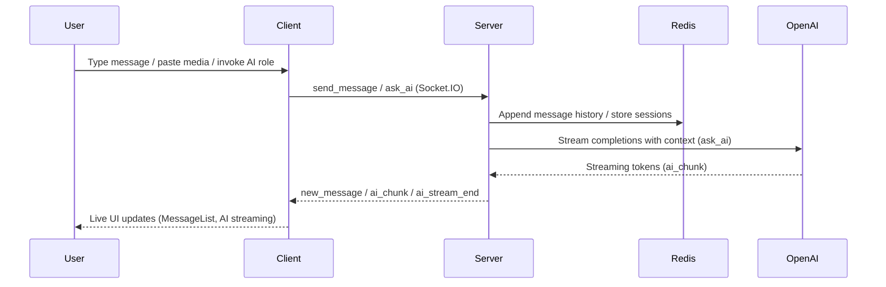

# RoomTalk

[中文版](./README.zh.md)

A modern, feature-rich real-time messaging system built with WebSocket and Redis. Supports Markdown formatting, image sharing, user avatars, and multi-instance deployment. Perfect for building chat applications, team collaboration tools, or any real-time communication platform.

**Current Version: 1.0** (AI assistant & experience refresh)

---

## 🚀 Tech Stack

### Client

- React + TypeScript + Vite
- Tailwind CSS + HeroUI Components
- React Router v6
- Socket.io Client
- i18next (Internationalization)
- Markdown-to-JSX (Rich Text Rendering)
- KaTeX (Math Formula Support)

### Server

- Node.js + Express
- Socket.io with Redis Adapter
- Redis (for persistence and pub/sub)
- OpenAI SDK (for AI streaming responses)
- UUID-based identity system
- Multi-instance support
- Docker containerization

### DevOps & Deployment

- Fly.io cloud platform
- Docker multi-stage builds
- Redis clustering
- Environment-based configuration
- Health monitoring endpoints

---

## 📐 System Architecture



## ✨ Highlights since v0.5

- Intelligent multi-language UI (English/中文/हिन्दी) with localized random usernames
- Desktop navbar + mobile bottom navigation for room, saved, chat, settings views
- In-room presence indicators, join confirmations, and toast-style status messages
- AI role manager with persistent custom roles, system prompts, icon/color badges
- Streaming AI responses rendered incrementally with retry awareness
- Sticky room history (localStorage) and shareable deep links (`/?room=ID`)

---

## 🌟 Features

### v1.0 - Streaming AI & Experience Refresh
- ✅ **AI assistant**: Streaming responses via OpenAI, customizable roles with saved system prompts
- ✅ **Message input**: Mixed media editor with improved clipboard + image handling  
- ✅ **Presence & storage**: Room member counts, join/leave events, persistent room/username/saved lists
- ✅ **UI refresh**: New desktop navbar, mobile bottom nav, status banners, shareable room links
- ✅ **Internationalization**: Added Hindi, localized random usernames, expanded translation keys

### v0.4 - Fly.io Deployment & Markdown Support
- ✅ **Fly.io deployment**: Multi-instance capabilities with environment variable management
- ✅ **Markdown rendering**: Rich text message support with integrated parsing and KaTeX math formulas

### v0.3 - User Identity System  
- ✅ **Personalized avatars**: Username-based generation with intelligent text extraction and hash-based color mapping
- ✅ **Enhanced chat**: Username display, message ownership indication, and Redis persistence for consistency
- ✅ **Localized names**: Cute random name generation in English and Chinese with localStorage persistence

### v0.2 - Enhanced Messaging with Image Support
- ✅ **Comprehensive image system**: Base64 encoding, up to 9 images per message
- ✅ **Advanced content editor**: Mixed-content editing with clipboard operations
- ✅ **Performance optimization**: Throttling and async processing for large images

### v0.1 - Core Foundation
- ✅ **Real-time messaging**: Socket.IO with Redis persistence and pub/sub for multi-instance scaling
- ✅ **Room management**: Comprehensive creation, joining, and access control systems  
- ✅ **Foundation features**: Multi-language support, theme toggling, and responsive design principles

---

## 🧪 Quick Start

### Requirements

- Node.js installed
- Redis installed and running locally (default on `localhost:6379`)

### Install Dependencies

```bash
# Server
cd server
npm install

# Client
cd ../client-heroui
npm install
```

### Build (optional, required for production)

```bash
cd client-heroui
npm run build
cd ../server
npm run build
```

### Start the System

Use the provided script:

```bash
./start.sh
```

Or start manually:

```bash
# Start the server (development mode)
cd server
npm run dev

# Start the client
cd ../client-heroui
npm run dev
```

To run the server in production mode, first execute `npm run build` inside the `server` directory, then run `npm start` to launch the compiled code from `dist/`.

---

## 🧭 Usage

1. Visit [http://localhost:3011](http://localhost:3011) after starting both client and server
2. A persistent `clientId` is generated and stored locally (also displayed in header/settings)
3. Create or join rooms from the home view, or paste a shared link like `/?room=ID`
4. Customize AI roles via the message input settings cog, then trigger with `Ctrl/⌘ + Enter`
5. Manage saved rooms, change language/theme, and edit username in the Settings tab

---

## 🔧 Technical Challenges

### WebSocket Reliability on Mobile Devices

One of the most significant challenges we faced was maintaining reliable WebSocket connections on mobile devices, particularly when apps transition between foreground and background states.

#### Problem
- When a mobile app moves to the background, browsers may suspend WebSocket connections
- Even when connections appear active, event listeners often become unresponsive
- Users can send messages (via HTTP fallback) but not receive them without refreshing
- Different browsers and mobile platforms handle background connections inconsistently

#### Our Solution
We implemented a multi-layered approach to ensure connection reliability:

1. **Enhanced Socket.io Configuration**
   - Configured automatic reconnection with optimized timeouts and delays
   - Implemented connection state tracking to detect "zombie" connections
   - Added transport fallback mechanisms (WebSocket → HTTP polling)

2. **Event Listener Management**
   - Created a system to detect and rebind event listeners when they become unresponsive
   - Implemented event reference tracking to prevent duplicate event bindings
   - Added message deduplication to prevent repeated messages after reconnection

3. **Visibility-Based Recovery**
   - Utilized the Page Visibility API to detect when apps return to the foreground
   - Implemented connection health checks when visibility changes
   - Automatically refresh message data when returning from background state

4. **Active Room Tracking**
   - Maintained client-side records of active room participation
   - Automatically rejoined rooms after connection reestablishment
   - Implemented server-side session recovery mechanisms

This comprehensive approach ensures message delivery reliability across different devices and network conditions, maintaining a seamless user experience even in challenging mobile environments.

---

## 🔧 Technical Highlights

- **Redis persistence & Socket.IO scaling**: Hash + list storage (`rooms`, `room:{id}:messages`, membership sets) and Redis adapter for multi-instance Fly.io deployments
- **AI streaming pipeline**: Context-aware prompts, `ask_ai` Socket.IO event, OpenAI streaming, client-side chunk rendering, and retry/edit workflows
- **Rich message editor**: Mixed text/image contentEditable with throttled paste, compression
- **Responsive shell**: HeroUI-based header, status banners, room list grids, and mobile bottom navigation with saved-room management
- **Internationalization**: i18next resources for English/中文/हिन्दी including localized prompts, button labels, and random usernames
- **Deployment**: Fly.io app (`fly.toml`) targeting Node 22 runtime with Redis secrets; Docker-based multi-stage build included

---

## 🔌 API Overview

### HTTP Endpoints

| Path                                        | Method | Description                                                       |
|---------------------------------------------|--------|-------------------------------------------------------------------|
| `/api/rooms/:roomId/messages`               | `GET`  | Get messages for the specified room                               |
| `/api/clients/:clientId/rooms`              | `GET`  | Get rooms created by the specified client                         |
| `/api/clients/:clientId/rooms`              | `POST` | Create a new room for the specified client                        |
| `/api/clients/:clientId/rooms/:roomId`        | `GET`  | Get specific room details (only if owned by the client)             |
| `/api/rooms/:roomId/messages`               | `POST` | Send a message to the specified room                              |

### WebSocket Events

| Event             | Direction       | Description                                               |
|-------------------|-----------------|-----------------------------------------------------------|
| `register`        | Client → Server | Register user with clientId                               |
| `get_rooms`       | Client → Server | Request rooms created by the user                         |
| `create_room`     | Client → Server | Create a new room                                         |
| `join_room`       | Client → Server | Join an existing room                                     |
| `leave_room`      | Client → Server | Leave a room                                              |
| `send_message`    | Client → Server | Send a message to a room                                  |
| `get_room_by_id`  | Client → Server | Request room details via room ID                          |
| `message_history` | Server → Client | Deliver room message history                              |
| `new_room`        | Server → Client | Notify user of a new room created (scoped to client)      |
| `new_message`     | Server → Client | Broadcast new message to room participants                |

---

## ⚙️ Configuration

### Server Environment Variables

| Variable         | Default                   | Description                     |
|------------------|---------------------------|---------------------------------|
| `PORT`           | 3012                      | Server port                     |
| `CLIENT_URL`     | http://localhost:3011     | CORS origin                     |
| `REDIS_URL`      | redis://localhost:6379    | Redis connection URL            |
| `OPENAI_API_KEY` | —                         | OpenAI API key (required for AI)|
| `OPENAI_MODEL`   | gpt-5                     | OpenAI model (optional)         |

### Client Environment Variables

**.env.development:**

| Variable         | Default              | Description                  |
|------------------|----------------------|------------------------------|
| `VITE_SOCKET_URL`| http://localhost:3012| WebSocket base URL           |

**.env.production:**

| Variable         | Default | Description                                        |
|------------------|---------|----------------------------------------------------|
| `VITE_SOCKET_URL`| `/`     | Use relative path for same-origin deployment      |

### Setup Instructions

**Local Development:**

Create `server/.env` file:

```env
PORT=3012
CLIENT_URL=http://localhost:3011
REDIS_URL=redis://localhost:6379
OPENAI_API_KEY=sk-...
# optional
OPENAI_MODEL=gpt-4
```

Client uses mode-specific files:
- `client-heroui/.env.development` for `npm run dev`
- `client-heroui/.env.production` for builds

**Production (Fly.io):**

```bash
fly secrets set OPENAI_API_KEY="sk-..."
fly secrets set REDIS_URL="redis://..."
# optional
fly secrets set OPENAI_MODEL="gpt-5"
```

## 📦 Redis Persistence

The system supports two Redis deployment options:

### Local Development
Uses standard Redis with **RDB snapshot** persistence by default. You may enable **AOF** or adjust save policies via `redis.conf`.

### Production (Upstash Redis)
For production environments, we recommend using Upstash Redis, which offers:

- **Instant Persistence**: Data is immediately saved to block storage alongside memory, making it reliable as a primary database
- **Multi-Region Replication**: Automatic data replication across regions for better availability
- **Serverless Architecture**: No Redis instance management needed, scales automatically
- **REST API Access**: Supports both Redis protocol and HTTP/REST API access

Configuration example:
```env
REDIS_URL=your-upstash-redis-url
REDIS_TOKEN=your-upstash-token
```

---

## 📄 License

MIT License

Copyright (c) 2024 RoomTalk

Permission is hereby granted, free of charge, to any person obtaining a copy
of this software and associated documentation files (the "Software"), to deal
in the Software without restriction, including without limitation the rights
to use, copy, modify, merge, publish, distribute, sublicense, and/or sell
copies of the Software, and to permit persons to whom the Software is
furnished to do so, subject to the following conditions:

The above copyright notice and this permission notice shall be included in all
copies or substantial portions of the Software.

THE SOFTWARE IS PROVIDED "AS IS", WITHOUT WARRANTY OF ANY KIND, EXPRESS OR
IMPLIED, INCLUDING BUT NOT LIMITED TO THE WARRANTIES OF MERCHANTABILITY,
FITNESS FOR A PARTICULAR PURPOSE AND NONINFRINGEMENT. IN NO EVENT SHALL THE
AUTHORS OR COPYRIGHT HOLDERS BE LIABLE FOR ANY CLAIM, DAMAGES OR OTHER
LIABILITY, WHETHER IN AN ACTION OF CONTRACT, TORT OR OTHERWISE, ARISING FROM,
OUT OF OR IN CONNECTION WITH THE SOFTWARE OR THE USE OR OTHER DEALINGS IN THE
SOFTWARE.

## 📝 Version History

### v1.0 - Streaming AI & Experience Refresh
- **AI assistant**: Streaming responses via OpenAI, customizable roles with saved system prompts
- **Message input**: Mixed media editor with improved clipboard + image handling
- **Presence & storage**: Room member counts, join/leave events, persistent room/username/saved lists
- **UI refresh**: New desktop navbar, mobile bottom nav, status banners, shareable room links
- **Internationalization**: Added Hindi, localized random usernames, expanded translation keys

### v0.4 - Fly.io Deployment & Markdown Message Display
- **Fly.io Deployment**: Added support for deploying the application on Fly.io with multi-instance capabilities
  - Updated deployment scripts and documentation for Fly.io
  - Implemented environment variable management for Fly.io
- **Markdown Message Display**: Enhanced message rendering to support Markdown formatting
  - Integrated Markdown parsing and rendering in the chat interface
  - Improved user experience with rich text message support

### v0.3 - User Identity System
- **Personalized Avatars**: Implemented username-based avatar generation with consistent colors
  - Developed intelligent avatar text extraction algorithm that handles both English initials and Chinese characters
  - Created hash-based color mapping for consistent user identification
  - Implemented fallback icon system for missing avatar information
- **Enhanced Chat Experience**: Added username display for each message to improve conversation clarity
  - Extended Message data structure with username and avatar fields
  - Modified socket communication to transmit user identity with each message
  - Persisted user identity data in Redis for message history consistency
- **Improved UI**: Redesigned chat interface with better indication of message ownership and streamlined room information display
  - Applied conditional styling based on message ownership
  - Optimized avatar display for various screen sizes
  - Implemented proper type validation for component properties
- **Localized Random Names**: Added cute random name generation in both English and Chinese based on language settings
  - Created separate adjective and noun libraries for English and Chinese
  - Implemented automatic language detection and name generation based on i18n settings
  - Used localStorage for username persistence across sessions

### v0.2 - Enhanced Messaging with Image Support
- **Comprehensive Image System**: Implemented a robust message type framework with Base64 encoding, supporting up to 9 images per message with optimized aspect ratio display and seamless viewing across devices
- **Advanced Content Editor**: Developed a sophisticated mixed-content editor with intuitive clipboard operations, intelligent cursor positioning, and natural editing experience similar to modern messaging platforms
- **Performance & Experience Enhancements**: Engineered throttling mechanisms and asynchronous processing to ensure smooth operation with large images, while maintaining responsive UI across all device types

### v0.1 - Initial Release
- **Core Messaging System**: Implemented real-time messaging with Socket.IO and Redis persistence
- **Room Management**: Created comprehensive room creation, joining, and access control systems
- **Foundation Features**: Established multi-language support, theme toggling, and responsive design principles
