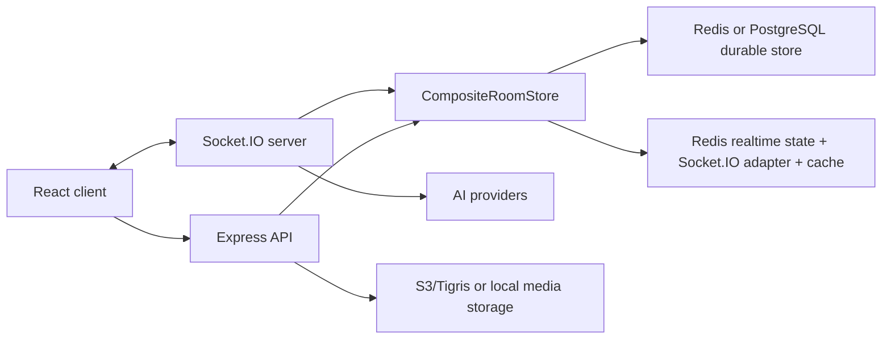

# Message System

[中文版](./README.zh.md)

Message System is a real-time room chat system with AI assistants, private media, stickers, room management, saved rooms, mobile recovery, and optional PostgreSQL durable storage. The repository contains a React/Vite client and a Node/Express/Socket.IO server.

## Current Capabilities

- Room creation, joining by ID/link, saved rooms, room rename/delete, member roles, admin controls, ownership transfer, password rooms, and posting schedules.
- Text, AI, media, sticker, reply, edit, delete, and clear-history message flows.
- AI streaming with provider-aware clients for DeepSeek, Anthropic, OpenAI, and OpenRouter-routed models.
- AI role presets, model selection, premium model confirmation, usage/cost metadata, retry/edit-and-ask flows, and A2UI streaming surfaces.
- Private media upload/download via S3-compatible storage, local media fallback in development, media history, image/video/audio handling, and mobile media-viewer gestures.
- Voice transcription via AssemblyAI when configured.
- Google sign-in linking, client password protection, token-based socket registration, and optional web-push notifications.
- i18n for English, Chinese, Hindi, Japanese, and Korean.
- Mobile-focused reliability: active-room restore, reconnect handling, member-count recovery, keyboard viewport fixes, and mobile E2E coverage.

## Repository Layout

```text
client-heroui/     React + TypeScript + Vite frontend
server/            Express + Socket.IO TypeScript backend
docs/              Runbooks, design records, migration notes, reliability writeups
Dockerfile         Production image build used by Fly.io
fly.toml           Fly.io app configuration
start.sh           Local convenience launcher: server on 3012, client on 3011
CLAUDE.md          Agent/developer guide; AGENTS.md symlinks to it
```

## Architecture



The server uses a `CompositeRoomStore`:

- Durable store: Redis by default, or PostgreSQL with `PERSISTENCE_STORE=postgres`.
- Realtime store: Redis for socket sessions, online membership, and Socket.IO adapter state.
- Message cache: Redis TTL cache in front of PostgreSQL message reads.

Client state is centered in `MessagePage`, with reusable UI in `src/components`, socket/API wrappers in `src/utils`, and room/message sync logic in `src/hooks`.

## Quick Start

Requirements:

- Node.js 24.18.0 LTS recommended.
- Redis running locally at `localhost:6379`.
- Optional: PostgreSQL test database for PostgreSQL-mode smoke/E2E.

Install dependencies:

```bash
cd server && npm install
cd ../client-heroui && npm install
```

Create local server config:

```bash
cp server/.env.example server/.env
```

For AI with the default model, set `DEEPSEEK_API_KEY`. For OpenRouter-routed models and AI role draft generation, set `OPENROUTER_API_KEY`.

Start both apps:

```bash
./start.sh
```

Manual development mode:

```bash
cd server
npm run dev

cd ../client-heroui
npm run dev
```

Open [http://localhost:3011](http://localhost:3011).

## Commands

Server:

```bash
cd server
npm run dev                         # ts-node-dev server
npm run build                       # TypeScript build
npm start                           # run dist/src/server.js
npm test                            # Node test runner over src/**/*.test.ts
npm run migrate:redis-to-postgres   # Redis -> PostgreSQL durable migration
npm run smoke:persistence           # safe local persistence smoke test
```

Client:

```bash
cd client-heroui
npm run dev                 # Vite dev server
npm test                    # Vitest unit/component tests
npm run lint                # ESLint
npm run check:i18n          # verify translation keys
npm run build               # i18n check + TypeScript + Vite build
npm run test:e2e            # Playwright E2E against Redis mode
npm run test:e2e:postgres   # Playwright E2E against PostgreSQL mode
```

## Configuration

Use `server/.env.example` as the backend source of truth. Important groups:

| Area | Variables |
| --- | --- |
| HTTP/CORS | `PORT`, `CLIENT_URL`, `CLIENT_URLS`, `NODE_ENV` |
| Redis | `REDIS_URL` |
| PostgreSQL mode | `PERSISTENCE_STORE`, `DATABASE_URL`, `POSTGRES_SSL`, `POSTGRES_SSL_REJECT_UNAUTHORIZED`, `POSTGRES_SSL_CA_BASE64`, `POSTGRES_SSL_CA`, `ROOM_MESSAGES_CACHE_TTL_SECONDS` |
| AI | `AI_MODEL`, `AI_MODEL_OPTIONS`, `DEEPSEEK_API_KEY`, `ANTHROPIC_API_KEY`, `OPENAI_API_KEY`, `OPENROUTER_API_KEY`, `OPENROUTER_BASE_URL`, `OPENROUTER_HTTP_REFERER`, `OPENROUTER_APP_NAME` |
| Media storage | `MEDIA_BUCKET_NAME`, `MEDIA_STORAGE_REGION`, `MEDIA_STORAGE_ENDPOINT`, `MEDIA_STORAGE_FORCE_PATH_STYLE`, `AWS_ACCESS_KEY_ID`, `AWS_SECRET_ACCESS_KEY` |
| Optional services | `ASSEMBLYAI_API_KEY`, `GOOGLE_CLIENT_ID`, `GOOGLE_CLIENT_IDS`, `WEB_PUSH_VAPID_PUBLIC_KEY`, `WEB_PUSH_VAPID_PRIVATE_KEY`, `WEB_PUSH_SUBJECT` |

Client configuration:

- `client-heroui/.env.development`: local `VITE_SOCKET_URL` and public Google client ID.
- `client-heroui/.env.production`: same-origin `VITE_SOCKET_URL=/` for Fly deployment.

Use `CLIENT_URL` for the primary public client URL. Set `CLIENT_URLS` to a comma-separated origin allowlist when multiple production domains should work, for example `https://room.ruit.me,https://ai-chat.wenlin.dev`.

Only put browser-safe values in `VITE_*` variables.

## Persistence And Migrations

Redis remains the default local durable store. PostgreSQL mode makes PostgreSQL the durable source of truth while Redis still handles realtime state, Socket.IO scaling, and short TTL message cache.

Redis to PostgreSQL cutover:

```bash
cd server
REDIS_URL="redis://..." npm run migrate:redis-to-postgres -- --dry-run
REDIS_URL="redis://..." DATABASE_URL="postgres://..." npm run migrate:redis-to-postgres
```

Run the final migration during a write freeze or maintenance window, then set:

```bash
fly secrets set PERSISTENCE_STORE="postgres"
fly secrets set DATABASE_URL="postgres://..."
fly secrets set POSTGRES_SSL="true"
```

Rollback is configuration-only while Redis durable data is retained:

```bash
fly secrets set PERSISTENCE_STORE="redis"
```

Full checklist: [docs/postgres-rollout-runbook.md](docs/postgres-rollout-runbook.md).

Persistence smoke tests are intentionally guarded:

```bash
cd server
npm run smoke:persistence
TEST_DATABASE_URL="postgres://localhost/message_system_test" npm run smoke:persistence
```

The PostgreSQL smoke database name must include `test` or `e2e` as a separated token.

## Media Storage

New media uploads use private S3-compatible object storage via `MEDIA_*` and AWS credential variables. Development can use local object routes when storage is not configured.

Legacy base64 image cleanup is available through `cd server && npm run migrate:media-to-object-storage`. It defaults to dry-run, converts candidate images to lossless WebP in memory, and requires `--execute` plus a verified backup file before uploading objects or updating PostgreSQL. See [docs/image-object-storage-migration-runbook.md](docs/image-object-storage-migration-runbook.md).

## Deployment

Production deployment is CI-first:

- Pushes to `master` trigger `.github/workflows/fly-deploy.yml`.
- CI installs dependencies, builds server/client, checks translations, verifies required Fly secrets, then deploys with `flyctl deploy --remote-only`.
- The Fly app is `message-system` in `dfw`, with a Node 24.18.0 Alpine Docker image and a 512 MB VM.

Required production services normally include Redis, PostgreSQL, S3/Tigris-compatible media storage, AI provider keys, and Google OAuth. Optional services include AssemblyAI and web-push VAPID keys.

Deployment guide: [DeploymentGuide.md](DeploymentGuide.md). Chinese guide: [部署指南.md](部署指南.md).

## Testing Coverage

The test suite includes:

- Server unit/socket/repository/API tests with Node's built-in runner.
- Client component and utility tests with Vitest and Testing Library.
- Playwright E2E for room flows, message flows, AI/media/sharing, mobile core paths, room restore, multi-client realtime, and PostgreSQL persistence.
- i18n key checks in the client build.

Use focused tests next to changed code. Use Playwright for browser-visible behavior and PostgreSQL E2E for persistence-mode regressions.

## Documentation Map

- [CLAUDE.md](CLAUDE.md): concise contributor/agent operating guide.
- [docs/postgres-rollout-runbook.md](docs/postgres-rollout-runbook.md): production PostgreSQL cutover checklist.
- [docs/postgres-migration-development-summary.zh.md](docs/postgres-migration-development-summary.zh.md): historical PostgreSQL migration review.
- [docs/migration-completion-audit.md](docs/migration-completion-audit.md): current migration completion evidence and remaining external gates.
- [docs/room-reliability/README.zh.md](docs/room-reliability/README.zh.md): room restore and room-update reliability series.
- [docs/media-viewer-gesture-requirements.md](docs/media-viewer-gesture-requirements.md): active media-viewer gesture requirements.
- [docs/mobile-keyboard-viewport-fix.zh.md](docs/mobile-keyboard-viewport-fix.zh.md): iOS keyboard viewport fix record.

Some files in `docs/` are historical plans or postmortems. Treat runbooks and this README as the active operational entry points.

## License

MIT.
