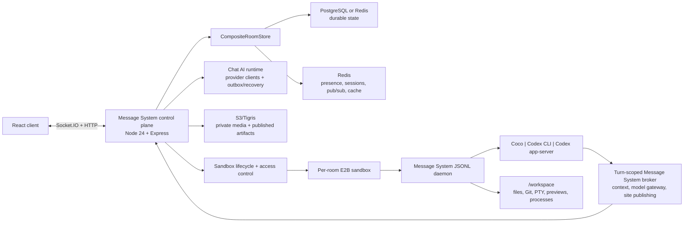

# Message System

[Live app](https://ai-chat.wenlin.dev/) · [中文说明](./README.zh.md)

Message System is a real-time AI collaboration platform built around shared rooms and persistent, sandboxed code-agent workspaces. Humans and multiple agent backends can work in the same room while Message System owns identity, permissions, durable transcripts, workspace access, artifacts, and recovery.

The monorepo contains a React/Vite client, a Node/Express/Socket.IO control plane, and a Python JSONL runner packaged into pinned E2B sandbox artifacts.

## Highlights

### Shared AI collaboration

- Realtime rooms with invitations, passwords, member roles, admin controls, ownership transfer, posting schedules, saved rooms, and multi-client presence.
- Provider-neutral AI streaming across Anthropic, OpenAI, DeepSeek, and OpenRouter-compatible models, with role/context controls, usage and cost accounting, recovery of interrupted streams, and A2UI surfaces.
- Text, private media, stickers, replies, edits, reactions, transcription, web push, Google sign-in, and English/Chinese/Hindi/Japanese/Korean UI.
- Mobile recovery for reconnects, BFCache restores, keyboard viewport changes, room-version ordering, and read-your-write room updates.

### Sandboxed code-agent rooms

- One shared E2B workspace per code-agent room, with Coco, Codex CLI, and Codex app-server backends behind one Message System turn protocol.
- A reusable sandbox-local JSONL daemon that executes sequential turns, streams text/tool/model-step events, accepts interrupt and steer controls, and is reclaimed during sandbox or server shutdown.
- Four permission modes: Plan, Edit, Approve for me, and Full access. Plan uses an OS-enforced read-only shell; writable modes can modify the workspace and run background jobs.
- Turn-scoped model-gateway, room-context, and static-publish credentials. Provider keys and Message System service secrets stay outside the browser and agent prompt.
- Room-aware agents can query bounded history, deltas, individual messages, search results, and published sites through the sandbox-local `message-system` CLI.
- Durable, correctly ordered AI/tool transcripts grouped by turn, including image inputs, model-step usage, queued prompts, live steering, interruption, retry, and approval events.

### Browser workspace

- File tree/search, source editing, image/Markdown/media previews, workspace asset access, and saved panel state.
- Git-aware changed-file trees, branch/base-ref selection, unified and split diffs, viewed state, and line-scoped review comments that can be attached to the next agent turn.
- Interactive PTY terminal over authenticated Socket.IO sessions, with resize handling, buffered input, local echo, and bounded output snapshots.
- Embedded browser previews for workspace files and detected dev servers, responsive viewport controls, screenshots, recordings, and preview-server status.
- Durable static-site publishing to Message System object storage. Published artifacts remain available after an E2B sandbox pauses or is replaced and appear in the workspace Artifacts view.
- Idle/active sandbox TTLs, reconnect and stale-state recovery, per-user/global limits, Git baseline initialization, and archive-based workspace migration across pinned artifact upgrades.

## Architecture



The ownership boundary is deliberate:

- **Message System control plane** owns rooms, membership, permissions, message/turn persistence, scoped credentials, sandbox lifecycle, object storage, and browser APIs.
- **E2B execution plane** owns untrusted files, processes, terminals, dev servers, and agent execution inside `/workspace`.
- **Agent backends** own reasoning and native tool loops. They consume Message System capabilities through a narrow JSONL/CLI contract rather than receiving database or infrastructure credentials.

See [Code-agent runtime architecture](docs/code-agent-runtime-architecture.md) for the complete turn flow, security model, workspace surfaces, persistence boundaries, and release process.

## Repository Layout

```text
client-heroui/                    React + TypeScript + Vite client
server/src/                       Express/Socket.IO control plane
server/message-system_code_agent_runner Python runner, daemon, backends, and Message System CLI
ops/code-agent-sandbox/           pinned E2B artifact definition and lock
scripts/code-agent/               artifact context preparation
docs/                             architecture, runbooks, plans, and postmortems
output/resume-overleaf/           generated resume sources and PDFs
```

## Quick Start

Requirements:

- Node.js 24.18.0 or newer.
- Redis at `localhost:6379`.
- Optional PostgreSQL test database for PostgreSQL-mode smoke/E2E.
- Optional E2B credentials and pinned template settings for real code-agent rooms.

Install dependencies and create local configuration:

```bash
cd server && npm install
cd ../client-heroui && npm install
cp ../server/.env.example ../server/.env
```

Start both applications:

```bash
./start.sh
```

The client runs at [http://localhost:3011](http://localhost:3011) and the server at `http://localhost:3012`.

Manual development:

```bash
cd server && npm run dev
cd client-heroui && npm run dev
```

## Common Commands

Server:

```bash
cd server
npm run build
npm test
npm run smoke:persistence
npm run smoke:code-agent:e2b
npm run smoke:codex:e2b
npm run migrate:redis-to-postgres
npm run migrate:media-to-object-storage
```

Client:

```bash
cd client-heroui
npm run lint
npm run check:i18n
npm test
npm run build
npm run test:e2e
npm run test:e2e:postgres
```

## Configuration

Use `server/.env.example` as the general backend starting point. Important groups include:

| Area | Examples |
| --- | --- |
| HTTP and origins | `PORT`, `CLIENT_URL`, `CLIENT_URLS`, `NODE_ENV` |
| Durable/realtime stores | `PERSISTENCE_STORE`, `DATABASE_URL`, `REDIS_URL`, PostgreSQL TLS, message-cache TTL |
| Chat AI | provider API keys, default model, OpenRouter routing metadata |
| Media and artifacts | S3/Tigris bucket, endpoint, region, and AWS-compatible credentials |
| Optional services | Google OAuth, AssemblyAI, Web Push VAPID |
| Code-agent control plane | backend allowlists, E2B template/artifact pins, TTL/limits, model-gateway and publish token secrets |

Only browser-safe values belong in `VITE_*` variables. Code-agent provider keys, model-gateway tokens, room-context tokens, and static-publish tokens must never be exposed to the client.

Production code-agent rooms use a pinned E2B artifact. Runner, tool, prompt, Dockerfile, or code-agent engine changes require an artifact version bump, a new E2B template, matching production pins, and an E2B smoke test. See [Code-agent sandbox artifact](docs/code-agent-sandbox-artifact.md).

## Persistence and Object Storage

`CompositeRoomStore` separates durable and realtime concerns:

- PostgreSQL or Redis stores rooms, messages, members, auth, media metadata, AI runs, code-agent turns, and sandbox metadata.
- Redis always owns presence, socket sessions, pub/sub, and optional short-TTL PostgreSQL message caching.
- S3/Tigris-compatible storage holds private media and versioned static-site artifacts; development can use the local object-storage implementation.

Migration and rollout references:

- [PostgreSQL rollout runbook](docs/postgres-rollout-runbook.md)
- [PostgreSQL migration summary](docs/postgres-migration-development-summary.zh.md)
- [Media object-storage migration](docs/image-object-storage-migration-runbook.md)
- [Static publishing implementation](docs/code-agent-static-publish-implementation.md)

## Testing

The repository uses layered verification:

- Node's test runner for services, protocols, stores, socket handlers, E2B adapters, lifecycle, model gateway, and static publishing.
- Vitest and Testing Library for client state, messages, workspace files/diffs/reviews, terminal behavior, browser previews, queue controls, and responsive views.
- Playwright for desktop/mobile room flows, recovery, multi-client realtime behavior, media, AI, and PostgreSQL parity.
- Real E2B smoke tests for pinned artifact metadata, daemon health, Coco/Codex execution, permissions, context access, publishing, and workspace behavior.

Run focused tests next to changed code, then run both production builds before shipping.

## Deployment

`master` is the release branch. `.github/workflows/fly-deploy.yml` runs on a schedule or through manual dispatch, checks whether `master` has changed since the latest successful run, builds both packages, validates translations and secrets, and deploys to Fly.io. Do not run `fly deploy` manually.

Production uses Fly.io for the Node control plane, Supabase PostgreSQL, Upstash Redis, Tigris object storage, and E2B for per-room execution sandboxes.

## Documentation Map

- [Code-agent runtime architecture](docs/code-agent-runtime-architecture.md): current end-to-end design and ownership boundaries.
- [Code-agent sandbox artifact](docs/code-agent-sandbox-artifact.md): pinned artifact build and rollout contract.
- [Room-context CLI design](docs/codex-room-context-cli-design.zh.md): brokered history/search access and Plan-mode isolation.
- [Static publishing implementation](docs/code-agent-static-publish-implementation.md): durable artifact pipeline and Message System CLI.
- [Sandbox daemon plan](docs/sandbox-daemon-plan.md): daemon protocol and migration rationale.
- [PostgreSQL rollout runbook](docs/postgres-rollout-runbook.md): durable-store production cutover.
- [Room reliability](docs/room-reliability/README.zh.md): restore, ordering, and multi-client consistency work.
- [CLAUDE.md](CLAUDE.md): contributor and release guidance.

Some files under `docs/` are historical plans or postmortems. The architecture document, runbooks, this README, and the source code are the current operational references.

## License

MIT.
