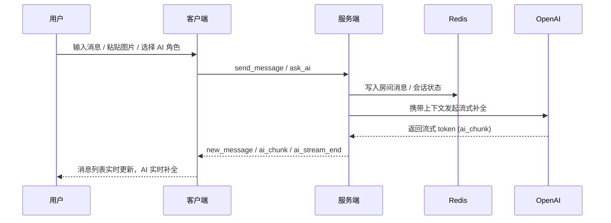

# RoomTalk

[English Version](./README.md)

一个现代化、功能丰富的实时消息系统，基于 WebSocket 和 Redis 构建。支持 Markdown 格式化、图片分享、用户头像和多实例部署。完美适用于构建聊天应用、团队协作工具或任何实时通信平台。

**当前版本: 1.0**（AI 助手与体验全面升级）

---

## 🚀 技术栈

### 客户端（Client）

- React + TypeScript + Vite
- Tailwind CSS + HeroUI 组件库
- React Router v6
- Socket.io Client
- i18next 多语言支持
- Markdown-to-JSX（富文本渲染）
- KaTeX（数学公式支持）

### 服务端（Server）

- Node.js + Express.js
- Socket.io（配备 Redis 适配器）
- Redis（用于持久化和发布/订阅）
- OpenAI SDK（AI 流式响应集成）
- UUID 用户身份系统
- 多实例部署支持
- Docker 容器化

### 运维与部署

- Fly.io 云平台
- Docker 多阶段构建
- Redis 集群
- 基于环境的配置
- 健康监控端点

---

## 📐 系统架构 & AI 流程



## ✨ v0.5 新增要点

- 桌面端顶部导航 + 移动端底部导航，房间/保存/聊天/设置四大视图
- 房间成员实时提醒、加入确认对话框、顶部状态条
- AI 角色管理器：多角色、颜色/图标、系统提示词本地持久化
- OpenAI 流式回复，支持重试/编辑后的上下文重算
- URL 房间分享（`/?room=ID`）+ 本地恢复上次房间

---

## 🌟 功能亮点

### v1.0 - 流式 AI 与体验升级
- ✅ **AI 助手**：接入 OpenAI 流式回复，自定义角色/系统提示词并本地保存
- ✅ **消息输入**：混合内容编辑器，粘贴/图片交互优化
- ✅ **房间体验**：成员数量、加入/离开提示、用户名/房间信息持久化
- ✅ **界面焕新**：桌面导航、移动底部栏、状态提示、分享链接
- ✅ **多语言**：新增印地语翻译，随机用户名根据语言自动生成

### v0.4 - Fly.io 部署与 Markdown 支持
- ✅ **Fly.io 部署**：支持多实例能力，环境变量管理
- ✅ **Markdown 渲染**：增强消息渲染，支持富文本消息和KaTeX数学公式

### v0.3 - 用户身份系统
- ✅ **个性化头像**：智能文本提取算法，哈希颜色映射确保用户标识一致性
- ✅ **增强聊天体验**：用户名显示，消息所有权指示，Redis持久化保证一致性
- ✅ **本地化名称**：中英文双语可爱随机名称生成，localStorage跨会话保存

### v0.2 - 增强型消息与图片支持
- ✅ **全面的图片系统**：Base64编码传输，每条消息最多9张图片
- ✅ **高级内容编辑器**：混合内容编辑，直观的剪贴板操作
- ✅ **性能优化**：节流机制和异步处理，处理大图片时保持流畅

### v0.1 - 核心基础
- ✅ **实时消息系统**：Socket.IO配合Redis持久化和发布/订阅，支持多实例扩展
- ✅ **房间管理功能**：完整的房间创建、加入和访问控制系统
- ✅ **基础功能支持**：多语言支持、主题切换和响应式设计原则

---

## 🧪 快速开始

### 环境准备

- 安装 Node.js
- 安装并启动 Redis（默认 `localhost:6379`）

### 安装依赖

```bash
# 安装服务端依赖
cd server
npm install

# 安装客户端依赖
cd ../client-heroui
npm install
```

### 构建（生产模式需要）

```bash
cd client-heroui
npm run build
cd ../server
npm run build
```

### 启动系统

可以使用脚本一键启动：

```bash
./start.sh
```

或者分开启动：

```bash
# 启动服务端（开发模式）
cd server
npm run dev

# 启动客户端
cd ../client-heroui
npm run dev
```

生产模式需先在 `server` 目录执行 `npm run build`，再运行 `npm start` 使用编译后的 `dist/` 代码。

---

## 🧭 使用指南

1. 启动前后端后访问 [http://localhost:3011](http://localhost:3011)
2. 系统会生成并保存唯一的 `clientId`（导航/设置中可查看并复制）
3. 在主页创建、加入或保存房间，亦可通过分享链接 `/?room=ID` 直接进入
4. 在消息输入框点击齿轮配置 AI 角色，`Ctrl/⌘ + Enter` 触发 AI 回复
5. 在设置页修改用户名、主题、语言并管理保存房间

---

## 🔧 技术亮点

- **Redis & Socket.IO 扩展**：`rooms` 哈希、`room:{id}:messages` 列表、成员集合，配合 Redis 适配器支持 Fly.io 多实例
- **AI 流水线**：`ask_ai` 事件整合上下文、OpenAI 流式响应、前端分块渲染与重试逻辑
- **富文本编辑器**：文本/图片混排，粘贴节流，图片压缩
- **自适应外壳**：HeroUI 布局、房间宫格、状态条、移动底部导航、保存房间管理
- **多语言**：i18next 支持 English/中文/हिन्दी，随机用户名根据语言生成
- **部署**：`fly.toml` 指向 Node 22，Redis URL 通过 Secrets 下发，提供 Docker 多阶段构建

---

## 🔌 API 接口概览

### HTTP 接口

| 路径 | 方法 | 描述 |
|-----------------------------------------------|--------|------------------------------------------------|
| `/api/rooms/:roomId/messages`                 | `GET`  | 获取指定房间的消息                             |
| `/api/clients/:clientId/rooms`                | `GET`  | 获取指定用户创建的房间列表                     |
| `/api/clients/:clientId/rooms`                | `POST` | 为指定用户创建新房间                           |
| `/api/clients/:clientId/rooms/:roomId`          | `GET`  | 获取指定房间的详细信息（仅限房间创建者）         |
| `/api/rooms/:roomId/messages`                 | `POST` | 向指定房间发送消息                             |

### WebSocket 事件

| 事件名            | 方向         | 描述                                          |
|-------------------|--------------|-----------------------------------------------|
| `register`        | 客户端 → 服务端 | 注册用户，并加入以 clientId 命名的分组            |
| `get_rooms`       | 客户端 → 服务端 | 请求获取当前用户创建的房间                      |
| `create_room`     | 客户端 → 服务端 | 创建房间                                      |
| `join_room`       | 客户端 → 服务端 | 加入房间                                      |
| `leave_room`      | 客户端 → 服务端 | 离开房间                                      |
| `send_message`    | 客户端 → 服务端 | 发送消息到指定房间                            |
| `get_room_by_id`  | 客户端 → 服务端 | 根据房间 ID 请求房间详情                        |
| `message_history` | 服务端 → 客户端 | 返回房间消息历史                              |
| `new_room`        | 服务端 → 客户端 | 推送新房间信息（仅发送给房间创建者）             |
| `new_message`     | 服务端 → 客户端 | 向房间广播新消息                              |

---

## ⚙️ 配置

### 服务端环境变量

| 变量名           | 默认值                    | 说明                      |
|------------------|---------------------------|---------------------------|
| `PORT`           | 3012                      | 服务端端口                |
| `CLIENT_URL`     | http://localhost:3011     | CORS 配置                 |
| `REDIS_URL`      | redis://localhost:6379    | Redis 连接地址            |
| `PERSISTENCE_STORE` | redis                  | 持久化模式：`redis` 或 `postgres` |
| `DATABASE_URL`   | —                         | PostgreSQL 连接地址，`PERSISTENCE_STORE=postgres` 时必填 |
| `POSTGRES_SSL`   | false                     | 是否启用 PostgreSQL TLS |
| `POSTGRES_SSL_REJECT_UNAUTHORIZED` | true     | 仅在明确使用自签名 PostgreSQL TLS 时设为 `false` |
| `ROOM_MESSAGES_CACHE_TTL_SECONDS` | 30        | PostgreSQL 模式下 Redis 房间消息缓存 TTL；`0` 禁用缓存写入 |
| `OPENROUTER_API_KEY` | —                     | OpenRouter API 密钥（启用 AI 必填） |
| `AI_MODEL`       | deepseek-v4-pro           | 默认 AI 模型 ID          |
| `AI_MODEL_OPTIONS` | deepseek-v4-pro,gpt-5.5,claude-sonnet-4.6,claude-opus-4.7,kimi-k2.6,glm-5.1,minimax-m2.7 | 用户可选择的模型 ID，逗号分隔 |
| `OPENROUTER_HTTP_REFERER` | `CLIENT_URL`      | 可选 OpenRouter Referer 请求头 |
| `OPENROUTER_APP_NAME` | RoomTalk              | 可选 OpenRouter 应用名称请求头 |

### 客户端环境变量

**.env.development:**

| 变量名            | 默认值                  | 说明              |
|-------------------|-------------------------|-------------------|
| `VITE_SOCKET_URL` | http://localhost:3012    | WebSocket 地址    |

**.env.production:**

| 变量名            | 默认值 | 说明                                  |
|-------------------|--------|---------------------------------------|
| `VITE_SOCKET_URL` | `/`    | 同域部署时使用相对路径                 |

### 配置说明

**本地开发：**

创建 `server/.env` 文件：

```env
PORT=3012
CLIENT_URL=http://localhost:3011
REDIS_URL=redis://localhost:6379
PERSISTENCE_STORE=redis
OPENROUTER_API_KEY=sk-or-...
AI_MODEL=deepseek-v4-pro
AI_MODEL_OPTIONS=deepseek-v4-pro,gpt-5.5,claude-sonnet-4.6,claude-opus-4.7,kimi-k2.6,glm-5.1,minimax-m2.7
OPENROUTER_HTTP_REFERER=http://localhost:5173
OPENROUTER_APP_NAME=RoomTalk
```

客户端（Vite）按模式读取：
- `client-heroui/.env.development` 用于 `npm run dev`
- `client-heroui/.env.production` 用于打包

**生产环境（Fly.io）：**

```bash
fly secrets set OPENROUTER_API_KEY="sk-or-..."
fly secrets set REDIS_URL="redis://..."
# 可选
fly secrets set AI_MODEL="deepseek-v4-pro"
fly secrets set AI_MODEL_OPTIONS="deepseek-v4-pro,gpt-5.5,claude-sonnet-4.6,claude-opus-4.7,kimi-k2.6,glm-5.1,minimax-m2.7"
```

## 📦 持久化

Redis 仍是本地开发和现有部署的默认持久化路径。也可以启用 PostgreSQL 作为持久事实来源，此时 Redis 继续负责 Socket.IO 多实例同步、实时会话状态、在线成员集合和短 TTL 消息缓存。

### PostgreSQL 切换流程

1. 先执行只读 dry-run：
   ```bash
   cd server
   REDIS_URL="redis://..." npm run migrate:redis-to-postgres -- --dry-run
   ```
2. 执行幂等迁移：
   ```bash
   REDIS_URL="redis://..." DATABASE_URL="postgres://..." npm run migrate:redis-to-postgres
   ```
3. 切换持久化模式：
   ```bash
   fly secrets set PERSISTENCE_STORE="postgres"
   fly secrets set DATABASE_URL="postgres://..."
   fly secrets set POSTGRES_SSL="true"
   ```
4. 检查 `/api/status` 返回 `persistenceStore: "postgres"`，并确认房间数量符合预期。

回滚只需要将 `PERSISTENCE_STORE` 设回 `redis` 并重启/重新部署：

```bash
fly secrets set PERSISTENCE_STORE="redis"
```

PostgreSQL 切换验证完成前，不要清理 Redis 里的原始数据。

完整上线检查清单见：[docs/postgres-rollout-runbook.md](docs/postgres-rollout-runbook.md)。

### Redis 持久化

系统支持两种Redis部署方案：

### 本地开发环境
默认使用标准Redis，采用 **RDB 快照** 方式持久化。你可以通过修改 `redis.conf` 来启用 **AOF** 或调整保存策略。

### 生产环境 (Upstash Redis)
在生产环境中，我们推荐使用 Upstash Redis，它提供以下优势：

- **即时持久化**：除了内存存储外，数据会立即保存到块存储中，可以安全地用作主数据库
- **多区域复制**：自动跨区域数据复制，提供更好的可用性
- **无服务器架构**：无需管理Redis实例，自动扩展
- **REST API支持**：除了Redis协议外，还支持HTTP/REST API访问

配置示例：
```env
REDIS_URL=your-upstash-redis-url
REDIS_TOKEN=your-upstash-token
```

---

## 📄 许可证

MIT License

版权所有 (c) 2024 RoomTalk

特此免费授予任何获得本软件及相关文档文件（以下简称"软件"）副本的人，不受限制地处理本软件的权利，包括但不限于使用、复制、修改、合并、出版、分发、再许可及/或销售软件的副本，并允许其受让人如此做，但须符合以下条件：

上述版权声明及本许可声明应包含在本软件的所有副本或主要部分中。

本软件按"原样"提供，不附带任何明示或暗示的保证，包括但不限于对适销性、特定用途适用性及非侵权性的保证。在任何情况下，作者或版权持有人均不对因软件或软件的使用或其他交易产生的任何索赔、损害或其他责任承担责任，无论是在合同、侵权或其他方面。

## 📝 版本历史

-### v1.0 - 流式 AI 与体验升级
- **AI 助手**：接入 OpenAI 流式回复，自定义角色/系统提示词并本地保存
- **消息输入**：混合内容编辑器，粘贴/图片交互优化
- **房间体验**：成员数量、加入/离开提示、用户名/房间信息持久化
- **界面焕新**：桌面导航、移动底部栏、状态提示、分享链接
- **多语言**：新增印地语翻译，随机用户名根据语言自动生成

### v0.4 - Fly.io 部署 & Markdown 消息显示
- **Fly.io 部署**：支持在 Fly.io 上部署应用，具备多实例能力
  - 更新了 Fly.io 的部署脚本和文档
  - 实现了 Fly.io 的环境变量管理
- **Markdown 消息显示**：增强了消息渲染，支持 Markdown 格式
  - 在聊天界面中集成了 Markdown 解析和渲染
  - 提升了用户体验，支持富文本消息

### v0.3 - 用户身份系统
- **个性化头像**：实现基于用户名的头像生成，带有一致性颜色标识
  - 开发了智能头像文本提取算法，同时支持英文首字母和中文汉字处理
  - 创建了基于哈希算法的颜色映射，确保用户标识的一致性
  - 实现了缺失头像信息时的图标回退系统
- **增强聊天体验**：为每条消息添加用户名显示，提高对话清晰度
  - 扩展了Message数据结构，添加了username和avatar字段
  - 修改了socket通信机制，使每条消息都携带用户身份信息
  - 在Redis中持久化用户身份数据，确保消息历史记录的一致性
- **界面优化**：重新设计聊天界面，更好地指示消息所有权，简化房间信息显示
  - 根据消息所有权应用条件样式
  - 为各种屏幕尺寸优化头像显示
  - 实现了组件属性的正确类型验证
- **本地化随机名称**：添加中英文双语可爱随机名称生成，根据语言设置自动选择
  - 为英文和中文分别创建了形容词和名词库
  - 基于i18n设置实现了自动语言检测和名称生成
  - 使用localStorage跨会话保存用户名

### v0.2 - 增强型消息系统与图片支持
- **全面的图片系统**：实现了强大的消息类型框架和Base64编码传输，支持每条消息最多9张图片，优化了宽高比显示，确保在各种设备上无缝浏览
- **高级内容编辑器**：开发了支持混合内容的复杂编辑器，提供直观的剪贴板操作、智能光标定位和类似现代消息平台的自然编辑体验
- **性能与体验优化**：设计了节流机制和异步处理流程，确保处理大图片时的流畅操作，同时在所有设备类型上保持响应式用户界面

### v0.1 - 初始版本
- **核心消息系统**：基于Socket.IO实现实时消息传递，使用Redis进行数据持久化
- **房间管理功能**：创建了完整的房间创建、加入和访问控制系统
- **基础功能支持**：建立了多语言支持、主题切换和响应式设计原则

---
