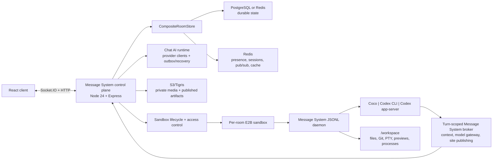

# Message System

[在线应用](https://ai-chat.wenlin.dev/) · [English](./README.md)

Message System 是一个以共享房间和可持续工作的沙盒化 Code Agent 工作区为核心的实时 AI 协作平台。人类和多种 Agent backend 可以在同一个房间中协作；Message System 统一负责身份、权限、持久化 transcript、工作区访问、产物和故障恢复。

仓库包含 React/Vite 客户端、Node/Express/Socket.IO control plane，以及打包进固定 E2B sandbox artifact 的 Python JSONL runner。

## 核心能力

### 共享 AI 协作

- 实时房间、邀请链接、密码、成员角色、管理员、所有权转移、发言时间段、收藏房间和多客户端在线状态。
- 跨 Anthropic、OpenAI、DeepSeek 和 OpenRouter 兼容模型的 provider-neutral AI 流式运行时，支持角色/上下文控制、usage/cost 计费、中断流恢复和 A2UI 界面。
- 文本、私有媒体、贴纸、回复、编辑、reaction、语音转写、Web Push、Google 登录，以及中英印日韩五种 UI 语言。
- 针对移动端重连、BFCache 恢复、键盘 viewport、room-version 顺序和 read-your-write 房间更新的可靠性保护。

### 沙盒化 Code Agent 房间

- 每个 Code Agent 房间拥有一个共享 E2B 工作区；Coco、Codex CLI 和 Codex app-server 统一接入 Message System turn 协议。
- 沙盒内可复用的 JSONL daemon 顺序执行 turn、流式输出文本/工具/model-step 事件、接收 interrupt/steer 控制，并在沙盒或服务退出时回收。
- Plan、Edit、Approve for me、Full access 四种权限模式。Plan 使用操作系统强制的只读 Shell；可写模式可以修改 workspace 和运行后台任务。
- 每个 turn 独立签发 model gateway、room context 和 static publish 凭据。Provider key 与 Message System 服务端 secret 不进入浏览器和 Agent prompt。
- Agent 可通过沙盒内 `message-system` CLI 按需读取有界历史、增量、单条消息、搜索结果和已发布站点。
- AI/工具消息按真实执行顺序持久化并按 turn 分组，同时支持图片输入、model-step usage、排队 prompt、运行中 steer、interrupt、retry 和审批事件。

### 浏览器工作区

- 文件树与搜索、源码编辑、图片/Markdown/媒体预览、workspace asset 读取和 panel 状态保存。
- Git changed-files tree、branch/base-ref 选择、unified/split diff、viewed 状态，以及可附加到下一轮 Agent prompt 的行级 review comment。
- 基于认证 Socket.IO session 的交互式 PTY terminal，包含 resize、输入缓冲、本地 echo 和有界输出 snapshot。
- Workspace 文件和已探测 dev server 的内嵌浏览器预览、响应式 viewport、截图、录屏和 preview server 状态。
- 将静态站点持久发布到 Message System 对象存储。E2B 暂停或替换后 URL 仍可访问，并显示在 workspace 的 Artifacts 视图中。
- Idle/active sandbox TTL、重连与 stale state 恢复、全局/用户级配额、Git baseline 初始化，以及固定 artifact 升级时的 archive workspace migration。

## 架构



系统边界是刻意设计的：

- **Message System control plane**：拥有房间、成员、权限、消息/turn 持久化、scoped credential、sandbox lifecycle、对象存储和浏览器 API。
- **E2B execution plane**：在 `/workspace` 中承载不可信文件、进程、terminal、dev server 和 Agent 执行。
- **Agent backend**：拥有推理和原生工具循环，通过窄 JSONL/CLI 合约使用 Message System 能力，不接触数据库或基础设施凭据。

完整 turn 流程、安全模型、workspace surface、持久化边界和发布流程见 [Code Agent 运行时架构](docs/code-agent-runtime-architecture.md)。

## 仓库结构

```text
client-heroui/                    React + TypeScript + Vite 客户端
server/src/                       Express/Socket.IO control plane
server/message-system_code_agent_runner Python runner、daemon、backend 和 Message System CLI
ops/code-agent-sandbox/           固定 E2B artifact 定义与 lock
scripts/code-agent/               artifact context 准备脚本
docs/                             架构、runbook、方案和复盘
output/resume-overleaf/           简历源文件与 PDF
```

## 快速开始

环境要求：

- Node.js 24.18.0 或更高版本。
- 本地 Redis 运行在 `localhost:6379`。
- 可选 PostgreSQL 测试库，用于 PostgreSQL 模式 smoke/E2E。
- 真实 Code Agent 房间还需要 E2B 凭据和固定 template 配置。

安装依赖并创建本地配置：

```bash
cd server && npm install
cd ../client-heroui && npm install
cp ../server/.env.example ../server/.env
```

启动前后端：

```bash
./start.sh
```

客户端地址为 [http://localhost:3011](http://localhost:3011)，服务端地址为 `http://localhost:3012`。

手动开发：

```bash
cd server && npm run dev
cd client-heroui && npm run dev
```

## 常用命令

服务端：

```bash
cd server
npm run build
npm test
npm run smoke:persistence
npm run smoke:code-agent:e2b
npm run smoke:codex:e2b
npm run migrate:redis-to-postgres
npm run migrate:media-to-object-storage
```

客户端：

```bash
cd client-heroui
npm run lint
npm run check:i18n
npm test
npm run build
npm run test:e2e
npm run test:e2e:postgres
```

## 配置

通用后端配置以 `server/.env.example` 为起点。主要分组如下：

| 范围 | 示例 |
| --- | --- |
| HTTP 与 origin | `PORT`、`CLIENT_URL`、`CLIENT_URLS`、`NODE_ENV` |
| 持久/实时存储 | `PERSISTENCE_STORE`、`DATABASE_URL`、`REDIS_URL`、PostgreSQL TLS、message cache TTL |
| 普通 Chat AI | Provider API key、默认模型、OpenRouter 路由 metadata |
| 媒体与 artifact | S3/Tigris bucket、endpoint、region 和 AWS 兼容凭据 |
| 可选服务 | Google OAuth、AssemblyAI、Web Push VAPID |
| Code Agent control plane | Backend allowlist、E2B template/artifact pin、TTL/配额、model gateway 与 publish token secret |

只有浏览器可公开的值才能放入 `VITE_*`。Code Agent provider key、model-gateway token、room-context token 和 static-publish token 都不能暴露给客户端。

生产 Code Agent 房间使用固定 E2B artifact。Runner、工具、prompt、Dockerfile 或 Code Agent engine 发生变化时，必须 bump artifact version、构建新 E2B template、同步生产 pin，并执行 E2B smoke。详见 [Code Agent sandbox artifact](docs/code-agent-sandbox-artifact.md)。

## 持久化与对象存储

`CompositeRoomStore` 分离持久与实时职责：

- PostgreSQL 或 Redis 保存房间、消息、成员、认证、媒体 metadata、AI run、Code Agent turn 和 sandbox metadata。
- Redis 始终负责 presence、socket session、pub/sub，以及可选的 PostgreSQL 消息短 TTL 缓存。
- S3/Tigris 兼容存储保存私有媒体和版本化静态站点 artifact；开发环境可使用本地对象存储实现。

迁移和上线参考：

- [PostgreSQL 上线 runbook](docs/postgres-rollout-runbook.md)
- [PostgreSQL 迁移总结](docs/postgres-migration-development-summary.zh.md)
- [媒体对象存储迁移](docs/image-object-storage-migration-runbook.md)
- [静态发布实现](docs/code-agent-static-publish-implementation.md)

## 测试

仓库采用分层验证：

- Node test runner 覆盖 service、protocol、store、socket handler、E2B adapter、lifecycle、model gateway 和 static publishing。
- Vitest + Testing Library 覆盖客户端状态、消息、workspace 文件/diff/review、terminal、browser preview、queue control 和响应式 view。
- Playwright 覆盖桌面/移动端房间流程、恢复、多客户端实时行为、媒体、AI 和 PostgreSQL parity。
- 真实 E2B smoke 覆盖固定 artifact metadata、daemon health、Coco/Codex 执行、权限、context access、发布和 workspace 行为。

修改后先运行同目录 focused test，发布前再跑两端 production build。

## 部署

`master` 是 release branch。`.github/workflows/fly-deploy.yml` 按计划运行或手动 dispatch，检查 `master` 是否比最近成功版本有新提交，随后构建两端、校验翻译与 secret，并部署到 Fly.io。不要手动执行 `fly deploy`。

生产使用 Fly.io 承载 Node control plane、Supabase PostgreSQL、Upstash Redis、Tigris 对象存储，以及 E2B 的每房间 execution sandbox。

## 文档地图

- [Code Agent 运行时架构](docs/code-agent-runtime-architecture.md)：当前端到端设计与职责边界。
- [Code Agent sandbox artifact](docs/code-agent-sandbox-artifact.md)：固定 artifact 的构建与上线合约。
- [Room context CLI 设计](docs/codex-room-context-cli-design.zh.md)：broker 历史/搜索访问与 Plan 模式隔离。
- [静态发布实现](docs/code-agent-static-publish-implementation.md)：持久 artifact pipeline 与 Message System CLI。
- [Sandbox daemon 方案](docs/sandbox-daemon-plan.md)：daemon 协议和迁移动机。
- [PostgreSQL 上线 runbook](docs/postgres-rollout-runbook.md)：durable store 生产切换。
- [房间可靠性](docs/room-reliability/README.zh.md)：恢复、顺序和多客户端一致性。
- [CLAUDE.md](CLAUDE.md)：贡献与 release 规范。

`docs/` 中部分文件是历史方案或复盘。当前操作应以架构文档、runbook、本 README 和源码为准。

## 许可证

MIT。
