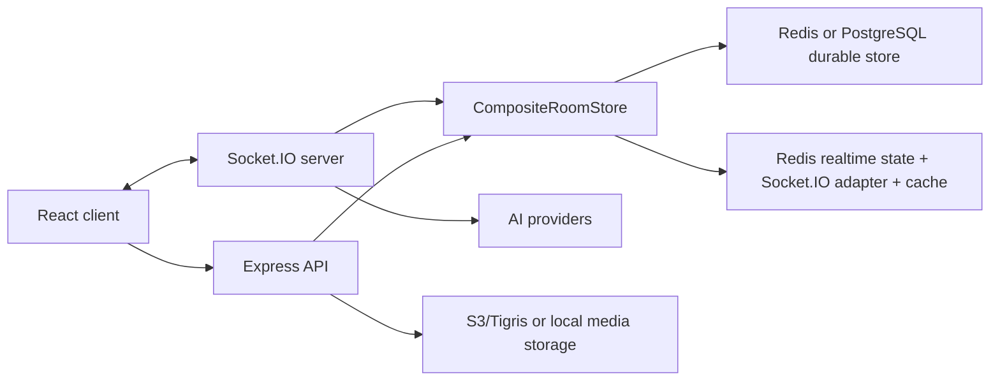

# Message System

[English Version](./README.md)

Message System 是一个实时房间聊天系统，包含 AI 助手、私有媒体、贴纸、房间管理、已保存房间、移动端恢复，以及可选 PostgreSQL 持久化。仓库由 React/Vite 客户端和 Node/Express/Socket.IO 服务端组成。

## 当前能力

- 创建房间、按 ID/链接加入、保存房间、重命名/删除房间、成员角色、管理员、所有权转移、密码房和发言时间段。
- 文本、AI、媒体、贴纸、引用回复、编辑、删除和清空历史消息。
- AI 流式回复，按模型提供方接入 DeepSeek、Anthropic、OpenAI 和 OpenRouter 路由模型。
- AI 角色预设、模型选择、高价模型二次确认、usage/cost 元数据、重试、编辑后追问，以及 A2UI 流式界面。
- 通过 S3 兼容存储私有上传/下载媒体；开发环境支持本地媒体兜底；支持媒体历史、图片/视频/音频和移动端媒体查看手势。
- 配置 AssemblyAI 后支持语音转写。
- Google 登录关联、client 密码保护、token 化 socket 注册，以及可选 Web Push 通知。
- English、中文、हिन्दी、日本語、한국어 多语言。
- 移动端可靠性：当前房间恢复、重连处理、成员数恢复、键盘视口修复和移动端 E2E。

## 仓库结构

```text
client-heroui/     React + TypeScript + Vite 前端
server/            Express + Socket.IO TypeScript 后端
docs/              Runbook、设计记录、迁移记录、可靠性复盘
Dockerfile         Fly.io 使用的生产镜像构建
fly.toml           Fly.io 应用配置
start.sh           本地启动脚本：服务端 3012，客户端 3011
CLAUDE.md          Agent/开发指南；AGENTS.md 是它的符号链接
```

## 架构



服务端使用 `CompositeRoomStore`：

- Durable store：默认 Redis，也可用 `PERSISTENCE_STORE=postgres` 切到 PostgreSQL。
- Realtime store：Redis 保存 socket session、在线成员和 Socket.IO adapter 状态。
- Message cache：PostgreSQL 模式下用 Redis 短 TTL 缓存消息读取。

客户端以 `MessagePage` 为状态编排中心，`src/components` 放 UI，`src/utils` 放 socket/API/i18n/localStorage/domain helper，`src/hooks` 放房间与消息同步逻辑。

## 快速开始

环境要求：

- 推荐 Node.js 24.18.0 LTS。
- 本地 Redis 运行在 `localhost:6379`。
- 可选：用于 PostgreSQL smoke/E2E 的测试数据库。

安装依赖：

```bash
cd server && npm install
cd ../client-heroui && npm install
```

创建本地服务端配置：

```bash
cp server/.env.example server/.env
```

默认 AI 模型需要 `DEEPSEEK_API_KEY`。OpenRouter 路由模型和 AI 角色草稿生成需要 `OPENROUTER_API_KEY`。

一键启动：

```bash
./start.sh
```

手动开发模式：

```bash
cd server
npm run dev

cd ../client-heroui
npm run dev
```

访问 [http://localhost:3011](http://localhost:3011)。

## 常用命令

服务端：

```bash
cd server
npm run dev                         # ts-node-dev 开发服务
npm run build                       # TypeScript 构建
npm start                           # 运行 dist/src/server.js
npm test                            # Node test runner 跑 src/**/*.test.ts
npm run migrate:redis-to-postgres   # Redis -> PostgreSQL 持久化迁移
npm run smoke:persistence           # 安全的本地持久化 smoke
```

客户端：

```bash
cd client-heroui
npm run dev                 # Vite 开发服务
npm test                    # Vitest 单元/组件测试
npm run lint                # ESLint
npm run check:i18n          # 检查翻译 key
npm run build               # i18n + TypeScript + Vite build
npm run test:e2e            # Redis 模式 Playwright E2E
npm run test:e2e:postgres   # PostgreSQL 模式 Playwright E2E
```

## 配置

后端配置以 `server/.env.example` 为准。重要分组：

| 范围 | 变量 |
| --- | --- |
| HTTP/CORS | `PORT`, `CLIENT_URL`, `CLIENT_URLS`, `NODE_ENV` |
| Redis | `REDIS_URL` |
| PostgreSQL 模式 | `PERSISTENCE_STORE`, `DATABASE_URL`, `POSTGRES_SSL`, `POSTGRES_SSL_REJECT_UNAUTHORIZED`, `POSTGRES_SSL_CA_BASE64`, `POSTGRES_SSL_CA`, `ROOM_MESSAGES_CACHE_TTL_SECONDS` |
| AI | `AI_MODEL`, `AI_MODEL_OPTIONS`, `DEEPSEEK_API_KEY`, `ANTHROPIC_API_KEY`, `OPENAI_API_KEY`, `OPENROUTER_API_KEY`, `OPENROUTER_BASE_URL`, `OPENROUTER_HTTP_REFERER`, `OPENROUTER_APP_NAME` |
| 媒体存储 | `MEDIA_BUCKET_NAME`, `MEDIA_STORAGE_REGION`, `MEDIA_STORAGE_ENDPOINT`, `MEDIA_STORAGE_FORCE_PATH_STYLE`, `AWS_ACCESS_KEY_ID`, `AWS_SECRET_ACCESS_KEY` |
| 可选服务 | `ASSEMBLYAI_API_KEY`, `GOOGLE_CLIENT_ID`, `GOOGLE_CLIENT_IDS`, `WEB_PUSH_VAPID_PUBLIC_KEY`, `WEB_PUSH_VAPID_PRIVATE_KEY`, `WEB_PUSH_SUBJECT` |

前端配置：

- `client-heroui/.env.development`：本地 `VITE_SOCKET_URL` 和公开 Google Client ID。
- `client-heroui/.env.production`：Fly 同域部署使用 `VITE_SOCKET_URL=/`。

`CLIENT_URL` 用作主要公开客户端地址。生产环境需要多个域名同时可用时，用 `CLIENT_URLS` 配置逗号分隔的 origin 白名单，例如 `https://room.ruit.me,https://ai-chat.wenlin.dev`。

只有浏览器可公开的值才应放入 `VITE_*`。

## 持久化与迁移

Redis 是默认本地 durable store。PostgreSQL 模式下，PostgreSQL 是持久事实来源，Redis 继续负责实时状态、Socket.IO 扩展和短 TTL 消息缓存。

Redis 到 PostgreSQL 切换：

```bash
cd server
REDIS_URL="redis://..." npm run migrate:redis-to-postgres -- --dry-run
REDIS_URL="redis://..." DATABASE_URL="postgres://..." npm run migrate:redis-to-postgres
```

最终迁移应在写入冻结或维护窗口内执行，然后设置：

```bash
fly secrets set PERSISTENCE_STORE="postgres"
fly secrets set DATABASE_URL="postgres://..."
fly secrets set POSTGRES_SSL="true"
```

只要保留 Redis durable 数据，回滚就是配置切换：

```bash
fly secrets set PERSISTENCE_STORE="redis"
```

完整清单见 [docs/postgres-rollout-runbook.md](docs/postgres-rollout-runbook.md)。

持久化 smoke 有安全保护：

```bash
cd server
npm run smoke:persistence
TEST_DATABASE_URL="postgres://localhost/message_system_test" npm run smoke:persistence
```

PostgreSQL smoke 数据库名必须包含独立的 `test` 或 `e2e` token。

## 媒体存储

新媒体上传通过 `MEDIA_*` 和 AWS 凭据变量写入私有 S3 兼容对象存储。未配置对象存储时，开发环境可以使用本地对象路由兜底。

Legacy Base64 图片清理可通过 `cd server && npm run migrate:media-to-object-storage` 执行。默认是 dry-run，会在内存中把候选图片转为 lossless WebP；只有显式 `--execute` 并提供已验证备份文件后，才会上传对象并更新 PostgreSQL。详见 [docs/image-object-storage-migration-runbook.md](docs/image-object-storage-migration-runbook.md)。

## 部署

生产部署以 CI 为主：

- 推送到 `master` 会触发 `.github/workflows/fly-deploy.yml`。
- CI 安装依赖、构建服务端/客户端、检查翻译、校验 Fly secrets，然后执行 `flyctl deploy --remote-only`。
- Fly 应用名为 `message-system`，区域 `dfw`，Node 24.18.0 Alpine Docker 镜像，512 MB VM。

生产通常需要 Redis、PostgreSQL、S3/Tigris 兼容媒体存储、AI provider key 和 Google OAuth。AssemblyAI 与 Web Push VAPID key 是可选服务。

英文部署指南：[DeploymentGuide.md](DeploymentGuide.md)。中文部署指南：[部署指南.md](部署指南.md)。

## 测试覆盖

测试体系包括：

- 服务端 Node test runner：单元、socket、repository、API 测试。
- 客户端 Vitest + Testing Library：组件和工具函数测试。
- Playwright E2E：房间、消息、AI/媒体/分享、移动端核心链路、房间恢复、多客户端实时同步和 PostgreSQL 持久化。
- 客户端 build 中的 i18n key 检查。

窄改动优先在改动代码旁边加 focused test。用户可见行为用 Playwright，持久化模式回归用 PostgreSQL E2E。

## 文档地图

- [CLAUDE.md](CLAUDE.md)：精简的 contributor/agent 操作指南。
- [docs/postgres-rollout-runbook.md](docs/postgres-rollout-runbook.md)：生产 PostgreSQL 切换清单。
- [docs/postgres-migration-development-summary.zh.md](docs/postgres-migration-development-summary.zh.md)：PostgreSQL 迁移历史复盘。
- [docs/migration-completion-audit.md](docs/migration-completion-audit.md)：当前迁移完成证据和剩余外部 gate。
- [docs/room-reliability/README.zh.md](docs/room-reliability/README.zh.md)：房间恢复和房间更新可靠性系列入口。
- [docs/media-viewer-gesture-requirements.md](docs/media-viewer-gesture-requirements.md)：当前媒体查看器手势需求。
- [docs/mobile-keyboard-viewport-fix.zh.md](docs/mobile-keyboard-viewport-fix.zh.md)：iOS 键盘视口修复记录。

`docs/` 中部分文件是历史计划或复盘。日常操作以 runbook 和本 README 为入口。

## 许可证

MIT。
