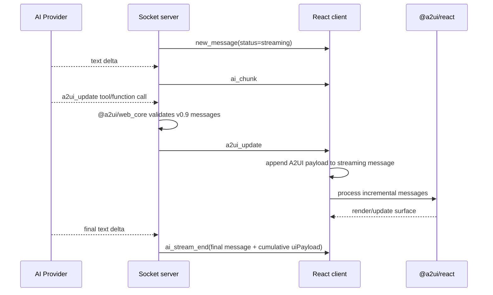
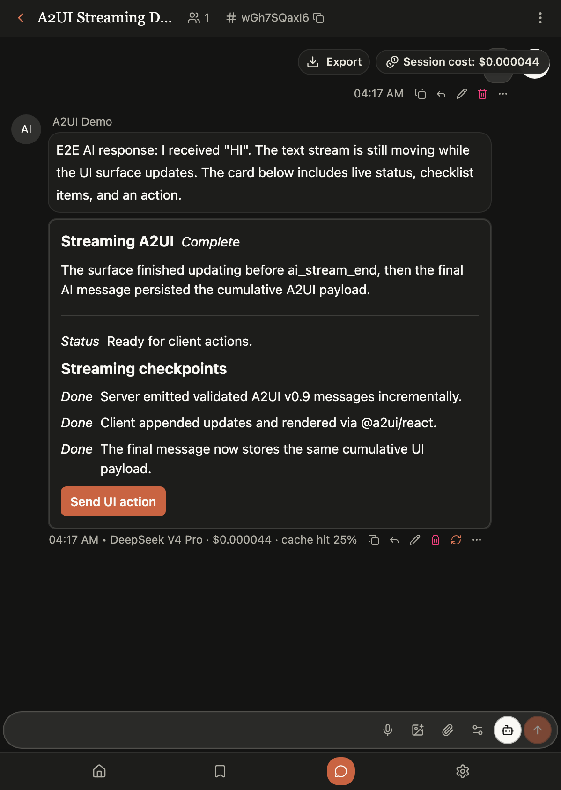

# A2UI 流式渲染接入记录

## 目标

在现有 AI 消息流里接入 A2UI，让 LLM 可以通过结构化 tool/function call 逐步推送 UI 更新，而不是等 `ai_stream_end` 之后再统一水合。

本次实现覆盖：

- 服务端使用官方 `@a2ui/web_core` v0.9 schema 校验 A2UI 消息。
- 客户端使用官方 `@a2ui/react` v0.9 renderer 渲染 surface。
- 当前开放官方 v0.9 basic catalog 全量组件：`Text`、`Image`、`Icon`、`Video`、`AudioPlayer`、`Row`、`Column`、`List`、`Card`、`Tabs`、`Modal`、`Divider`、`Button`、`TextField`、`CheckBox`、`ChoicePicker`、`Slider`、`DateTimeInput`。
- OpenAI-compatible provider 通过 `tool_calls` 流式收集 `a2ui_update`。
- Anthropic provider 通过 `tool_use` 收集 `a2ui_update`。
- fake E2E AI 在流式文本过程中发送多次 `a2ui_update`，用于本地稳定演示。
- 新增默认 AI Role：`A2UI Demo`。真实 provider 下用户发送 `HI` 时会被 system prompt 明确要求触发 A2UI demo。

## 设计取舍（Why）

这几条是回头看代码时最容易忘记动机的地方，单独记录：

- **为什么用 prompt-first，而不是严格 structured output / strict function schema。**
  A2UI 协议本身在 v0.9 从 “Structured Output First” 改成了 “Prompt First”：schema 直接嵌进 system prompt 让模型自然生成，而不是靠 strict JSON 模式强约束。v0.8 那种深层嵌套 wrapper “proved confusing for an LLM to generate”。所以我们的 tool schema 是**描述性引导**（`additionalProperties: true`、18 个组件共用一个组件 schema），真正的强制发生在服务端校验，而不是 API 层 strict。参考 A2UI evolution guide v0.8→v0.9。

- **为什么需要 normalizer（`a2uiPayload.ts` 的 `normalizeA2UIAliases`）。**
  官方 `@a2ui/web_core` 只提供 “校验即拒绝” 的 Zod schema，没有任何容错/归一化 API。但我们的消息是 LLM 生成的，常见错误（`type`→`component`、`content`→`text`、`MultipleChoice`→`ChoicePicker`、moustache `{{x}}`→`{path}`、内联子对象→id 引用、`data`→`value`）如果直接进严格校验会被大量拒绝。normalizer 是 “LLM 输出 → 严格协议” 之间的适配层，这正是官方推荐的 “生成后修复 + 校验” 模式的增强版。

- **为什么 prompt 里的组件清单/示例由 `A2UI_COMPONENT_CATALOG` 生成（`a2uiTools.ts`）。**
  对应官方 Python SDK 的 `A2uiSchemaManager.generate_system_prompt()`（从 catalog 抽取每个组件示例注入 prompt）。JS 版 `web_core` 没有这个 API，所以用 TS 在本地维护一份单一来源的目录，由 `buildA2UIComponentGuide()` 生成 prompt，避免 few-shot 与实际校验的 v0.9 catalog 漂移。`a2uiTools.test.ts` 断言每个 `A2UI_BASIC_COMPONENT_NAMES` 都有目录条目。

- **为什么交互回灌由模型自己决定（follow-up 接线）。**
  组件的 `action` 点击会上报，但不是每个点击都该触发下一轮对话。我们让模型在它想要 “点击→继续对话” 的那些 action 上显式写 `context.followUp = true`（见 `A2UI_FOLLOW_UP_CONTEXT_KEY`）。服务端只有看到该标记才会起新的一轮 AI（`aiHandlers.ts` 的第二个 `a2ui_action` 监听器）。输入类组件（ChoicePicker/TextField/Slider…）本身不发事件、只写 data model，所以客户端在上报 follow-up 时会带上该 surface 的 data model 快照，否则模型不知道用户选了/填了什么。

- **为什么 `ui_payload` 要显式列进 `MESSAGE_COLUMNS`（`postgresStore.ts`）。**
  曾经写入了但读取的 `SELECT` 列清单漏了它，导致流式时能看到 UI（来自 `ai_stream_end` 内存事件），但关闭房间重进、走 `get_room_messages` 从 Postgres 读时 `ui_payload` 永远 undefined，UI 丢失。Redis 路径整条 `JSON.stringify` 不受影响，所以只在生产（Supabase/Postgres）复现。

## 事件流

## 关键实现

- `server/src/services/a2uiPayload.ts`
  - 动态加载 `@a2ui/web_core/v0_9`。
  - 校验 `createSurface` / `updateComponents` / `updateDataModel` 等 server-to-client messages。
  - 限制消息数量和 payload 体积，拒绝 markdown fence 里的伪 JSON。

- `server/src/services/a2uiTools.ts`
  - 定义统一 tool 名：`a2ui_update`。
  - 为 OpenAI-compatible Chat Completions 提供 function tool schema。
  - 为 Anthropic Messages 提供 `input_schema` tool。
  - 将 A2UI 使用规则注入 system prompt，包括 demo Role 的 `HI` 触发规则。
  - prompt 明确只允许官方 basic catalog 全量组件，并使用当前 v0.9 的 `ChoicePicker` 名称，避免模型生成旧的 `MultipleChoice`。

- `server/src/socket/aiHandlers.ts`
  - fake AI：4 个 text chunk 期间发送 5 个 A2UI message batch。
  - OpenAI-compatible：边读 `delta.content` 边缓存 `delta.tool_calls[*].function.arguments`，完整 tool call 到达后立刻 emit `a2ui_update`，再追加 tool result 继续下一轮。
  - Anthropic：处理 `tool_use` block，emit 后追加 `tool_result` 继续下一轮。
  - final message 持久化累计后的 `uiPayload`，历史消息恢复时仍能渲染同一个 surface。

- `client-heroui/src/components/A2UIRenderer.tsx`
  - 使用 `MessageProcessor([basicCatalog])` 处理增量 message。
  - 使用 `A2uiSurface` 渲染官方 basic catalog。
  - 使用 `@a2ui/markdown-it` 渲染 A2UI Text 内部 markdown，并保留 DOMPurify 清洗。
  - 前端不手写每个组件；官方 `basicCatalog` 已包含 basic catalog 的原生 React 实现。

- `client-heroui/src/components/A2UIRenderer.css`
  - 覆盖 A2UI CSS variables，使官方组件适配当前浅色/暗色主题。
  - 修复暗色模式下白底白字问题。

- `client-heroui/src/utils/aiRoles.ts`
  - 新增默认 `A2UI Demo` Role。
  - 对已有 localStorage 角色做一次性默认角色迁移，让老用户也能看到新 Role，但用户删除后不会反复被加回。

## 本地演示

当前 dev server：

- Client: `http://127.0.0.1:3021/`
- Server: `http://127.0.0.1:3022/`

推荐手动验证：

1. 进入任意房间。
2. 在 AI 设置中选择 `A2UI Demo`。
3. 输入 `HI` 并触发 AI。
4. 观察 AI 文本仍在流式输出时，A2UI card 已经出现并继续更新。
5. 点击 `Send UI action`，服务端会收到并广播 `a2ui_action`。

## 截图

暗色模式下的流式 A2UI card：

截图验证点：

- A2UI card 背景为暗色 `rgb(29, 29, 27)`。
- A2UI 文本为浅色 `rgb(250, 249, 245)`。
- Button 为项目主色橙色。
- `Complete` / `Status` / `Done` 由官方 markdown renderer 正常渲染 emphasis，不再显示裸 `*...*`。

## 测试

已覆盖：

- `server/src/services/a2uiPayload.test.ts`
  - 官方 v0.9 schema 校验。
  - wrapper normalization。
  - invalid payload rejection。

- `server/src/socket/aiHandlers.test.ts`
  - fake E2E AI 在 `ai_stream_end` 前发送多次 `a2ui_update`。
  - OpenAI-compatible tool calls 在 stream end 前 emit A2UI。
  - Anthropic `tool_use` 在 stream end 前 emit A2UI。

- `client-heroui/src/components/A2UIRenderer.test.tsx`
  - 官方 A2UI components 渲染。
  - A2UI client action 回传 room/message context。

- `client-heroui/src/utils/aiRoles.test.ts`
  - 默认 A2UI Demo Role 翻译。
  - 老用户默认 Role 一次性迁移。
