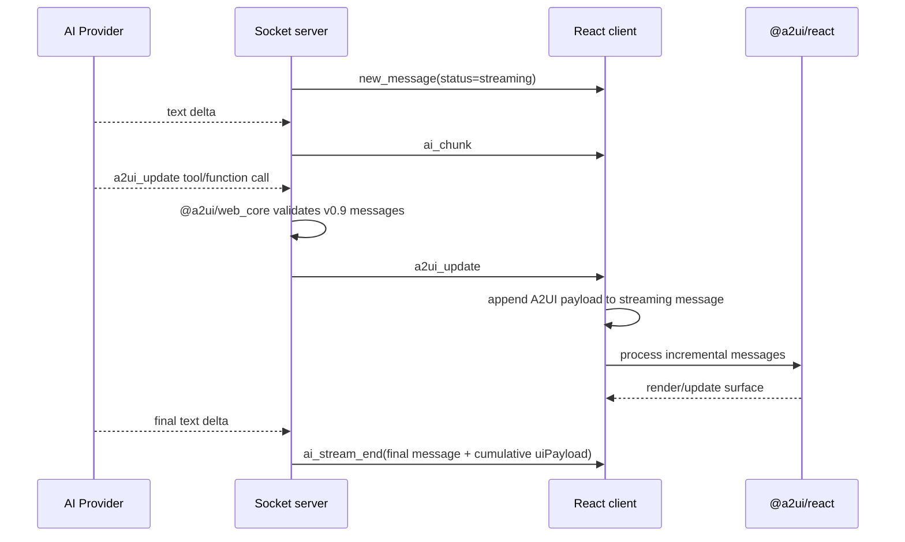

# A2UI 流式渲染接入记录

## 目标

在现有 AI 消息流里接入 A2UI，让 LLM 可以通过结构化 tool/function call 逐步推送 UI 更新，而不是等 `ai_stream_end` 之后再统一水合。

本次实现覆盖：

- 服务端使用官方 `@a2ui/web_core` v0.9 schema 校验 A2UI 消息。
- 客户端使用官方 `@a2ui/react` v0.9 renderer 渲染 surface。
- 当前开放官方 v0.9 basic catalog 全量组件：`Text`、`Image`、`Icon`、`Video`、`AudioPlayer`、`Row`、`Column`、`List`、`Card`、`Tabs`、`Modal`、`Divider`、`Button`、`TextField`、`CheckBox`、`ChoicePicker`、`Slider`、`DateTimeInput`。
- OpenAI-compatible provider 通过 `tool_calls` 流式收集 `a2ui_update`。
- Anthropic provider 通过 `tool_use` 收集 `a2ui_update`。
- fake E2E AI 在流式文本过程中发送多次 `a2ui_update`，用于本地稳定演示。
- 新增默认 AI Role：`A2UI Demo`。真实 provider 下用户发送 `HI` 时会被 system prompt 明确要求触发 A2UI demo。

## 事件流

## 关键实现

- `server/src/services/a2uiPayload.ts`
  - 动态加载 `@a2ui/web_core/v0_9`。
  - 校验 `createSurface` / `updateComponents` / `updateDataModel` 等 server-to-client messages。
  - 限制消息数量和 payload 体积，拒绝 markdown fence 里的伪 JSON。

- `server/src/services/a2uiTools.ts`
  - 定义统一 tool 名：`a2ui_update`。
  - 为 OpenAI-compatible Chat Completions 提供 function tool schema。
  - 为 Anthropic Messages 提供 `input_schema` tool。
  - 将 A2UI 使用规则注入 system prompt，包括 demo Role 的 `HI` 触发规则。
  - prompt 明确只允许官方 basic catalog 全量组件，并使用当前 v0.9 的 `ChoicePicker` 名称，避免模型生成旧的 `MultipleChoice`。

- `server/src/socket/aiHandlers.ts`
  - fake AI：4 个 text chunk 期间发送 5 个 A2UI message batch。
  - OpenAI-compatible：边读 `delta.content` 边缓存 `delta.tool_calls[*].function.arguments`，完整 tool call 到达后立刻 emit `a2ui_update`，再追加 tool result 继续下一轮。
  - Anthropic：处理 `tool_use` block，emit 后追加 `tool_result` 继续下一轮。
  - final message 持久化累计后的 `uiPayload`，历史消息恢复时仍能渲染同一个 surface。

- `client-heroui/src/components/A2UIRenderer.tsx`
  - 使用 `MessageProcessor([basicCatalog])` 处理增量 message。
  - 使用 `A2uiSurface` 渲染官方 basic catalog。
  - 使用 `@a2ui/markdown-it` 渲染 A2UI Text 内部 markdown，并保留 DOMPurify 清洗。
  - 前端不手写每个组件；官方 `basicCatalog` 已包含 basic catalog 的原生 React 实现。

- `client-heroui/src/components/A2UIRenderer.css`
  - 覆盖 A2UI CSS variables，使官方组件适配当前浅色/暗色主题。
  - 修复暗色模式下白底白字问题。

- `client-heroui/src/utils/aiRoles.ts`
  - 新增默认 `A2UI Demo` Role。
  - 对已有 localStorage 角色做一次性默认角色迁移，让老用户也能看到新 Role，但用户删除后不会反复被加回。

## 本地演示

当前 dev server：

- Client: `http://127.0.0.1:3021/`
- Server: `http://127.0.0.1:3022/`

推荐手动验证：

1. 进入任意房间。
2. 在 AI 设置中选择 `A2UI Demo`。
3. 输入 `HI` 并触发 AI。
4. 观察 AI 文本仍在流式输出时，A2UI card 已经出现并继续更新。
5. 点击 `Send UI action`，服务端会收到并广播 `a2ui_action`。

## 截图

暗色模式下的流式 A2UI card：

截图验证点：

- A2UI card 背景为暗色 `rgb(29, 29, 27)`。
- A2UI 文本为浅色 `rgb(250, 249, 245)`。
- Button 为项目主色橙色。
- `Complete` / `Status` / `Done` 由官方 markdown renderer 正常渲染 emphasis，不再显示裸 `*...*`。

## 测试

已覆盖：

- `server/src/services/a2uiPayload.test.ts`
  - 官方 v0.9 schema 校验。
  - wrapper normalization。
  - invalid payload rejection。

- `server/src/socket/aiHandlers.test.ts`
  - fake E2E AI 在 `ai_stream_end` 前发送多次 `a2ui_update`。
  - OpenAI-compatible tool calls 在 stream end 前 emit A2UI。
  - Anthropic `tool_use` 在 stream end 前 emit A2UI。

- `client-heroui/src/components/A2UIRenderer.test.tsx`
  - 官方 A2UI components 渲染。
  - A2UI client action 回传 room/message context。

- `client-heroui/src/utils/aiRoles.test.ts`
  - 默认 A2UI Demo Role 翻译。
  - 老用户默认 Role 一次性迁移。
