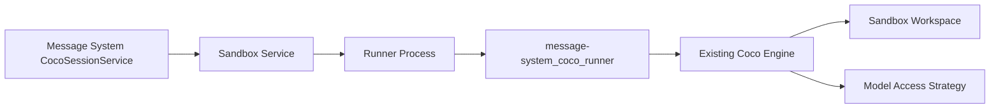

# Coco Phase 6 Real Runner Plan

## Goal

Run the existing Coco coding assistant inside the file/process sandbox. Message System must not reimplement Coco's agent loop. Message System only owns:

- room and permission checks
- sandbox lifecycle
- JSONL runner protocol
- persistence and UI replay
- feature flags and rollout safety

Coco owns:

- model/tool loop
- tool execution semantics
- permissions mode behavior
- session/context management

## Current Coco Capability Check

Local Coco source:

```text
/Users/sky/projects/coco
```

Relevant public APIs:

- `core.engine.Engine.run(...)`
  - accepts `on_text_chunk`
  - accepts `on_tool_call`
  - returns `EngineResult.answer`, `tool_log`, `usage`, and full internal `messages`
- `core.permissions.PermissionChecker`
  - supports `default`, `acceptEdits`, and `plan`
- `core.tools`
  - provides Read, Glob, Grep, Write, Edit, Shell

Known gap:

- Coco does not currently expose a real-time `on_tool_result` callback. Phase 6 MVP will emit text chunks live, then emit tool_call/tool_result events by replaying `EngineResult.messages` after the engine returns. A later Coco-side hook can make tool results live without changing the Message System protocol.
- Replayed tool_call/tool_result events must be emitted before the terminal `final` event. `final` always means no more events for that turn.
- A runner process/session that exits successfully without emitting `final` is still a protocol error and must be converted to an `error` event.

## Architecture Decision

Use a JSONL runner adapter:



The runner reads one `run` request from stdin and emits JSONL events to stdout. stderr is reserved for diagnostics and must not be parsed as protocol.

Process ownership rule:

- `CocoSandboxService.startRunner(...)` owns creating and stopping the runner process or remote command session.
- `JsonlCocoRunnerClient` must not spawn a second independent process for the same turn.
- For local development, a local sandbox/service may implement `startRunner(...)` by spawning the command locally and returning a process handle with JSONL stdin/stdout.
- For E2B, `startRunner(...)` must return a remote process/session handle that the JSONL client can use.

The implementation phase must refactor the current fake-only boundary before adding the JSONL client:

```ts
runnerClient.run(request, handlers, {
  process: runnerProcess,
  sandbox: sandbox.handle,
})
```

`FakeCocoRunnerClient` may ignore the context. `JsonlCocoRunnerClient` must require it.

## Security Decision

Do not inject long-lived provider keys into a sandbox that has Shell access.

Phase 6 will support two modes:

1. `plan` mode: only Read/Glob/Grep. Can run with direct provider key because Shell/write tools are not exposed.
2. `acceptEdits` mode: requires model proxy or scoped provider key before production enablement.

MVP implementation can keep fake/local direct-key smoke gated behind explicit env vars, but production `COCO_ENABLED=true` with write/Shell capability must require one of:

- Message System model proxy
- short-lived scoped key with budget and redaction

Subprocess environment rule:

- JSONL runner processes must start with an explicit minimal environment, not inherited `process.env`.
- Long-lived provider keys (`ANTHROPIC_API_KEY`, `OPENAI_API_KEY`, `OPENROUTER_API_KEY`, `DEEPSEEK_API_KEY`, etc.) must be absent unless the selected mode is proven Shell-free or the key is scoped/short-lived.
- Tool outputs must be treated as potentially sensitive and redacted before storage when proxy/scoped-key mode is not yet complete.

Allowed path rule:

- Every `allowedPaths` entry is relative to `workspace`.
- The runner must canonicalize `workspace`, each allowed path, and each requested tool path by resolving `..` segments and symlinks before comparison.
- Absolute requested paths are allowed only if their canonical path is under one of the canonical allowed roots.

## Sub-Phases

### Phase 6.1: Runner Adapter Package

Scope:

- Add a Python `message-system_coco_runner` package in the Message System repo.
- Read `CocoRunnerRunRequest` JSONL from stdin.
- Validate schema version and required fields.
- Build Coco `AppSettings`, tools, `PermissionChecker`, and `Engine`.
- Enforce `workspace` and `allowedPaths`.
- Emit protocol events:
  - `status`
  - `text_delta`
  - `tool_call`
  - `tool_result`
  - `final`
  - `error`

Acceptance:

- Python unit tests pass without real provider calls by using a fake Engine/LLM seam.
- Invalid JSON and unsupported schema version emit `error`.
- `plan` mode exposes only Read/Glob/Grep.
- `acceptEdits` exposes write tools only when explicitly allowed.
- Tool result replay preserves tool_use id/name/input/result pairing.
- Allowed paths reject traversal outside workspace.

### Phase 6.2: Node JSONL Runner Client

Scope:

- Add a production `JsonlCocoRunnerClient` implementing `CocoRunnerClient`.
- Extend `CocoRunnerClient.run(...)` to receive the already-started `CocoRunnerProcess` and sandbox handle.
- Use the `CocoRunnerProcess` returned by `CocoSandboxService.startRunner(...)`; do not spawn a second command inside the runner client.
- Parse stdout line-by-line with `parseCocoRunnerEventLine`.
- Treat malformed protocol output and process exit as runner errors.
- Keep `FakeCocoRunnerClient` as the default test/E2E path.

Acceptance:

- Unit tests cover final, error, malformed JSON, process failure, and handler failure.
- Unit tests cover process/session exit 0 with no `final`; it must return an error result.
- Unit tests assert terminal event ordering: replayed `tool_call` and `tool_result` events are delivered before `final`.
- Runner subprocess/session environment is explicit and minimal; inherited provider keys are not passed by default.
- The process lifecycle has one owner; `finally` cleanup stops the same process/session that handled the run.
- Existing CocoSessionService tests still pass.
- Server build passes.

### Phase 6.3: Sandbox Runner Wiring

Scope:

- Select fake vs E2B sandbox service from `COCO_SANDBOX_PROVIDER`.
- Select fake vs JSONL runner client from `COCO_RUNNER_CLIENT`.
- Keep fake runner as E2E default.
- For E2B, run the same JSONL adapter command inside the sandbox image.
- Reject incoherent startup combinations:
  - `fake` sandbox with `jsonl` runner client
  - `e2b` sandbox with `fake` runner client unless explicitly marked as test mode
  - `acceptEdits` or Shell-capable mode without model proxy/scoped-key configuration

Acceptance:

- No E2B key/template: real smoke tests skip cleanly.
- E2B configured before Phase 6.5: only `plan`-mode smoke is allowed. It creates sandbox, runs runner, returns final response, and destroys sandbox without Shell/write tools or long-lived provider keys.
- E2B `acceptEdits` smoke is blocked until Phase 6.5 is complete.
- Sandbox TTL and active sandbox limits remain enforced.
- `COCO_ENABLED=false` blocks backend turns and hides/blocks frontend entry.

### Phase 6.4: Sandbox Image / Artifact

Scope:

- Define a reproducible artifact containing:
  - fixed Coco source/version
  - `message-system_coco_runner`
  - Python dependencies
  - startup command
- Do not depend on the developer workstation path in production.

Acceptance:

- Artifact build instructions are documented.
- Artifact version or source commit is pinned.
- Local smoke can mount `/Users/sky/projects/coco` only for development mode.
- Production config uses the pinned artifact.

Implementation note:

- Artifact details live in `docs/coco-sandbox-artifact.md`.
- The lock file is `ops/coco-sandbox/artifact.lock.json`.
- Python dependencies are pinned and hash-verified in `ops/coco-sandbox/requirements.lock`; the Dockerfile loads fixed Coco and runner source trees through `PYTHONPATH` to avoid implicit build-time dependency downloads.
- The base image is pinned by digest and the runtime user is non-root.
- Production startup validation requires `COCO_ARTIFACT_VERSION` and `COCO_SOURCE_REF` for E2B JSONL mode and rejects `COCO_SOURCE_DIR`.
- Development artifact mode is the only accepted way to use `/Users/sky/projects/coco/src`.

### Phase 6.5: Model Access Strategy

Scope:

- Implement or document the model access strategy before enabling write/Shell mode in production.
- Preferred: Message System model proxy.
- Alternative: scoped key with budget, TTL, and audit logging.

Acceptance:

- Long-lived provider keys are not available to Shell-enabled sandbox processes.
- Tests or documented smoke prove `acceptEdits` production config refuses to start without proxy/scoped-key configuration.
- After this phase, E2B `acceptEdits` smoke may run only through the approved proxy/scoped-key path.

## Commands Per Sub-Phase

Minimum local verification after every sub-phase:

```bash
cd server && npm test && npm run build
cd client-heroui && npm test && npm run lint && npm run check:i18n && npm run build
```

Additional Phase 6 checks:

```bash
pytest server/message-system_coco_runner
cd client-heroui && npx playwright test --list e2e/coco-flows.spec.ts
```

Actual browser E2E and real E2B smoke may require system environment access to local Redis/localhost and external credentials. If the Codex sandbox blocks those, the command, reason, and exact gap must be recorded before moving on.

## Review Rule

After each implementation sub-phase:

1. Run verification.
2. Call Claude Code Opus 4.7 in read-only mode.
3. Fix blocking/high findings.
4. Commit that sub-phase.
5. Continue to the next sub-phase.
