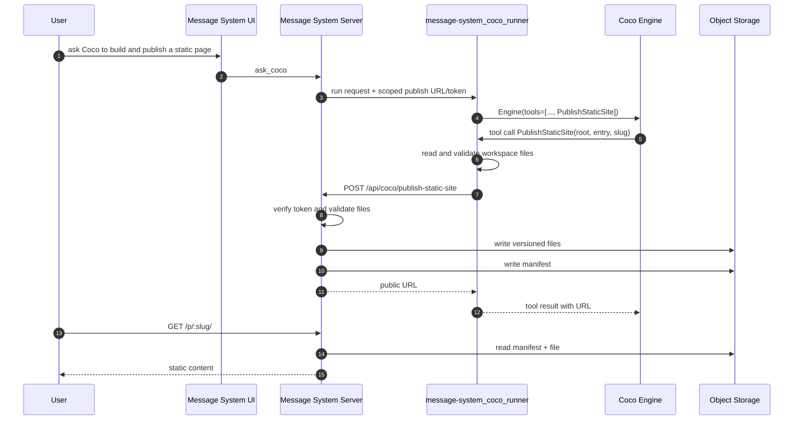

# Coco Static Publish Implementation

Date: 2026-06-30

## Architecture



## Components

### 1. `PublishedStaticSiteService`

New service under `server/src/services/publishedStaticSite.ts`.

Responsibilities:

- Issue and verify HMAC-signed scoped publish tokens.
- Validate publish payloads.
- Sanitize and reserve slugs.
- Write files to `MediaObjectStorage`.
- Write a manifest at `published-sites/<slug>/manifest.json`.
- Read a manifest and resolve request paths for serving.

Object layout:

```text
published-sites/
  <slug>/
    manifest.json
    versions/
      <versionId>/
        index.html
        assets/app.js
        assets/style.css
```

Manifest shape:

```json
{
  "schemaVersion": 1,
  "slug": "message-system-demo",
  "roomId": "room-1",
  "clientId": "client-1",
  "turnId": "turn-1",
  "title": "Message System Demo",
  "entry": "index.html",
  "versionId": "20260630T120000Z_abcd1234",
  "fileCount": 3,
  "totalBytes": 12345,
  "createdAt": "2026-06-30T12:00:00.000Z",
  "updatedAt": "2026-06-30T12:00:00.000Z",
  "files": [
    {
      "path": "index.html",
      "mimeType": "text/html; charset=utf-8",
      "byteSize": 5120,
      "objectKey": "published-sites/message-system-demo/versions/.../index.html"
    }
  ]
}
```

### 2. Publish Routes

New route module under `server/src/routes/publishedStaticSiteRoutes.ts`.

Routes:

- `POST /api/coco/publish-static-site`
  - Protected by `Authorization: Bearer <scoped token>`.
  - Uses a larger JSON body limit for small static artifacts.
  - Returns `{ url, slug, entry, versionId, fileCount, totalBytes }`.

- `GET /p/:slug`
- `GET /p/:slug/*`
  - Reads manifest and serves the requested file.
  - No path means the manifest entry file.
  - Directory paths fall back to `<dir>/index.html`, then manifest entry for SPA-style routes.

### 3. Media Object Storage

`MediaObjectStorage` already supports local development and S3-compatible writes. S3 needs `getMediaObject` so the app can proxy public published files without signed URLs.

### 4. Coco Session Env

`CocoSessionService` should issue a per-turn publish token and pass these environment variables only to the runner process:

```text
MESSAGE_SYSTEM_COCO_ENABLE_STATIC_PUBLISH=true
MESSAGE_SYSTEM_STATIC_PUBLISH_URL=https://ai-chat.wenlin.dev/api/coco/publish-static-site
MESSAGE_SYSTEM_STATIC_PUBLISH_TOKEN=<scoped token>
MESSAGE_SYSTEM_STATIC_PUBLISH_PUBLIC_BASE_URL=https://ai-chat.wenlin.dev
```

The token is not stored in messages and is not sent to the browser.

### 5. Runner Tool

`message-system_coco_runner` adds `PublishStaticSite` when all are true:

- Mode is `acceptEdits`.
- `MESSAGE_SYSTEM_COCO_ENABLE_STATIC_PUBLISH=true`.
- Publish URL and token are present.

Tool input:

```json
{
  "root": "dist",
  "entry": "index.html",
  "slug": "message-system-demo",
  "title": "Message System Demo"
}
```

The tool:

1. Resolves `root` inside the current workspace.
2. Walks files recursively.
3. Filters unsafe directories and file names.
4. Enforces file count and byte limits.
5. Base64-encodes file contents.
6. POSTs the payload to Message System.
7. Returns a concise tool result with the durable URL.

### 6. System Prompt

The runner system prompt should describe the new tool only when available:

```text
PublishStaticSite: Publish a static site directory to a stable Message System URL.
Use it after creating a static HTML/CSS/JS site. Do not use it for Flask, Node,
or other server-side apps.
```

## Tests

### Server

- Token issue/verify accepts valid tokens and rejects expired/tampered tokens.
- Publish stores files and manifest.
- Publish rejects missing entry, bad path traversal, unsupported MIME/type, oversized payload, and slug ownership conflict.
- Routes serve `index.html`, assets, directory index, and SPA fallback.
- Routes return 404 for missing slugs and unsafe paths.

### Runner

- Plan mode does not expose `PublishStaticSite`.
- Edit mode exposes `PublishStaticSite` only with publish env vars.
- System prompt lists the tool only when present.
- Tool posts valid payloads and returns the URL.
- Tool rejects traversal, missing entry, oversized files, and secret-like files before making an HTTP request.

### Integration

- `CocoSessionService` passes the scoped publish env only to JSONL runner turns.
- The publish env includes room, client, turn, and mode-bound token claims.

## Deployment

Required production settings:

```text
MEDIA_BUCKET_NAME=...
MEDIA_STORAGE_ENDPOINT=...
MEDIA_STORAGE_REGION=...
COCO_STATIC_PUBLISH_PUBLIC_URL=https://ai-chat.wenlin.dev
COCO_STATIC_PUBLISH_TOKEN_SECRET=...
```

Recommended later:

```text
COCO_STATIC_PUBLISH_PUBLIC_URL=https://published.ai-chat.wenlin.dev
```

Using a dedicated publish host isolates arbitrary static JavaScript from the main Message System app origin.
