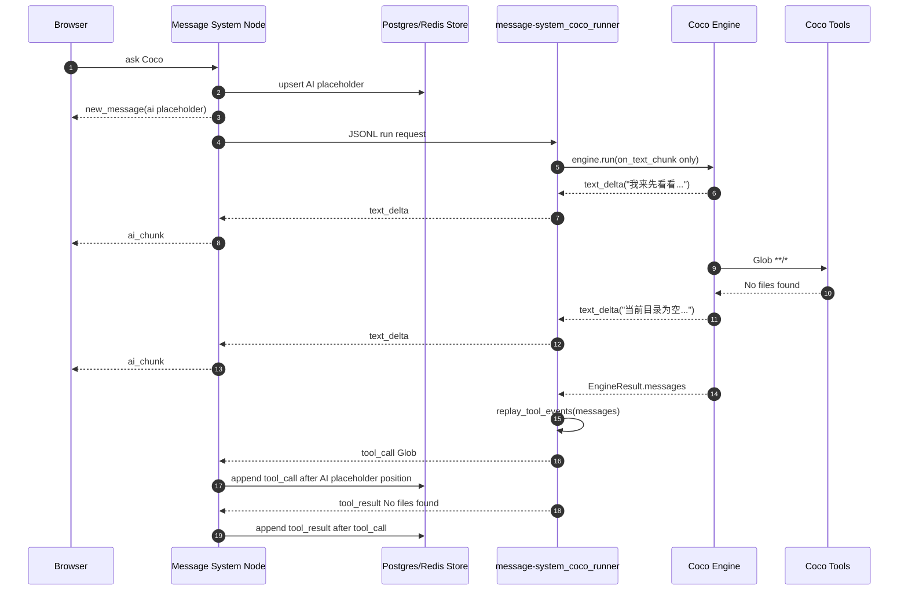
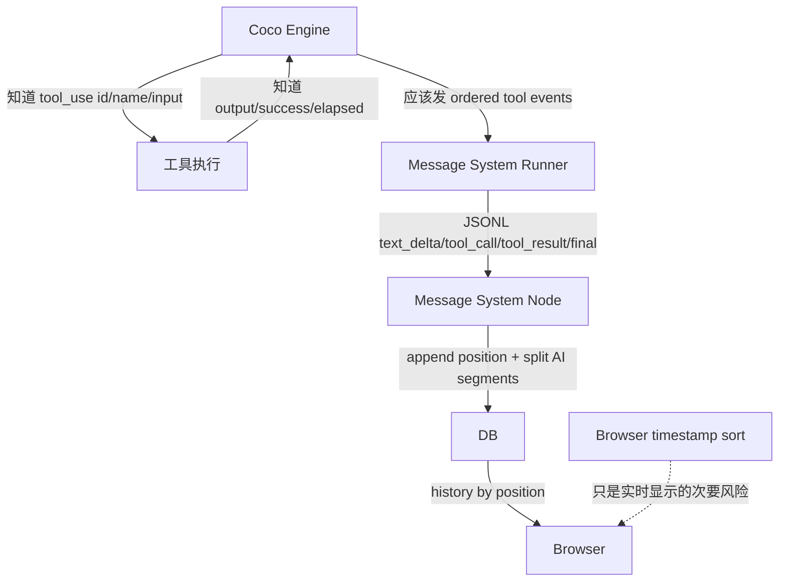
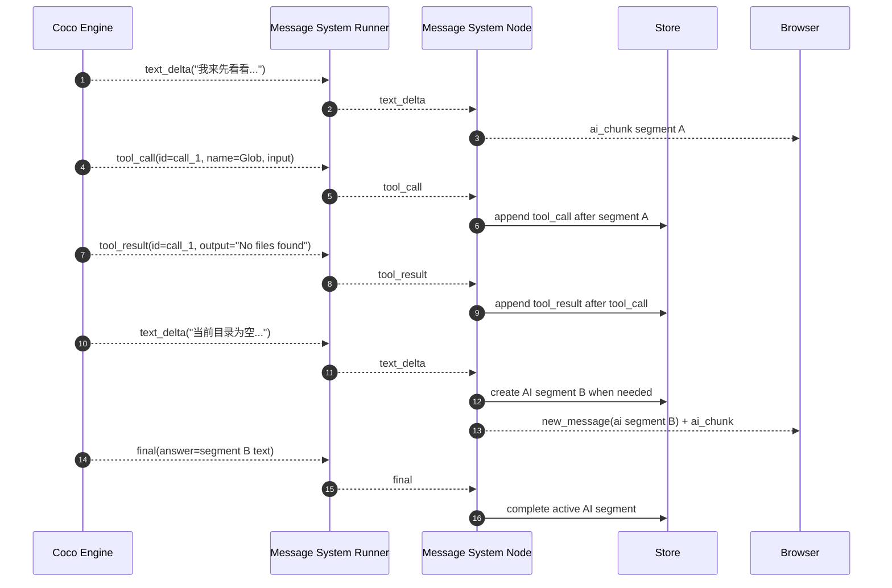
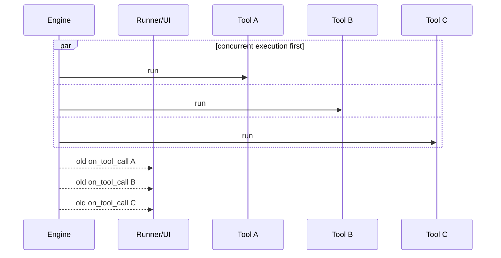
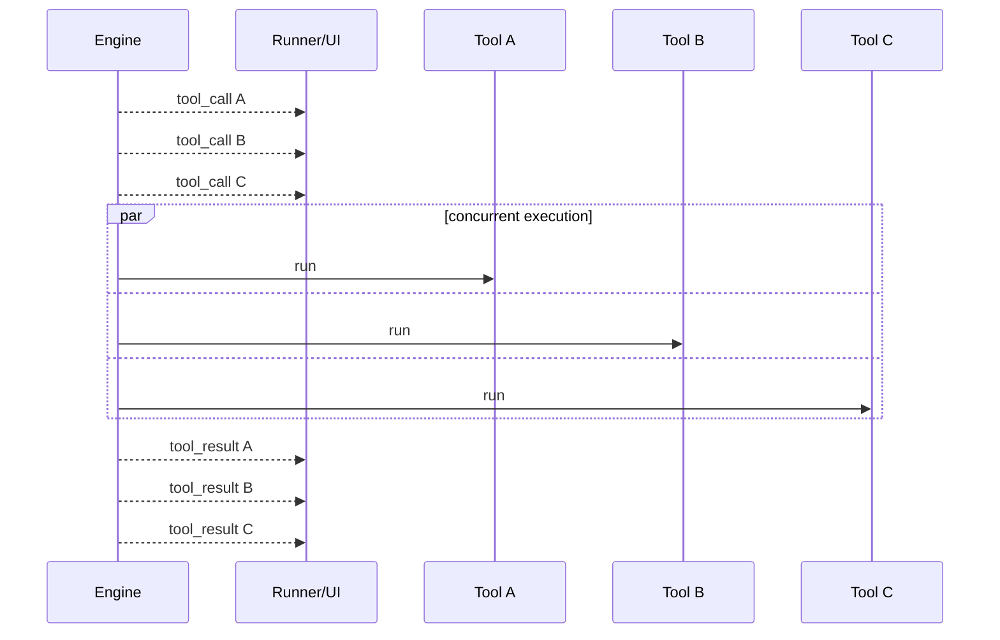
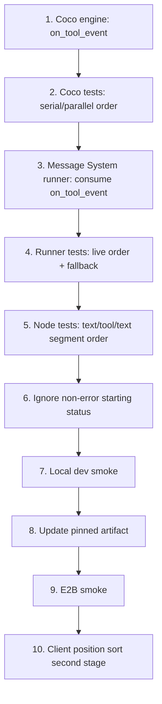

# Coco AI/工具消息顺序修复方案

日期：2026-06-27

## 背景

生产房间 `hXCMDgoefm` 暴露了一个稳定复现的问题：Coco 在一次 turn 里交替产生 AI 文本、工具调用、工具结果时，刷新后聊天记录仍然显示为“整段 AI 文本先出现，工具消息后出现”。这说明问题不只是前端实时排序，而是持久化顺序已经错误。

典型生产数据：

| position | 类型 | 内容摘要 |
|---:|---|---|
| 160 | user | `写一个python绘图，然后运行一下` |
| 161 | ai | `我来先看看当前目录下有什么文件...当前目录为空...` |
| 162 | sandbox_status | `Coco runner starting` |
| 163 | tool_call | `Glob {"pattern":"**/*"}` |
| 164 | tool_result | `No files found matching the pattern.` |
| 165+ | tool_call/tool_result | 后续 `Write` / `Read` / `Grep` |
| 183 | ai | `（已达到工具调用轮次上限 10...）` |

其中 `Glob` 的 tool result 已经在 AI 说“当前目录为空”之前完成，但 DB `position` 是 AI 在前、工具在后。刷新读取 `position`，所以刷新后仍然错。

## 当前实现

Message System 现在的 Coco 链路分成四段：

1. 浏览器发起 Coco turn。
2. Node `CocoSessionService` 创建 AI placeholder，并按收到的 runner 事件追加消息。
3. Python `message-system_coco_runner` 调用 Coco `Engine.run(...)`。
4. Coco engine 内部调用 LLM、执行工具，最后返回 `EngineResult.messages`。

当前 runner 的关键实现：

```python
def on_text_chunk(delta: str) -> None:
    emitter.emit({"type": "text_delta", ...})

result = engine.run(request.prompt, on_text_chunk=on_text_chunk)

for event in replay_tool_events(result.messages, turn_id=request.turn_id):
    emitter.emit(event)
```

也就是说，文本是实时流式发出；工具事件不是实时发出，而是在整个 `engine.run()` 结束后，从最终 transcript 里扫描并“回放”。

## 当前错误链路



这个链路的本质问题是：Node 收到工具事件时，前面的 AI placeholder 已经占了更早的 `position`，而且 AI 文本已经被追加到同一个 message。Node 没有足够信息把“当前目录为空”切回工具结果之后。

## 为什么会有 replay

Replay 是 Phase 6 MVP 的适配策略，不是最终正确模型。

当时的背景是：

- Coco engine 已经能返回完整 `EngineResult.messages`。
- `EngineResult.messages` 里有 assistant `tool_use` block 和 user `tool_result` block。
- Message System runner 可以不改 Coco engine，直接扫描最终 messages 生成 Message System 的 `tool_call/tool_result`。
- 但 Coco 当时没有完整实时 `tool_result` callback。

所以 MVP 选择了：

```text
实时 text_delta + 最后 replay tool_call/tool_result
```

这个策略只保证工具事件出现在 terminal `final` 之前，不保证工具事件和 AI 文本的真实 transcript 顺序。

## 责任边界



各层应该承担的职责：

| 层 | 应该负责 | 不应该负责 |
|---|---|---|
| Coco Engine | 按真实执行顺序暴露 text/tool call/tool result 边界 | Message System 的 DB position、Socket 事件 |
| Message System Runner | 把 Coco ordered events 转成 JSONL 协议 | 事后猜 AI 文本应该切在哪里 |
| Message System Node | 按 JSONL 到达顺序落库、切 AI segment | 根据完整 AI 文本反推工具发生点 |
| Browser | 展示服务端给出的顺序，实时合并 chunk | 修正已经错误的 DB transcript |

结论：主修点应该是 **Coco Engine + Message System Runner**。只改前端或只改 Node 都不够。

## 方案选型

| 方案 | 改动范围 | 刷新后正确 | 实时正确 | 风险 | 结论 |
|---|---|---:|---:|---|---|
| A. 只改前端排序 | client | 否 | 部分 | 掩盖问题 | 不采用 |
| B. Node 收到 final 后重建 transcript | server Node | 是 | 弱 | 需要删除/重写已流式消息 | 只作为止血备选 |
| C. Runner 最后用 `EngineResult.messages` 重建所有消息 | runner + Node 协调 | 是 | 弱 | 实时体验倒退 | 备选 |
| D. Engine 暴露 ordered tool events，runner 直接转 JSONL | coco + runner | 是 | 是 | 需要改 Coco repo 和重建 artifact | 推荐 |

推荐采用 D。

## 目标事件顺序

目标是 runner 给 Node 的 JSONL 顺序本身正确：



目标 DB 顺序：

```text
user prompt
ai segment A: 我来先看看...
tool_call Glob **/*
tool_result No files found...
ai segment B: 当前目录为空...
tool_call ...
tool_result ...
ai segment C: ...
final/error status if any
```

## 具体修改计划

### 1. Coco engine 增加 ordered tool event callback

仓库：`/Users/sky/projects/coco`

目标文件：

- `src/core/engine.py`
- `tests/test_engine.py`
- `tests/test_engine_parallel.py`

新增一个结构化 callback，建议叫 `on_tool_event`，作为 engine 对外暴露工具边界的唯一正式接口。现有 `on_tool_call` 不建议长期保留；Coco CLI 应迁移到 `on_tool_event` 的 `tool_call` 分支。

建议事件结构：

```python
EngineToolEvent = dict[str, Any]

{
    "type": "tool_call",
    "id": "toolu_...",
    "name": "Glob",
    "input": {"pattern": "**/*"},
}

{
    "type": "tool_result",
    "id": "toolu_...",
    "name": "Glob",
    "input": {"pattern": "**/*"},
    "output": "No files found matching the pattern.",
    "success": True,
    "elapsed_ms": 12.3,
}
```

`Engine.run(...)` 签名建议变成：

```python
def run(
    self,
    user_text: str,
    *,
    prior_messages: list[dict] | None = None,
    on_text_chunk: Callable[[str], None] | None = None,
    on_tool_event: Callable[[dict], None] | None = None,
) -> EngineResult:
```

接口策略：

- `on_tool_event` 同时服务 Coco CLI 和 Message System runner。
- Coco CLI 在收到 `{"type": "tool_call"}` 时执行现在 `_on_tool_call` 的 flush/打印逻辑。
- Coco CLI 可以先忽略 `tool_result`，也可以后续用它展示更精确的工具结果状态。
- 如果担心外部调用方仍使用 `on_tool_call`，可以短期保留一个 deprecated shim，把 `on_tool_call(name, input)` 包装成 `on_tool_event({"type": "tool_call", ...})`；但不要在 engine 内维护两套并行事件路径。
- `on_tool_event` 负责完整 ordered event，包含 call 和 result。

### 2. 修改 engine 串行工具执行路径

当前串行路径在 `_run_batch_serial` 里：

```python
if on_tool_call is not None:
    on_tool_call(name, inp)
tid, body, _, elapsed_ms = _execute_one_tool(...)
```

目标顺序：

```text
emit tool_call
execute tool
emit tool_result
append result_blocks
```

需要让 `_execute_one_tool` 返回 `success`：

```python
return tid, body, inp, elapsed_ms, success
```

成功判断应该尽量使用真实工具结果，而不是只靠字符串：

- unknown tool: `success=False`
- not allowed: `success=False`
- path denied: `success=False`
- permission denied: `success=False`
- tool raised exception: `success=False`
- `tool.invoke(...)` 返回 `out.success`: 使用它

这样 runner 不需要再用字符串猜 `success`，现有 error regex 可以移除。旧 engine fallback 只保留灰度兼容：如果最终 transcript 有 `is_error` 或 shell exit code，就用这些结构化标记；否则默认成功。

### 3. 修改 engine 并发工具执行路径

Coco engine 现在会把连续的只读工具合成一个并发批次。例如模型一次返回了三个工具：

```text
assistant:
  tool_use A = Glob **/*
  tool_use B = Read README.md
  tool_use C = Grep "foo"
```

这些工具之间没有写入依赖，可以同时跑。当前 `_run_batch_parallel` 的问题是：它先把 A/B/C 都跑完，再按原顺序调用旧的 `on_tool_call`。所以从外部看，工具“被宣布”时其实已经执行结束了，更不可能实时拿到正确的 call/result 顺序。

当前行为：



目标不是把并发工具强行变成串行，而是把“宣布调用”和“返回结果”拆成两个阶段：

```text
1. 按模型给出的 tool_blocks 顺序 emit tool_call A/B/C
2. 并发执行 A/B/C
3. 全部完成后，按模型给出的 tool_blocks 顺序 emit tool_result A/B/C
4. result_blocks 继续按原顺序写回给下一轮 LLM
```

目标行为：



这里的关键点：

- `tool_call A/B/C` 必须在工具真正开始前发出，让 UI/DB 先看到模型请求了哪些工具。
- A/B/C 仍然并发执行，不牺牲性能。
- `tool_result A/B/C` 第一版按模型请求顺序发，不按完成时间发。
- 不按完成时间发的原因是 DB transcript 需要稳定：如果 A 今天比 B 快、明天比 B 慢，聊天记录顺序不能跟着抖。
- `result_blocks` 继续按模型 tool_use 顺序写回，这和 Anthropic/OpenAI tool result 的语义一致。

所以并发批次在 transcript 里会长这样：

```text
tool_call A
tool_call B
tool_call C
tool_result A
tool_result B
tool_result C
```

串行工具仍然是一对一：

```text
tool_call A
tool_result A
tool_call B
tool_result B
```

### 4. Message System runner 使用 `on_tool_event`

仓库：`/Users/sky/projects/interview-coder/message-system`

目标文件：

- `server/message-system_coco_runner/message-system_coco_runner/runner.py`
- `server/message-system_coco_runner/tests/test_runner.py`

runner 改成：

```python
def on_tool_event(event: dict[str, Any]) -> None:
    if event["type"] == "tool_call":
        emitter.emit({
            "type": "tool_call",
            "id": event["id"],
            "name": event["name"],
            "args": event["input"],
            "turnId": request.turn_id,
        })
    elif event["type"] == "tool_result":
        output, truncated = _truncate_output(event["output"])
        emitter.emit({
            "type": "tool_result",
            "id": event["id"],
            "name": event["name"],
            "success": event["success"],
            "output": output,
            "elapsedMs": event.get("elapsed_ms"),
            "truncated": truncated or None,
            "turnId": request.turn_id,
        })
```

然后调用 engine：

```python
run_kwargs = {"on_text_chunk": on_text_chunk}

if engine.run supports on_tool_event:
    run_kwargs["on_tool_event"] = on_tool_event
    live_tool_events_enabled = True

result = engine.run(request.prompt, **run_kwargs)

if not live_tool_events_enabled:
    for event in replay_tool_events(result.messages, turn_id=request.turn_id):
        emitter.emit(event)
```

注意点：

- 必须避免 live tool event 和 replay 同时开启，否则会出现重复工具消息。
- JSONL schema 不需要升级，因为 `tool_call/tool_result` 事件形状已经存在。
- `elapsedMs` 已经是协议里的可选字段。
- `replay_tool_events` 保留为旧 engine fallback。

### 5. Message System Node 增加回归测试

目标文件：

- `server/src/services/cocoSessionService.test.ts`
- 可能涉及 `server/src/services/cocoEventMapper.test.ts`

新增测试覆盖真实目标顺序：

```text
text_delta("我先看看")
tool_call Glob
tool_result No files found
text_delta("当前目录为空")
final(answer="当前目录为空")
```

断言持久化顺序：

```text
text user
ai complete: 我先看看
tool_call Glob
tool_result No files found
ai complete: 当前目录为空
```

这个测试验证 Node 的 `needsNewSegment` 逻辑在收到正确 runner 顺序后确实工作。

### 6. 处理 `Coco runner starting` status 的位置问题

这是另一个独立但相关的问题。

当前 Node 先创建 AI placeholder，再启动 runner。runner 的 `status: starting` 后到，所以 DB 顺序天然是：

```text
ai placeholder position N
sandbox_status "Coco runner starting" position N+1
```

当 AI placeholder 最后被填上文本，刷新后就会看到 AI 文本在 `Coco runner starting` 前面。

建议第一版改成：

- `status: starting/running/ready/complete` 不再持久化为聊天消息。
- 这些状态只更新房间状态或运行态 UI。
- `status: error` 继续持久化为 `sandbox_status` 错误消息。

对应改动：

- `server/src/services/cocoEventMapper.ts`
- `server/src/services/cocoEventMapper.test.ts`

当前 mapper 已经忽略 `running/ready/complete`，只需要把 `starting` 也加入 ignored。

好处：

- 新 turn 不再出现 `Coco runner starting` 插在 AI 和工具之间。
- 聊天 transcript 更接近用户关心的对话和工具事实。
- 错误状态仍然可见。

### 7. 客户端实时排序补强

这是第二阶段，但建议同一轮做完，避免“实时看着和刷新后不一样”。

当前情况：

- server `Message` 类型没有 `position` 字段。
- client `Message` 类型也没有 `position` 字段。
- `client-heroui/src/utils/messageState.ts` 用 timestamp 排序。
- 历史加载保留 server 返回顺序，但实时 `new_message` 会走 `upsertMessage` 并 timestamp sort。

建议：

1. server `Message` 增加可选 `position?: number`。
2. Postgres/Redis store 在 append/upsert 后返回或广播带 position 的 message。
3. `new_message` 对 Coco tool/AI segment 尽量带 server position。
4. client `Message` 增加 `position?: number`。
5. `sortMessages` 优先按 `position`，没有 position 的 optimistic 消息才 fallback 到 timestamp。

排序建议：

```typescript
if (a.position !== undefined && b.position !== undefined) {
  return a.position - b.position
}
if (a.position !== undefined) return -1
if (b.position !== undefined) return 1
return timestampSort(a, b)
```

是否第一版必须做：

- 修复刷新顺序：不必须。
- 修复实时和刷新一致性：建议做。

如果控制风险，可以分两个 PR：

1. Engine + runner + Node status/test，解决持久化错误。
2. Message position 下发 + client sort，解决实时一致性。

## 文件级改动清单

### Coco repo

路径：`/Users/sky/projects/coco`

| 文件 | 改动 |
|---|---|
| `src/core/engine.py` | 增加 `on_tool_event`，工具执行前后发 ordered event |
| `tests/test_engine.py` | 覆盖串行工具 call/result 顺序 |
| `tests/test_engine_parallel.py` | 覆盖并发工具 call/result 顺序和 deterministic order |
| `src/core/main.py` | CLI 从 `on_tool_call` 迁移到 `on_tool_event` 的 `tool_call` 分支 |

### Message System repo

路径：`/Users/sky/projects/interview-coder/message-system`

| 文件 | 改动 |
|---|---|
| `server/message-system_coco_runner/message-system_coco_runner/runner.py` | 接 `on_tool_event`，直接发 JSONL tool events，fallback 才 replay |
| `server/message-system_coco_runner/tests/test_runner.py` | 覆盖 live tool event 顺序、fallback replay、无重复事件 |
| `server/src/services/cocoSessionService.test.ts` | 覆盖 text/tool/text 持久化顺序 |
| `server/src/services/cocoEventMapper.ts` | 忽略非错误 starting status |
| `server/src/services/cocoEventMapper.test.ts` | 更新 status mapper 测试 |
| `server/src/types.ts` | 第二阶段：增加 `position?: number` |
| `client-heroui/src/utils/types.ts` | 第二阶段：增加 `position?: number` |
| `client-heroui/src/utils/messageState.ts` | 第二阶段：优先按 position 排 |
| `client-heroui/src/utils/messageState.test.ts` | 第二阶段：覆盖 position sort |

## 兼容和部署

### 兼容旧 Coco engine

Message System runner 应该用 `inspect.signature(engine.run)` 检测 `on_tool_event`：

```python
supports_tool_event = "on_tool_event" in inspect.signature(engine.run).parameters
```

如果旧 engine 不支持：

- 继续使用当前 `replay_tool_events`。
- 行为和现在一致。
- 测试要覆盖 fallback。

这可以降低 artifact 更新过程中的灰度风险。

### Artifact 更新

生产 E2B sandbox 使用 pinned Coco artifact。改 Coco engine 后，需要更新 artifact：

1. Coco repo 提交 engine 改动。
2. Message System 更新 `ops/coco-sandbox/artifact.lock.json` 里的 `coco.sourceRef` 和 artifact version。
3. 重新准备 sandbox context：

```bash
node scripts/coco/prepare-sandbox-context.mjs \
  --output /tmp/message-system-coco-sandbox-context \
  --coco-repo /Users/sky/projects/coco
```

4. 重建并发布新的 E2B template。
5. 更新生产 env 的 `COCO_E2B_TEMPLATE_ID` / `COCO_ARTIFACT_VERSION` / `COCO_SOURCE_REF`。

不要用生产机器上的可变本地源覆盖 pinned artifact。

## 验证矩阵

### Coco repo

```bash
cd /Users/sky/projects/coco
uv run --extra dev pytest tests/test_engine.py tests/test_engine_parallel.py
uv run --extra dev pytest tests/test_llm.py
```

### Message System runner

```bash
cd /Users/sky/projects/interview-coder/message-system
pytest server/message-system_coco_runner
```

### Message System server

```bash
cd /Users/sky/projects/interview-coder/message-system/server
npm test -- src/services/cocoSessionService.test.ts src/services/cocoEventMapper.test.ts src/services/jsonlCocoRunner.test.ts
```

### Client second stage

```bash
cd /Users/sky/projects/interview-coder/message-system/client-heroui
npm test -- src/utils/messageState.test.ts src/hooks/useRoomMessageEvents.test.tsx
```

### Real sandbox smoke

```bash
cd /Users/sky/projects/interview-coder/message-system/server
RUN_COCO_E2B_SMOKE=true npm run smoke:coco:e2b
```

建议 smoke prompt：

```text
先列出当前目录文件，再根据结果说明当前目录里有什么。
```

验收时检查：

- 实时 UI 里 `Glob` 出现在“当前目录为空/有哪些文件”之前。
- 刷新后顺序不变。
- DB `room_messages.position` 顺序和 UI 一致。
- 没有重复 tool_call/tool_result。
- `Coco runner starting` 不再作为普通聊天消息插入新 turn。

## 验收标准

必须满足：

1. 新 Coco turn 的 DB position 是真实 transcript 顺序。
2. AI 文本在工具前后的内容被拆成不同 AI segment。
3. tool_call 和 tool_result 成对出现，不重复。
4. 刷新后顺序和实时顺序一致。
5. 旧 engine fallback 测试仍然通过。
6. runner `final` 仍然是 terminal event，final 后不能再发 tool/text。

可以接受：

- 旧历史 turn 不自动修复。
- 并发工具结果第一版按模型请求顺序显示，而不是按实际完成时间显示。
- 第二阶段前，少数非 Coco optimistic 消息仍按 timestamp fallback。

## 历史数据处理

不建议自动修复已有错序 turn。

原因：

- DB 里只保存了最终 AI message 文本，没有保存每个 text chunk 的边界。
- 仅靠最终 AI 文本和 tool messages，无法可靠判断“当前目录为空”这句话应该切到哪个 tool_result 后面。
- 强行把工具整体移动到 AI 前面，只会制造另一种错误。

可以做的低风险处理：

- 保持历史消息不动。
- 修复新 turn。
- 如需人工修当前房间，只对特定 turn 做手工调整或标记，不做通用迁移脚本。

## 推荐实施顺序



第一批建议包含 1-9，解决根因和刷新顺序。第 10 项可以同批做，也可以作为紧随其后的第二个小改动。

## 风险清单

| 风险 | 触发条件 | 防范 |
|---|---|---|
| 工具事件重复 | live event 后仍执行 replay | runner 用 `live_tool_events_enabled` 禁止 replay |
| 并发工具 UI 顺序不稳定 | 按完成时间发 result | 第一版按模型 tool_blocks 原顺序发 result |
| 旧 artifact 不兼容 | 生产仍跑旧 Coco engine | runner 检测 `on_tool_event`，fallback replay |
| status 仍插在 AI 后面 | starting status 继续持久化 | mapper 忽略非错误 starting |
| 客户端实时抖动 | new_message 没 position | 第二阶段下发 position 并按 position sort |
| 历史 turn 无法修复 | 已经丢失 text chunk 边界 | 不做自动历史迁移 |

## 最终判断

这不是单纯前端问题，也不是 Node store 随机排序问题。根因是 Message System runner 使用了 Phase 6 MVP 的“文本实时、工具事后 replay”策略，而 Coco engine 没有给 Message System 暴露完整 ordered tool events。

正确修复是：

```text
Coco engine 暴露 ordered tool_call/tool_result
Message System runner 直接转 JSONL
Node 按收到顺序落库和切 AI segment
Client 用 position 保持实时和刷新一致
```

这样才能同时解决实时显示和刷新后的持久化顺序。
