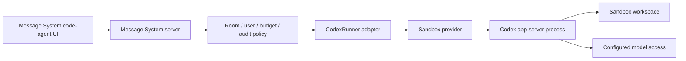

# Code Agent Codex Backend Spike

> Status: accepted as a docs-only spike; runtime remains disabled
> Date: 2026-05-30
> Scope: evaluate whether Message System can support a future `codeAgentBackend = coco | codex` without replacing Coco or weakening sandbox boundaries.

## Decision

Codex is technically feasible as a future second code-agent backend, but it is not ready to enable in Message System.

Message System should keep the current Coco backend as the only runnable backend and keep `CODE_AGENT_BACKEND=codex` rejected at startup. The next implementation step, if we continue toward Codex, is not a Codex runner. It is a protocol-neutral `CodeAgentRunner` contract that stops exposing Coco-specific request, handler, and result types at the generic boundary.

Preferred future shape:

```text
Browser UI
  -> Message System API / Socket.IO
  -> room, permission, budget, and audit checks
  -> CodeAgentSessionService
  -> CodeAgentRunner
  -> Codex app-server adapter
  -> sandboxed Codex process
```

The browser must never connect directly to a Codex app-server endpoint.

## Evidence Reviewed

Local Codex CLI:

- `codex-cli 0.125.0`
- `codex app-server` is marked experimental.
- app-server transports include `stdio://`, `unix://`, `unix://PATH`, `ws://IP:PORT`, and `off`.
- websocket auth supports `capability-token` and `signed-bearer-token`.

T3 Code audit:

- Repository: `https://github.com/pingdotgg/t3code`
- Audited commit: `b3e8c0334b25238e2b55868a87bd6270e234b7de`
- License: MIT, copyright `2026 T3 Tools Inc.`
- Relevant files:
  - `apps/server/src/provider/Drivers/CodexDriver.ts`
  - `apps/server/src/provider/Layers/CodexAdapter.ts`
  - `apps/server/src/provider/Layers/CodexSessionRuntime.ts`
  - `apps/server/src/provider/Layers/CodexProvider.ts`
  - `apps/server/src/provider/CodexDeveloperInstructions.ts`

No T3 Code source was copied into Message System for this spike.

## What T3 Code Teaches

T3 Code treats Codex as a provider/runtime integration, not as a simple command wrapper.

Useful patterns:

- Start a Codex app-server process per isolated runtime instance.
- Use a dedicated `CODEX_HOME` / home path per instance instead of sharing the developer desktop account state.
- Convert app-server events into product-owned provider events.
- Model runtime modes explicitly:
  - approval-required maps to read-only / untrusted behavior
  - auto-accept-edits maps to workspace-write / on-request behavior
  - full-access maps to danger-full-access / never-ask behavior
- Support thread start, resume, read, rollback, user input, and approval responses.
- Keep model probing, account metadata, session runtime, and UI event translation as separate layers.

This is a larger integration than calling `codex exec`.

## Current Message System Gap Analysis

Message System already has a named backend boundary:

```ts
export type CodeAgentBackend = 'coco' | 'codex';
```

But the boundary is still Coco-shaped:

- `CodeAgentRunner.run(...)` accepts `CocoRunnerRunRequest`.
- handlers are `CocoRunnerHandlers`.
- results are `CocoRunnerRunResult`.
- room persistence still stores `type: 'coco'`, `cocoStatus`, and `cocoSessionId`.
- workspace snapshots are derived from persisted Coco-style messages.
- there is no provider-neutral event schema for approvals, user input, file changes, diffs, rollback, cancel, or tool permissions.

This is acceptable for the current Coco product. It is not enough to safely enable Codex.

## Rejected Integration Options

### Direct browser to Codex app-server

Rejected.

Reasons:

- The browser would bypass Message System room permissions, budget policy, audit logging, and rollout flags.
- Codex websocket auth does not replace Message System's per-room authorization model.
- It would expose an agent runtime endpoint to untrusted web clients.

### Server host Codex process with write access

Rejected for production.

Reasons:

- Running Codex with workspace-write or full-access on the Message System host risks host file access.
- A server-hosted process can accidentally inherit long-lived credentials and local account state.
- It breaks the established rule that file and process effects belong inside an external sandbox.

### `codex exec` as the product backend

Rejected for the main integration.

Reasons:

- It is useful for smoke tests, but not a durable web-session runtime.
- It does not provide the full app-server session, approval, rollback, and event model Message System needs.
- It would force fragile stdout parsing where a typed app-server protocol exists.

## Preferred Future Integration

Run Codex app-server behind a Message System-owned adapter and inside a file/process sandbox.



The adapter should own:

- app-server process lifecycle
- app-server initialize/start/resume requests
- event translation into Message System `CodeAgentEvent`
- approval and user-input response routing
- cancellation / interrupt semantics
- thread snapshot and rollback calls
- usage and cost metadata mapping

The sandbox provider should own:

- isolated filesystem
- process execution boundary
- lifecycle cleanup
- network policy where supported

Message System should own:

- rooms and access control
- model selection policy
- pricing / budget policy
- message persistence and replay
- UI-visible workspace snapshots
- audit logs

## Security Requirements Before Enablement

Codex must stay disabled until these are true:

1. Browser clients can only control Codex through Message System APIs or Socket.IO events.
2. Codex app-server never listens on a public remote endpoint without Message System mediation.
3. Any websocket transport is loopback/internal and uses capability-token or signed-bearer-token auth.
4. The Codex process runs inside an external file/process sandbox for any write or shell-capable mode.
5. Default runtime mode is read-only / approval-required, not full-access.
6. Production does not use the developer desktop's logged-in Codex account or shared `~/.codex`.
7. `CODEX_HOME` or equivalent account/config state is isolated per service account, tenant, or sandbox policy; startup must pass an explicit isolated home/config path instead of inheriting the server user's `~/.codex`.
8. Long-lived model/provider credentials are not injected into a shell-capable sandbox.
9. Approval requests, denials, and elevated tool attempts are persisted for audit.
10. Cancellation, timeout, and sandbox teardown are tested.

## Required Message System Refactor

Before adding a real Codex runner, change the generic backend contract to product-level types:

```ts
export interface CodeAgentRunInput {
  roomId: string;
  turnId: string;
  prompt: string;
  mode: CodeAgentRuntimeMode;
  model: CodeAgentModelSelection;
  workspace: CodeAgentWorkspaceRef;
  sessionId?: string;
}

export interface CodeAgentWorkspaceRef {
  provider: 'e2b' | 'local-dev' | 'external';
  workingDirectory: string;
  allowedPaths: string[];
  sandboxId?: string;
}

export type CodeAgentEvent =
  | { type: 'status'; status: CodeAgentStatus }
  | { type: 'text_delta'; messageId: string; delta: string }
  | { type: 'tool_call'; id: string; name: string; args: unknown }
  | { type: 'tool_result'; id: string; name: string; success: boolean; output: string }
  | { type: 'approval_request'; requestId: string; action: string; details: unknown }
  | { type: 'file_change'; path: string; changeType: 'created' | 'modified' | 'deleted' }
  | { type: 'usage'; inputTokens: number; outputTokens: number; cacheHitTokens?: number }
  | { type: 'final'; messageId: string; answer: string; sessionId?: string }
  | { type: 'error'; message: string; retryable: boolean };

export interface CodeAgentEventHandlers {
  onEvent(event: CodeAgentEvent): Promise<void>;
}
```

Then implement:

- `CocoCodeAgentRunner`: maps neutral input/events to the current Coco JSONL protocol.
- `CodexCodeAgentRunner`: maps neutral input/events to Codex app-server protocol.

This prevents future Codex work from leaking app-server details into the Message System UI or room model.

## Proposed Implementation Sequence

### Codex Phase A: Neutral Runner Contract

Scope:

- Introduce `CodeAgentRunInput`, `CodeAgentEventHandlers`, and `CodeAgentRunResult`.
- Keep Coco behavior unchanged by adapting the existing Coco protocol behind `CocoCodeAgentRunner`.
- Keep `CODE_AGENT_BACKEND=codex` disabled.

Acceptance:

- Existing Coco E2E flows still pass.
- Existing Coco runner protocol tests still pass.
- `CodeAgentRunner` no longer exposes `Coco*` types.

### Codex Phase B: Runtime Controls Contract

Scope:

- Add neutral contracts for cancel, timeout, approval request/response, user input, and rollback.
- Store enough per-turn metadata to audit elevated actions.

Acceptance:

- Coco may no-op unsupported controls, but unsupported state is explicit.
- UI never renders a control that the selected backend cannot support.

### Codex Phase C: Disabled Codex Adapter Skeleton

Scope:

- Add a `CodexCodeAgentRunner` behind `CODE_AGENT_BACKEND=codex`.
- Keep startup disabled unless `CODEX_BACKEND_EXPERIMENTAL=true`.
- Use mocked app-server client tests only.
- Require an explicit isolated Codex home/config path in runner options; tests must prove the adapter does not inherit the host user's `~/.codex`.

Acceptance:

- No real Codex process starts in unit tests.
- Config refuses production enablement without sandbox and credential policy.
- The disabled adapter cannot start with an implicit developer desktop Codex home.

### Codex Phase D: Sandboxed Smoke Test

Scope:

- Start Codex app-server inside a sandbox with read-only/default runtime.
- Run a prompt against a tiny fixture workspace.
- Capture text, tool, final, and usage events.

Acceptance:

- Smoke test is opt-in and skipped without explicit sandbox/Codex config.
- No developer desktop account state is used; the app-server process receives an isolated home/config path scoped to the sandbox or service account.
- Teardown is reliable after success, failure, and timeout.

## Final Recommendation

Proceed with Codex only after the neutral runner contract is implemented. Keep Coco as the production backend.

Do not enable `CODE_AGENT_BACKEND=codex` in this phase. The current explicit startup rejection is the correct behavior until the security and protocol requirements above are met.
