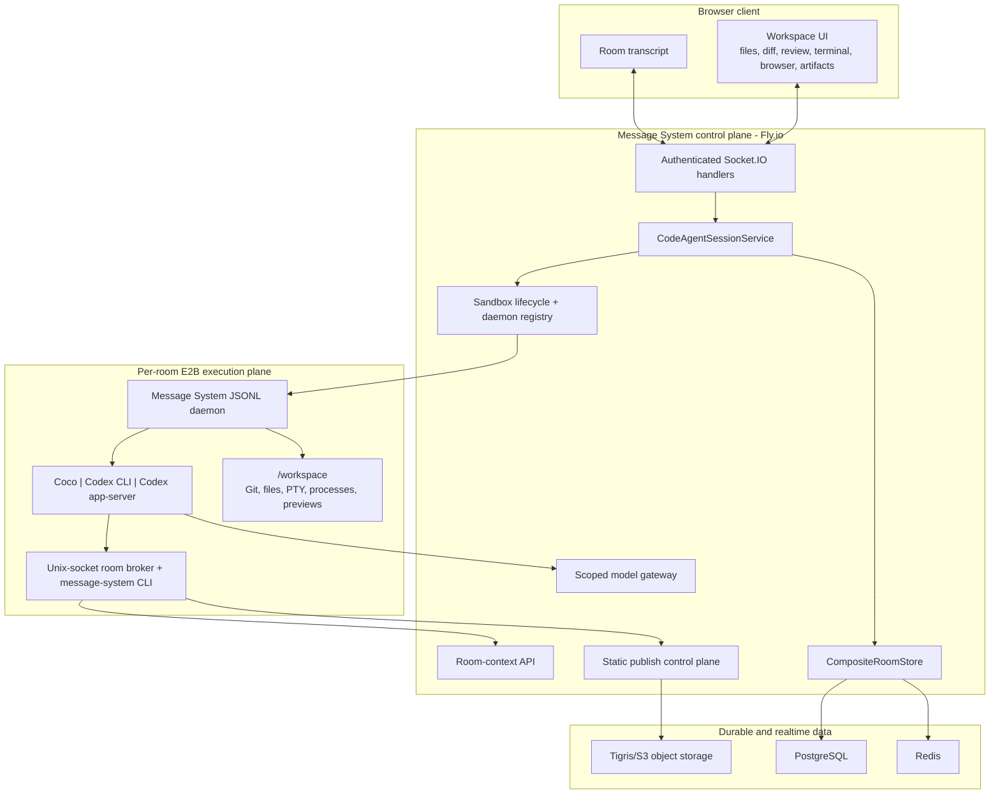
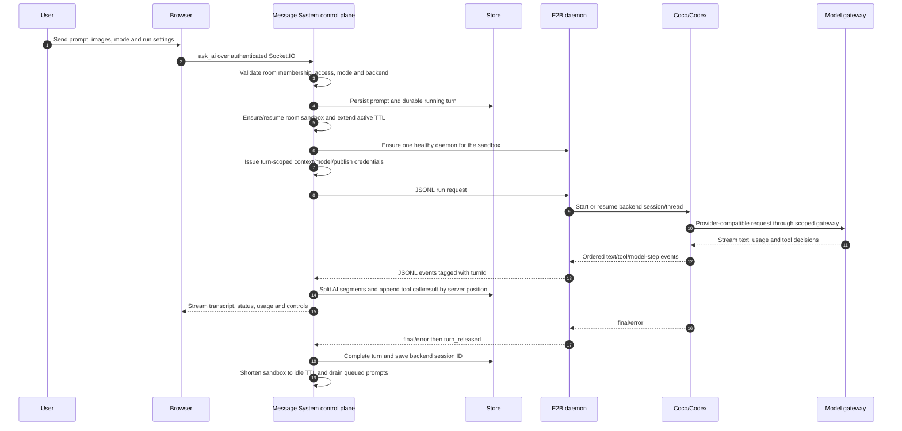

# Message System Code-Agent Runtime Architecture

Updated: 2026-07-11

This document describes the current implementation. Earlier files under `docs/` may describe individual phases, spikes, or migration plans; use this file as the concise architecture entry point and use source/tests as the final authority.

## Product Model

Message System has two room types:

| Room type | Primary purpose | Execution environment |
| --- | --- | --- |
| Chat room | Human conversation, AI streaming, media, roles, realtime collaboration | Message System Node process calls configured AI providers |
| Code-agent room | A shared conversation bound to a persistent development workspace | Message System controls one E2B sandbox and a sandbox-local agent daemon |

A code-agent room is not a chat prompt wrapped around remote shell commands. It is a room-scoped control plane around an isolated execution plane:

- The room is the shared source of truth for membership, prompts, turns, tool events, permissions, and artifacts.
- The sandbox is mutable runtime state for files, Git, processes, terminals, and dev servers.
- Coco is Message System's in-house CLI coding agent and engine; its reasoning/tool loop remains behind the runner contract.
- Codex is user-owned: a member connects their own Codex subscription through device authorization, and Message System brokers that encrypted connection into E2B only for their Codex runs.
- The browser never receives E2B credentials, provider keys, database credentials, or raw Message System service tokens.

## High-Level Architecture



## Ownership Boundaries

| Layer | Owns | Deliberately does not own |
| --- | --- | --- |
| Browser | User interaction, local panel state, streamed rendering, review drafts | Provider/E2B secrets, direct sandbox SDK access, persistence ordering |
| Message System control plane | Identity, room access, permission resolution, turn orchestration, transcript persistence, usage/cost, scoped tokens, sandbox lifecycle, public artifacts | Executing untrusted user commands in the Fly process, agent reasoning internals |
| E2B execution plane | Workspace files, Git, PTY, commands, background processes, dev servers, agent backend process | Room membership, durable message truth, public object storage ownership |
| Agent backend | Reasoning, native tool loop, model-specific session/thread state | Message System authorization, database access, public URL ownership |
| PostgreSQL/Redis/Tigris | Durable records, realtime coordination/cache, object bodies/manifests | Agent execution |

This split is the central security and reliability decision in the project: untrusted code runs in E2B, while every durable or externally visible action is mediated by Message System.

## Turn Lifecycle



### Turn controls

Only one agent turn mutates a room workspace at a time. Additional user prompts can be queued, edited, canceled, or promoted into steering input. A running turn supports:

- `interrupt`: request a clean cancellation and bound the wait for release;
- `steer`: inject additional guidance into the active agent flow;
- approval responses for backends that ask before commands or file changes;
- retry with the original turn mode and backend settings preserved.

The room stores a `RoomAgentTurn` projection separately from rendered messages so UI grouping and recovery do not depend on heuristics over timestamps.

## Sandbox and Daemon

### One room, one execution workspace

Each code-agent room resolves to one E2B sandbox and `/workspace` directory. The sandbox service can:

- create/connect/destroy sandboxes;
- initialize a Git baseline without rewriting imported history;
- read/search/write/rename/delete workspace entries;
- read assets, Git refs, changed files, and branch/unstaged diffs;
- start PTY terminals and streamed commands;
- discover dev servers and resolve E2B preview URLs;
- export/import bounded workspace archives during artifact migration.

The default E2B policy pauses an idle sandbox after five minutes, keeps memory, and enables provider auto-resume. Active turns receive a longer TTL. Message System reconnects paused sandboxes instead of treating the timeout as data loss.

### Reusable JSONL daemon

Message System starts one `message-system_code_agent_runner.daemon` per sandbox and reuses it for sequential turns. It supports:

- `code-agent` (Coco, Message System's self-built CLI agent and engine);
- `codex` (Codex CLI JSON events using the requesting user's connected Codex subscription);
- `codex-app-server` (Codex app-server thread/session protocol using the same user-owned connection);
- health, run, interrupt, steer, approval, thread list/read, and shutdown requests;
- `daemon_ready`, structured runner events, `turn_released`, and shutdown events.

The Fly process keeps an in-memory registry of daemon handles, but the daemon itself lives in E2B. Startup therefore serializes daemon creation and removes stale daemon/Codex child processes before launching a replacement. SIGTERM/SIGINT shutdown reclaims all daemons owned by the process. A bounded turn-release timeout prevents a lost release signal from leaving a room permanently `running`.

Codex connection ownership is per Message System client, not per room. Settings starts OpenAI/Codex device authorization; Message System encrypts the resulting auth material at rest, writes it to the E2B secret directory for a Codex run, and persists refreshed credentials without exposing them to other room members or the browser runtime. This lets collaborators share the room and workspace while each person uses their own Codex subscription.

## Permissions and Scoped Capabilities

### Permission modes

| Mode | Workspace writes | Shell | Network | Background jobs | Approval behavior |
| --- | ---: | --- | --- | ---: | --- |
| Plan | No | OS-enforced read-only shell | Direct IP network blocked; turn broker Unix socket allowed | No | No write approvals |
| Edit | Yes | Workspace shell | Allowed by sandbox policy | Yes | Agent applies permitted edits |
| Approve for me | Yes | Workspace shell | Allowed by sandbox policy | Yes | Message System can accept supported approvals for the turn |
| Full access | Yes | Least restrictive sandbox profile | Allowed | Yes | Backend runs without additional Message System approval gates |

Plan mode is not implemented with a fragile shell-command allowlist. Coco uses a bubblewrap-backed read-only shell, while Codex backends use a matching read-only permission profile. `Write`, `Edit`, and `BackgroundShell` are absent in Plan.

The resolved mode is persisted on the turn/message as an execution fact. Room defaults and per-user model/context preferences remain separate from what actually ran.

### Model gateway

Message System issues a short-lived token bound to room, client, turn, provider, and model. The gateway:

- routes only to the selected provider/model;
- applies request and USD budget limits;
- parses streaming/non-streaming usage;
- records per-step and aggregate cost;
- keeps provider keys out of E2B environment history and the browser.

### Room-context broker

Room history is not dumped into every system prompt. A turn-scoped Unix socket exposes the `message-system` CLI inside the sandbox:

```text
message-system room history
message-system room delta
message-system room search
message-system room message
message-system site list
```

The runner holds the upstream URL/token and brokers bounded requests. Responses project only agent-safe message fields and omit internal recovery, billing, storage, and streaming metadata. This gives Coco and Codex the same on-demand room awareness without adding a separate MCP lifecycle.

### Static publishing

Writable modes receive a separate turn-scoped publish token. `message-system site publish` uses a two-phase pipeline:

1. validate paths, sizes, entry file, mode, room ownership, and slug;
2. request presigned object uploads from Message System;
3. upload static bytes directly from E2B to Tigris;
4. finalize after the server verifies object sizes;
5. atomically replace the manifest for `/p/:slug/`.

Published sites are room-owned durable artifacts. They survive sandbox pause/replacement, can be listed or unpublished through the CLI, appear in the workspace Artifacts tab, and are deleted with the owning room.

## Workspace UI

The workspace is a browser IDE surface attached to the room rather than a separate editor product.

### Transcript and activity

- AI text, tool calls, and tool results are persisted in true execution order.
- Text is split into separate assistant segments around tool boundaries.
- Messages are grouped by durable turn metadata.
- Tool state, model-step usage, errors, approvals, queued prompts, and run controls remain visible after refresh.

### File and review surfaces

- searchable file tree with create, rename, delete, and editable source views;
- Markdown, image, video, audio, and workspace-asset previews;
- branch and base-ref selection plus branch/unstaged diff scopes;
- changed-file statistics, unified/split diff rendering, viewed state, whitespace controls;
- line-scoped review comments stored as room-local drafts and attached as structured context to the next prompt.

### Terminal and browser surfaces

- a real E2B PTY streamed through authenticated socket handlers;
- buffered input and local echo to avoid a network round trip per keystroke;
- bounded snapshots and delta events so terminal output does not rebroadcast a large tail on every chunk;
- browser tabs for files, public artifacts, and detected preview servers;
- responsive viewport presets, navigation/refresh, screenshots, recordings, and preview annotations.

Desktop uses resizable chat/workspace/right-panel regions. Mobile exposes the same capabilities through compact tabs and sheets while avoiding desktop-scale diff or toolbar layouts.

## State and Recovery

### Durable state

Message System persists:

- room identity, access policy, default mode/backend, sandbox identity/status/artifact metadata;
- prompt, image references, assistant segments, tool calls/results, usage/cost, and turn status;
- backend session/thread ID for resume;
- published-site manifests and room index;
- workspace-independent media and artifacts.

### Runtime state

E2B owns the live filesystem, Git worktree, processes, terminals, and preview servers. Redis owns presence, socket sessions, pub/sub, model-gateway counters, and caches. The Node process owns active-turn and daemon-handle maps.

### Recovery paths

- Server startup marks orphaned running turns as interrupted/error and resumes durable queued prompts.
- A stale `creating` sandbox state is converted to error before retry.
- Paused E2B sandboxes auto-resume with memory/files preserved.
- An incompatible pinned artifact triggers bounded archive export, replacement sandbox creation, import, Git initialization, atomic room swap, and old-sandbox cleanup.
- Daemon startup removes stale local agent processes; server shutdown stops tracked daemons.
- Static artifacts remain independent of sandbox lifetime.

The system does not yet claim a general immutable workspace-revision/rollback layer. Git and archive migration protect current workspace continuity, while published artifacts and room transcripts are separately durable.

## Persistence Model

`CompositeRoomStore` separates data by behavior:

| Store | Responsibilities |
| --- | --- |
| PostgreSQL or Redis durable store | Rooms, messages, members, auth, media metadata, AI runs, code-agent turns, sandbox metadata |
| Redis realtime store | Presence, socket sessions, pub/sub, locks/counters, optional short-TTL message cache |
| Tigris/S3 object storage | Private media, published-site versions/manifests, migration/object payloads |

Server-assigned message positions and room versions are the ordering authorities. Browser timestamps are display metadata, not the consistency mechanism.

## Verification Strategy

Changes are tested at the contract boundary where they can fail:

- Python runner tests for Coco/Codex mapping, daemon sequencing, permissions, broker/CLI behavior, controls, and image input.
- Node tests for protocol parsing, session orchestration, transcript ordering, lifecycle migration, daemon registry, model gateway, socket authorization, workspace access, and static publishing.
- Client tests for turn rendering, queue controls, files/diffs/reviews, terminal local echo/input batching, browser tabs, artifacts, and responsive behavior.
- Playwright for end-to-end room, mobile recovery, multi-client, media, and persistence flows.
- E2B smoke for the exact pinned artifact, daemon/backend startup, permissions, context, image input, toolchain, and public artifact behavior.

## Release Contract

There are two independently deployed layers:

1. The Message System application image on Fly.io.
2. The pinned E2B template containing the runner, daemon, tools, prompts, and agent engine source.

Any runner/tool/prompt/Dockerfile/context or agent-engine change is incomplete until:

1. source changes are committed;
2. `ops/code-agent-sandbox/artifact.lock.json` and Dockerfile version are updated;
3. a new E2B template is built;
4. E2B smoke passes against that template;
5. production template/artifact/source pins match;
6. Fly deploy and real room behavior are verified.

App-only UI, store, or socket changes still require server/client builds and focused tests, but do not require an E2B rebuild unless they change the sandbox contract.

## Interview Summary

The strongest way to describe this subsystem is:

> I built a shared cloud code-agent room, not a remote shell widget. Message System acts as the control plane for identity, permissions, durable turns, scoped model/context/publish access, and sandbox lifecycle. Each room gets an isolated E2B execution plane with a reusable daemon that can run Coco, our self-built CLI agent, or Codex through the requesting user's own subscription. The browser exposes files, Git diffs and review comments, a PTY terminal, dev-server previews, and durable artifacts, while the server preserves event ordering and recovers queued turns, paused sandboxes, stale daemons, and artifact upgrades.
