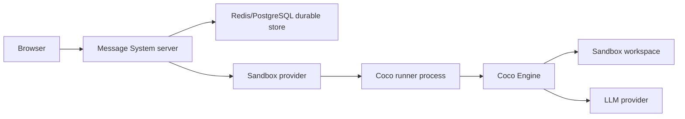

# Coco Code Agent Sandbox 方案

> 状态：分阶段实施中
> 日期：2026-05-16，合并到最新 master 时更新于 2026-06-25
> 范围：Message System 中新增 Coco 代码助手房间
> 关键约束：文件/进程沙盒仍然必须存在；沙盒内运行现有 Coco 助手，而不是在 Message System 里重写代码 agent。

本方案把 Coco 作为 Message System 的一种代码助手房间能力接入。Message System 负责房间、
权限、消息持久化、沙盒生命周期和 Web UI；隔离沙盒内运行现有 Coco 助手，
由 Coco 执行代码理解、文件修改、命令运行和工具事件输出。

---

## 1. 背景

Message System 当前是聊天系统。它可以让 AI 解释、生成代码，但不能真正读写一个隔离工作区、执行命令、安装依赖或验证结果。用户做代码任务时，仍然要在聊天窗口、本地编辑器和终端之间来回切换。

我们已经有一个本地实现好的代码助手 Coco，代码在：

```text
/Users/sky/projects/coco
```

Coco 已经具备：

- provider 自动探测和多模型支持。
- Read/Glob/Grep/Write/Edit/Shell 工具循环。
- `default` / `acceptEdits` / `plan` 模式。
- `Engine.run(...)` 流式文本回调和工具调用回调。
- `allowed_paths` / `allowed_tools` / `workspace` 等基本约束。
- CLI one-shot、resume 和交互 REPL。

所以 Message System 不应该重新实现这些能力。正确边界是：

```text
Message System 负责产品、房间、消息、权限、持久化和沙盒生命周期。
文件/进程沙盒负责隔离用户代码和命令执行。
Coco 在沙盒内运行，负责代码 agent 的推理、工具循环和项目操作。
```

---

## 2. 产品定位

### 2.1 房间类型

Coco 是 Message System 的一种新房间类型。

| 房间类型 | 用途 | 是否有文件沙盒 | 是否运行 Coco |
| --- | --- | --- | --- |
| `chat` | 普通聊天、图片、AI 问答 | 否 | 否 |
| `coco` | 代码任务、项目理解、文件修改、命令验证 | 是 | 是 |

旧房间没有 `type` 字段，读取时按 `chat` 处理。Coco 房间创建后不切回普通房间，避免消息结构、沙盒生命周期和权限语义混在一起。

### 2.2 MVP 用户体验

1. 用户创建 Coco 房间。
2. Message System 为房间准备一个隔离工作区。
3. Message System 在沙盒内启动 Coco runner。
4. 用户输入任务，例如“给这个项目加一个 CSV 汇总脚本并运行测试”。
5. Message System 把任务发送给沙盒内的 Coco。
6. Coco 在沙盒里读写文件、执行命令、返回流式文本和工具事件。
7. Message System 把文本、工具调用、工具结果持久化并展示在聊天流里。
8. 同一个 Coco 房间复用同一个沙盒和 Coco session，直到沙盒过期、失败或用户手动重置。

### 2.3 MVP 不做什么

- 不在 Message System 服务端进程里执行用户命令。
- 不把宿主机 `/Users/sky/projects/...` 直接暴露给用户任务。
- 不在 Message System 里重写 Coco 的 Read/Write/Shell 工具循环。
- 不把 Coco 的终端 TUI 直接嵌进网页。
- 不做任意宿主目录挂载。
- 不把 Message System 服务端 secrets 注入沙盒。
- 不允许普通聊天房间直接使用 Coco 工具。
- 不默认开启真实沙盒成本较高的生产流量。

---

## 3. 总体架构

### 3.1 推荐架构



核心原则：

- Message System 只和 Coco runner 协议通信。
- Coco runner 在沙盒内部 import 或调用 `/opt/coco` 中的 Coco 实现。
- Coco 的所有 Read/Write/Shell 都落在沙盒工作区。
- Message System 只持久化 UI 需要的事件和最终 session 状态，不直接操作用户项目文件。

### 3.2 沙盒提供方

MVP 仍然可以用 E2B 作为文件/进程沙盒：

- 支持云端隔离执行。
- 支持 sandbox ID 复连。
- 支持模板和超时。
- TypeScript 服务端可以通过 SDK 管理生命周期。

但 E2B 的角色要明确：它只是运行 Coco 的隔离环境，不是 Message System 的工具执行层。Message System 不应该把 `bash/read/write/list` 直接映射到 E2B 再自己实现 agent loop。

### 3.3 Coco 集成方式

推荐做一个轻量 `coco-runner`，在沙盒内运行。

两种可选实现：

| 方式 | 描述 | 适合阶段 |
| --- | --- | --- |
| CLI wrapper | Message System 在沙盒内执行 `coco -p "..." --resume <id>` 并解析 stdout | 探索和 smoke test |
| Python runner | 沙盒内启动一个 Python JSONL 进程，import `core.engine.Engine` | 正式 MVP |

正式 MVP 应选择 Python runner，因为它能稳定提供结构化事件、流式文本、工具调用和错误状态。CLI wrapper 可以作为早期验证，但不适合长期承载网页产品。

---

## 4. Coco Runner 协议

### 4.1 传输形式

MVP 推荐 JSONL over stdin/stdout：

- 启动成本低。
- 不需要沙盒内再暴露 HTTP 端口。
- 事件天然适合 streaming。
- 方便 fake runner 测试。

Message System 启动沙盒后执行：

```bash
python -m message-system_coco_runner
```

然后通过 stdin 写入请求，通过 stdout 读取 JSONL 事件。

### 4.2 请求

```json
{
  "schemaVersion": 1,
  "type": "run",
  "roomId": "abc123",
  "turnId": "turn_001",
  "sessionId": "coco_session_or_null",
  "prompt": "分析这个项目并修复测试",
  "mode": "acceptEdits",
  "provider": "openrouter",
  "modelId": "deepseek-v4-pro",
  "apiModel": "deepseek/deepseek-v4-pro",
  "workspace": "/workspace",
  "allowedPaths": ["."]
}
```

字段说明：

| 字段 | 说明 |
| --- | --- |
| `roomId` | Message System 房间 ID，只用于日志和关联 |
| `turnId` | Message System 本轮请求 ID，用于幂等和事件归属 |
| `sessionId` | Coco 会话 ID，首次为空，后续恢复 |
| `mode` | `plan` / `acceptEdits`，网页集成不使用需要终端确认的 `default` |
| `provider` | Message System 选择的 provider |
| `modelId` | Message System 内部模型 ID，只用于 UI 和审计 |
| `apiModel` | 传给 Coco/provider 的真实模型名，例如 OpenRouter 的 `deepseek/deepseek-v4-pro` |
| `workspace` | 沙盒内工作目录 |
| `allowedPaths` | 传给 Coco `Engine` 的路径边界 |

### 4.3 响应事件

```json
{"schemaVersion":1,"type":"status","status":"starting","turnId":"turn_001"}
{"schemaVersion":1,"type":"status","status":"running","turnId":"turn_001"}
{"schemaVersion":1,"type":"text_delta","messageId":"ai_1","delta":"我先查看项目结构。"}
{"schemaVersion":1,"type":"tool_call","id":"tool_1","name":"Glob","args":{"pattern":"**/*"}}
{"schemaVersion":1,"type":"tool_result","id":"tool_1","name":"Glob","success":true,"output":"package.json\nsrc/App.tsx"}
{"schemaVersion":1,"type":"final","messageId":"ai_1","answer":"已完成。","sessionId":"coco_xxx","usage":{"inputTokens":123,"outputTokens":45}}
```

必须支持的事件：

| 事件 | 用途 |
| --- | --- |
| `status` | 创建、ready、running、complete、error |
| `text_delta` | AI 文本流式输出 |
| `tool_call` | 工具开始执行 |
| `tool_result` | 工具执行结果 |
| `final` | 本轮完成，包含 Coco session 和 usage |
| `error` | runner 或 Coco 失败 |

### 4.4 当前 Coco 需要补的桥接能力

当前 Coco `Engine.run(...)` 已有：

- `on_text_chunk(chunk)`
- `on_tool_call(name, input)`
- 最终 `EngineResult.tool_log`
- 最终 `EngineResult.messages`

但网页 UI 要准确展示工具结果，最好在 Coco 增加一个事件 hook：

```python
on_tool_result(name, input, output, success, elapsed_ms)
```

阶段策略：

- Phase 1 可用 `tool_log` 做完成后摘要，验证端到端跑通。
- Phase 2 必须补 `on_tool_result` 或等价 runner hook，支持实时工具结果卡片。

这不是 Phase 6 才处理的细节。Phase 0 必须确定 runner 放在哪个 repo、JSONL schema 谁维护、`on_tool_result` 的 API 形状和落地时间。否则 Message System 的 fake runner 和真实 Coco runner 可能在后续阶段分叉。

---

## 5. 数据模型

### 5.1 Room

```ts
export type RoomType = 'chat' | 'coco';

export interface Room {
  id: string;
  name: string;
  description: string;
  createdAt: string;
  lastActivityAt?: string;
  creatorId: string;

  type?: RoomType; // 旧数据缺省为 chat

  sandboxId?: string;
  sandboxStatus?: 'none' | 'creating' | 'ready' | 'expired' | 'error';
  sandboxUpdatedAt?: string;

  cocoSessionId?: string;
  cocoStatus?: 'idle' | 'running' | 'error';
}
```

持久化要求：

- Redis 和 PostgreSQL 都支持新增字段。
- PostgreSQL 必须通过 migration 增加列，不能只依赖 `CREATE TABLE IF NOT EXISTS`。
- migration 需要有版本表或等价幂等机制；新增列、修改 `message_type` CHECK constraint、回滚策略都要写成可重复执行的脚本。
- `sandboxStatus = creating` 必须有启动恢复逻辑，防止服务崩溃后永久 stuck。
- `sandboxUpdatedAt` 每次 sandbox 状态变化时更新，用于判断 stale `creating/running` 状态和 TTL 剩余时间。

### 5.2 Message

```ts
export type MessageType =
  | 'text'
  | 'image'
  | 'ai'
  | 'tool_call'
  | 'tool_result'
  | 'sandbox_status';

export interface Message {
  id: string;
  clientId: string;
  content: string;
  roomId: string;
  timestamp: string;
  messageType: MessageType;
  username?: string;
  status?: 'streaming' | 'complete' | 'error';

  turnId?: string;
  toolCallId?: string;
  toolName?: string;
  toolArgs?: Record<string, unknown>;
  toolOutputPreview?: string;
  exitCode?: number;
  isError?: boolean;

  aiModel?: {
    id: string;
    apiModel: string;
    provider: AIModelProvider;
    label: string;
    isPremium?: boolean;
  };
  usage?: AIUsage;
  cost?: AICost;
}
```

PostgreSQL 当前如果对 `message_type` 有 CHECK constraint，必须先 migration 扩展到新类型，否则 `tool_call` / `tool_result` 会写入失败。

### 5.3 上下文和 UI 历史分离

Coco 的 provider context 不应该复用普通聊天的 `selectAIHistory(MAX_CONTEXT_MESSAGES=40)`。

原因：

- 一个复杂 Coco turn 可能有 20 轮工具调用。
- UI 消息是 `tool_call/tool_result/ai`，但 provider 需要 Coco 自己的内部 messages。
- 随便截断 UI 消息可能丢 tool result，导致模型重复执行或 provider 拒绝请求。

规则：

- Coco runner 负责维护 Coco engine 所需的 `prior_messages` / session。
- Message System 持久化的是 UI replay 和审计事件。
- Message System 不把 UI 消息简单拼回 Coco provider context。

---

## 6. 服务端设计

### 6.1 新增模块

| 文件 | 责任 |
| --- | --- |
| `server/src/services/cocoSandboxService.ts` | 创建、复连、销毁沙盒；启动/停止 runner |
| `server/src/services/cocoRunnerClient.ts` | JSONL 协议客户端；发送请求、读取事件 |
| `server/src/services/cocoSessionService.ts` | 每房间 Coco 生命周期编排 |
| `server/src/services/cocoEventMapper.ts` | runner 事件转 Message System message |
| `server/src/services/cocoLocks.ts` | 每房间运行锁和 sandbox 创建锁 |

### 6.2 SandboxService 接口

```ts
export interface CocoSandboxHandle {
  id: string;
  status: 'ready' | 'expired' | 'error';
}

export interface CocoRunnerProcess {
  write(event: unknown): Promise<void>;
  onEvent(handler: (event: CocoRunnerEvent) => void): void;
  stop(): Promise<void>;
}

export interface CocoSandboxService {
  create(roomId: string): Promise<CocoSandboxHandle>;
  connect(sandboxId: string): Promise<CocoSandboxHandle>;
  startRunner(handle: CocoSandboxHandle): Promise<CocoRunnerProcess>;
  destroy(sandboxId: string): Promise<void>;
}
```

实现：

- `FakeCocoSandboxService`：测试和 E2E 使用。
- `E2BCocoSandboxService`：真实沙盒。

### 6.3 CocoSessionService 流程

收到 Coco 房间的 `ask_ai`：

1. 读取 room，确认存在且 `room.type === 'coco'`。
2. 校验请求者有权限访问该 room。
3. 校验 `COCO_ENABLED` 和 `COCO_ALLOWED_USER_IDS`。
4. 解析模型选择，传给 runner 的必须是 `apiModel`，不是 Message System 内部 `modelId`。
5. 获取每房间运行锁。已有任务运行时，MVP 直接拒绝本次请求，不做排队。
6. 确保 sandbox：
   - 无 sandbox：原子地把 `sandboxStatus` 从 `none/error/expired` 改为 `creating`。
   - 创建成功：保存 `sandboxId` 和 `ready`。
   - 保存失败：销毁新建 sandbox。
   - 复连失败：标记 `expired`，按产品策略自动重建或提示用户重置。
   - 开始 turn 前检查 sandbox 剩余 TTL；小于 `COCO_TURN_TIMEOUT_MS` 时先重建或拒绝。
7. 启动或复用沙盒内 Coco runner。
8. 持久化 AI placeholder。
9. 发送 `run` 请求给 Coco runner。
10. 按 runner 事件持久化并广播：
   - `text_delta` -> `ai_chunk`
   - `tool_call` -> `new_message(tool_call)`
   - `tool_result` -> `new_message(tool_result)`
   - `final` -> `ai_stream_end`
   - `error` -> AI error message
11. 保存 `cocoSessionId`。
12. 释放每房间运行锁。

### 6.4 并发和一致性

必须有两个锁：

| 锁 | 目的 | MVP 实现 |
| --- | --- | --- |
| sandbox 创建锁 | 防止双击创建两个付费沙盒 | Store CAS；Postgres `UPDATE ... WHERE sandbox_status = expected RETURNING *`，Redis 用锁或 Lua |
| Coco 运行锁 | 防止同房间两个 agent 同时改同一个工作区 | 每房间 active turn guard |

新增 store 原语：

```ts
compareAndSetRoomSandboxStatus(roomId, expectedStatuses, nextStatus): Promise<boolean>
findInterruptedCocoRooms(): Promise<Room[]>
findDanglingToolCalls(): Promise<Message[]>
appendMessageWithAtomicPosition(message): Promise<void>
```

`appendMessageWithAtomicPosition` 必须保证 `position` 分配原子化。PostgreSQL 可用事务、行锁或序列；Redis 可用 Lua。Coco 一个 turn 会快速产生多条工具消息，不能在应用层读 max position 后裸写。

强一致规则：

1. `tool_call` 保存失败，不继续等待或展示对应结果。
2. `tool_result` 保存失败，当前 AI message 标记 error，停止本轮。
3. runner 进程退出，当前 turn 标记 error。
4. 服务启动时恢复：
   - `sandboxStatus=creating` -> `error`
   - `cocoStatus=running` -> `error`
   - `status=streaming` 的 AI message -> `error`
   - dangling `tool_call` 无 `tool_result` -> 追加 error `tool_result`

### 6.5 权限模式

网页集成不要使用 Coco 的交互式 `default` 模式，因为它会等待终端确认。

MVP 支持：

| UI 模式 | Coco 模式 | 工具 |
| --- | --- | --- |
| Plan | `plan` | Read/Glob/Grep |
| Auto-review / Edit | `acceptEdits` | Read/Glob/Grep/Write/Edit，Shell 是否开启由独立策略控制 |

Shell 是最敏感能力，因为它可以读取环境变量并尝试外发网络请求。MVP 若把 provider key 注入沙盒环境，则不能默认开启 Shell；要么走 Message System model proxy、不把长期 key 放进沙盒，要么使用短期 scoped key 和预算上限，再配合命令审批策略。不能依赖 terminal prompt。

---

## 7. 沙盒运行时

### 7.1 镜像内容

真实沙盒模板必须包含：

- Python >= 3.10。
- Git。
- Bash/sh。
- Coco 包或源码。
- `message-system_coco_runner` 入口。
- 常用项目工具：Node/npm、Python venv/pip。

生产不要直接依赖开发机路径 `/Users/sky/projects/coco`。开发阶段可以从该路径构建 runner 或打 wheel；生产模板必须固定版本：

```text
coco wheel / git commit SHA / image tag
```

### 7.2 环境变量注入

优先方案是不把长期 provider key 注入沙盒，而是让 Coco runner 调用 Message System 提供的受控 model proxy。proxy 在服务端持有 key，并对每个 room/turn 做鉴权、预算和审计。

如果 MVP 为了实现速度临时把 provider key 注入沙盒，则必须满足：

- 只使用短期或可快速轮换的 scoped key。
- key 有预算上限。
- Shell 默认关闭，或所有 Shell 命令进入 Message System approval flow。
- 工具输出写入数据库前做 secret redaction。
- 禁止把 Message System 内部 secrets 注入沙盒。

沙盒内 Coco 可见的 provider 配置示例：

```env
COCO_MODEL_ACCESS_STRATEGY=proxy
COCO_MODEL_PROXY_URL=https://message-system-internal/model-proxy
COCO_MODEL_PROXY_TOKEN=short_lived_turn_token
COCO_PROVIDER=openrouter
COCO_MODEL=deepseek/deepseek-v4-pro
```

不能注入：

- Message System Redis/PostgreSQL credentials。
- Fly deploy token。
- 其他服务端内部 secrets。

### 7.3 资源限制

| 限制 | 默认值 |
| --- | --- |
| 单 turn 最大时长 | 5 min |
| 单工具输出保存上限 | 64 KB |
| 单 stdout/stderr event 上限 | 16 KB |
| 单 turn JSONL 总输出上限 | 4 MB |
| 单房间同时运行任务 | 1 |
| sandbox TTL | 30-60 min |
| 全局最大 active sandbox | 配置项 |
| 单用户最大 active sandbox | 配置项 |

E2B 必须设置 hard timeout，避免房间删除或服务崩溃后产生长期孤儿沙盒。开始一个 turn 前要检查 sandbox 剩余 TTL；剩余时间小于 `COCO_TURN_TIMEOUT_MS` 时先重建或拒绝，避免 mid-turn 过期。

runner 启动失败时必须尽量输出结构化 `error` JSONL 事件，再退出。只有进程崩溃到无法写 JSONL 时，Message System 才使用通用的 “runner exited before ready” 错误。

---

## 8. Socket/API 协议

### 8.1 Client -> Server

| 事件 | 变更 |
| --- | --- |
| `create_room` | 新增 `type?: 'chat' | 'coco'` |
| `ask_ai` | 如果 room 是 `coco`，路由到 `CocoSessionService` |
| `reset_coco_sandbox` | 后续可选，销毁并重建沙盒 |

所有 Coco 相关事件都必须检查：

- room 存在。
- 请求者可访问该 room。
- `COCO_ENABLED` 打开。
- 如配置 allowlist，请求者在 `COCO_ALLOWED_USER_IDS` 内。

`reset_coco_sandbox` 是破坏性操作。MVP 只允许 room creator 触发；触发前必须拿到运行锁，已有 turn 运行时直接拒绝，不做强行销毁。

### 8.2 Server -> Client

| 事件 | 描述 |
| --- | --- |
| `new_message` | 继续作为统一新增消息事件 |
| `ai_chunk` | Coco 文本 streaming |
| `ai_stream_end` | Coco final、usage、metadata |
| `sandbox_status` | sandbox 创建、ready、expired、error |

工具调用和工具结果优先使用 `new_message` 广播，降低前端状态复杂度。

---

## 9. 前端设计

### 9.1 创建房间

创建房间弹窗增加模式：

- Chat：默认。
- Coco：代码助手。

移动端不要堆卡片；使用 segmented control 或简单单选列表。

### 9.2 房间列表和 Header

Coco 房间显示明确 badge：

- 房间列表：`Coco` 或代码图标 badge。
- 房间 header：sandbox 状态 pill，如 `Ready`、`Starting`、`Expired`。

### 9.3 消息展示

新增组件：

| 组件 | 责任 |
| --- | --- |
| `ToolCallMessage` | 显示工具名和参数摘要 |
| `ToolResultMessage` | 显示 stdout/stderr/exit code，长输出折叠 |
| `SandboxStatusMessage` | 显示环境创建、过期、重置提示 |

移动端要求：

- 工具卡不超过消息列宽度。
- 长命令和输出不能撑破布局。
- 默认展示摘要，点击展开完整输出。
- 工具事件必须能刷新恢复。

---

## 10. 测试策略

### 10.1 单元测试

覆盖：

- Coco runner event parser。
- Coco runner request builder。
- runner error event -> AI error message。
- `tool_call` / `tool_result` message 构造。
- sandbox status state machine。
- per-room run lock。
- sandbox 创建 CAS 失败路径。

### 10.2 Store 测试

Redis 和 PostgreSQL 都覆盖：

- 保存/读取 `room.type`、`sandboxId`、`sandboxStatus`、`cocoSessionId`。
- 保存/读取 `tool_call` / `tool_result`。
- startup recovery：
  - `creating` sandbox -> error。
  - running Coco turn -> error。
  - dangling tool_call -> error tool_result。

PostgreSQL 必须先有 migration 验收：

- 新列可重复执行 migration。
- `message_type` constraint 支持新类型。
- 旧数据读取仍正常。

### 10.3 Runner Contract 测试

使用 fake runner，不依赖 E2B：

1. Message System 发送 `run`。
2. fake runner 返回 `text_delta`。
3. fake runner 返回 `tool_call`。
4. fake runner 返回 `tool_result`。
5. fake runner 返回 `final`。
6. 验证消息持久化顺序和 socket 广播顺序。

### 10.4 Real Coco Smoke

使用真实 Coco，但仍可在本地临时目录或测试沙盒中运行：

```text
prompt: "读取 README.md，告诉我项目名称"
expected:
- Coco 调用 Read/Glob/Grep。
- 返回文本中包含项目名称。
- 不能访问 allowedPaths 之外的路径。
```

这个 smoke 不应该默认跑在普通 CI；需要显式环境变量开启。

### 10.5 E2E

E2E 默认使用 fake runner：

1. 创建 Coco 房间。
2. 发送“运行 echo hello”。
3. 看到 AI 文本 streaming。
4. 看到工具调用卡。
5. 看到工具结果卡。
6. 刷新后历史仍存在。
7. 同房间快速双击 Ask AI，第二个请求被明确拒绝。
8. fake runner fixture 覆盖多 KB stdout、stderr、非零 exit code、截断输出和非法 JSON。

---

## 11. 阶段计划和验收标准

### 11.0 当前进度

| Phase | 状态 | Commit | 结果 |
| --- | --- | --- | --- |
| Phase 0：文档、边界和 Coco 适配点确认 | 完成 | `6069d5e docs: plan coco sandbox integration` | 方案、边界、runner 协议和 review 规则已落文档 |
| Phase 1：Runner Contract 和 fake runner | 完成 | `5444525 feat: add coco runner contract` | runner contract、JSONL 解析、fake runner 测试已完成 |
| Phase 2：类型、迁移和持久化 | 完成 | `275c2f3 feat: add coco persistence primitives` | 新字段、migration、store 原语和 recovery 基础已完成 |
| Phase 3：沙盒生命周期 | 完成 | `fdf906c feat: add coco sandbox lifecycle` | fake/E2B sandbox lifecycle、CAS、recovery、destroy 路径已完成 |
| Phase 4：Coco ask_ai 主链路 | 完成 | `cbce88c feat: route coco ask ai turns` | Coco 房间 ask_ai 主链路、运行锁、事件持久化和广播已完成 |
| Phase 5：前端 Coco UI | 完成 | `f4ea991 feat: add coco room ui` | 创建入口、状态展示、工具消息组件、fake runner E2E spec 和移动端适配已完成；完整浏览器 E2E 运行受当前 Codex 沙箱本机网络限制阻塞 |
| Phase 6：真实 Coco runner 和沙盒镜像 | 完成 | `f34f0df`、`e02efd6`、`daf6bee`、`dcc6621`、`d4cdc2d`、`01771bf`、`94550bf`、`e2c5398` | runner adapter、JSONL client、runtime guardrails、artifact、model access contract、E2B SDK driver 和 smoke 入口已完成 |
| Phase 7：灰度上线和回滚 | 完成 | `3a5cc32 feat: add coco rollout controls` | feature flag、allowlist、前后端创建/加入/详情查询入口阻断、Coco 运行中输入锁定、回归测试和 Claude review |

后续执行规则：

1. 每个 Phase 单独实现、测试、Claude Code Opus 4.7 只读 review、修复高优先级问题、提交。
2. 任何 Phase 的验收标准不满足，不进入下一 Phase。
3. 真实 Coco 集成不能绕过文件/进程沙盒；Message System 只编排沙盒和 runner 协议。
4. UI 改动必须同时检查桌面端和移动端，不允许横向溢出、底部控件遮挡或弹层超出视口。

### Phase 0：文档、边界和 Coco 适配点确认

范围：

- 完成本方案。
- 明确不在 Message System 重写 agent 工具循环。
- 确认 Coco runner 协议。
- 明确 Coco 当前缺少的 `on_tool_result` 事件能力。

验收标准：

- 文档包含数据模型、runner 协议、沙盒生命周期、测试和上线回滚。
- Claude Code Opus 4.7 只读 review 完成。
- P0/P1 设计问题进入计划，不留“实现时再说”的空白。
- runner repo 归属、JSONL schema 维护方、`on_tool_result` API、Shell 默认策略必须在 Phase 1 前确定。

### Phase 1：Runner Contract 和 fake runner

范围：

- 定义 TypeScript `CocoRunnerClient` 接口。
- 实现 fake runner。
- 实现 JSONL parser/serializer。
- 不接入真实沙盒。

验收标准：

- fake runner contract 单测通过。
- JSONL schema 有版本字段，真实 runner 和 fake runner 共享同一份 contract 文档或 schema 文件。
- text/tool/final/error 事件都能转换为 Message System 消息。
- runner 进程异常、非法 JSON、超时都有测试。

### Phase 2：类型、迁移和持久化

范围：

- 新增 room/message 字段。
- PostgreSQL migration。
- Redis/PostgreSQL store 支持新字段。
- startup recovery 支持 Coco 状态。

验收标准：

- 旧数据可读取。
- `message_type` 支持 `tool_call` / `tool_result` / `sandbox_status`。
- migration 可重复运行。
- 新增 store 原语覆盖 CAS、dangling tool_call 查询、atomic position append。
- Redis/PostgreSQL 单测覆盖新增字段和 recovery。

### Phase 3：沙盒生命周期

范围：

- `CocoSandboxService` 接口。
- fake sandbox service。
- E2B service skeleton。
- sandbox 创建 CAS 或 per-room mutex。
- sandbox reconnect/expired/error 处理。

验收标准：

- 双击创建不会产生两个 sandbox。
- `creating` stuck 可恢复。
- connect 失败会进入 `expired` 或自动重建路径。
- 删除房间会尝试 destroy sandbox。
- 全局和单用户 active sandbox 上限生效。
- turn 前 TTL 检查生效。

### Phase 4：Coco ask_ai 主链路

范围：

- Coco 房间 `ask_ai` 路由到 `CocoSessionService`。
- 每房间运行锁。
- AI placeholder/upsert。
- runner 事件持久化和广播。
- 普通聊天路径不变。

验收标准：

- fake runner 完整链路测试通过。
- 同房间并发 ask 被拒绝。
- 未授权用户、feature flag 关闭、allowlist 不匹配时都会拒绝。
- tool_call 保存失败不会继续产生 tool_result。
- runner error 会标记 AI error。
- 普通聊天测试/E2E 不回归。

### Phase 5：前端 Coco UI

范围：

- 创建 Coco 房间入口。
- 房间列表/Header Coco badge 和 sandbox 状态。
- tool_call/tool_result/sandbox_status 消息组件。
- 移动端布局适配。

验收标准：

- 桌面端和移动端无横向溢出。
- 长命令、长输出可折叠。
- 刷新后历史恢复。
- 真实形状 fake fixtures 覆盖 stderr、exit code、长输出、错误工具结果。
- fake runner E2E 通过。

### Phase 6：真实 Coco runner 和沙盒镜像

范围：

- 在沙盒镜像内安装固定版本 Coco。
- 实现 `message-system_coco_runner`。
- 接入 E2B create/connect/start runner。
- 接入 model proxy 或 scoped provider key。
- 实现 real Coco smoke。

验收标准：

- 有 key 时真实沙盒 smoke 通过。
- 无 key 时 Coco 入口隐藏或禁用。
- Coco 不能访问 allowedPaths 之外文件。
- model proxy 或 scoped key 策略已落地；不能把长期 provider key 暴露给带 Shell 的沙盒。
- sandbox TTL、全局和单用户 active sandbox 上限生效。

### Phase 7：灰度上线和回滚

范围：

- Feature flag。
- 可选用户 allowlist。
- Fly secrets。
- 生产 smoke。
- 回滚开关。

验收标准：

- `COCO_ENABLED=false` 可立即隐藏入口。
- `COCO_ALLOWED_USER_IDS` 可小流量开放。
- 关闭 flag 不影响已有普通聊天。
- 生产普通聊天回归通过。

---

## 12. 环境变量

```env
# Feature flag
COCO_ENABLED=false
COCO_ALLOWED_USER_IDS=

# Sandbox
COCO_SANDBOX_PROVIDER=e2b
COCO_E2B_TEMPLATE_ID=
E2B_API_KEY=
E2B_ACCESS_TOKEN=
E2B_DOMAIN=
E2B_API_URL=
E2B_SANDBOX_URL=
E2B_REQUEST_TIMEOUT_MS=60000
COCO_SANDBOX_TTL_MS=3600000
COCO_MAX_ACTIVE_SANDBOXES=5
COCO_MAX_ACTIVE_SANDBOXES_PER_USER=1

# Runner
COCO_RUNNER_CLIENT=jsonl
COCO_RUNNER_COMMAND=python -m message-system_coco_runner
COCO_TURN_TIMEOUT_MS=300000
COCO_EVENT_MAX_BYTES=65536
COCO_TURN_OUTPUT_MAX_BYTES=4194304

# Model access
COCO_MODEL_ACCESS_STRATEGY=proxy
COCO_MODEL_PROXY_URL=
COCO_MODEL_PROXY_TOKEN=
```

---

## 13. 上线和回滚

### 13.1 上线

1. 部署字段兼容和 UI 隐藏逻辑，`COCO_ENABLED=false`。
2. 跑 migration。
3. 部署 fake runner 版本，跑 E2E。
4. 构建真实 sandbox template，固定 Coco 版本。
5. 配置 E2B key 和 model proxy/scoped key 策略。
6. 测试环境打开 `COCO_ENABLED=true`。
7. 跑 real Coco smoke。
8. 生产用 allowlist 灰度。
9. 观察成本、错误率和 sandbox orphan 日志。
10. 扩大开放。

### 13.2 回滚

- 快速回滚：设置 `COCO_ENABLED=false`。
- 任务中断：正在运行的 Coco turn 标记 error。
- 数据保留：Coco 消息保留，不影响普通聊天。
- 沙盒清理：后台销毁 active sandbox；销毁失败依赖 TTL 限制成本。

---

## 14. 风险清单

| 风险 | 处理 |
| --- | --- |
| Message System 误重写 Coco 工具循环 | 架构上只接 runner 协议 |
| 宿主文件泄漏 | Coco 只在沙盒内运行，生产不挂宿主目录 |
| Shell 越权 | 依赖沙盒隔离、TTL、输出截断和 allowed_paths |
| LLM key 从沙盒泄漏 | 优先 model proxy；否则 scoped key、预算上限、redaction、Shell 审批 |
| sandbox 创建竞态 | CAS 或 per-room mutex |
| 同房间并发改文件 | 每房间运行锁 |
| `creating/running` stuck | startup recovery |
| Postgres constraint 阻塞新 message type | versioned migration |
| provider context 被 UI 历史截断 | Coco session 和 UI replay 分离 |
| E2B 成本失控 | TTL、全局和单用户上限、allowlist |
| 真实 Coco 事件不够细 | 补 `on_tool_result` 或 runner hook |
| 未授权用户触发 Coco turn | ask_ai/reset/create 全部做 room 权限和 feature flag 检查 |

---

## 15. Review 规则

每个 Phase 完成后：

1. 本地测试和构建通过。
2. 异步启动 Claude Code Opus 4.7 做只读 review；review 运行时只继续不依赖 review 结果的准备工作。
3. Review prompt 必须明确当前架构是“沙盒内运行现有 Coco”，不是“Message System 自己实现工具循环”。
4. 提交或进入下一 Phase 前必须等待 review 结果。
5. Blocking/high/medium 问题修完后再进入下一 Phase。
6. 每个 Phase 的验收标准全部满足后再继续。

---

## 16. 当前决策和开放问题

### 16.1 已定决策

1. `message-system_coco_runner` 的产品边界在 Message System：Message System 管理房间、权限、持久化、沙盒生命周期和 JSONL 协议。
2. Coco 的代码助手能力不在 Message System 重写：沙盒内运行现有 Coco 能力。
3. Phase 5 先完成 fake runner UI 和 E2E 可视链路；真实 Coco 放到 Phase 6。
4. `acceptEdits` 不等于无限制宿主执行；真实 Shell 只能在沙盒内运行，且不能注入 Message System 服务端 secrets。
5. 真实沙盒前必须固定 Coco 版本来源，不能生产依赖开发机路径。

### 16.2 仍需在 Phase 6 前关闭的问题

1. `message-system_coco_runner` 的代码最终放在 Message System repo 还是 Coco repo：Phase 6 实现前必须确定。
2. Coco 是否直接增加 `on_tool_result` callback，还是 runner 从现有 `tool_log` 衍生工具结果事件：Phase 6 实现前必须确定。
3. 第一个真实沙盒模板预装范围：Node、Python、Git 是最小集，是否还要预装常见包管理器缓存需要按 smoke 结果决定。
4. 文件上传到 Coco workspace 是否进入 MVP：Phase 5/6 不默认做，除非另开独立验收。
5. 沙盒过期后默认自动重建，还是要求用户手动 Reset：Phase 6 按 TTL smoke 和成本策略定。
6. Shell 是否需要 Message System command approval：真实生产打开前必须决策；本地/测试沙盒可以先用 allowlist 和 scoped key 限制。

---

## 17. 后续执行计划

### Step 1：提交计划更新

验收标准：

- 本文档反映当前 Phase 0-4 已完成状态。
- 剩余 Phase 5-7 有明确范围和验收标准。
- 提交只包含计划文档更新。

### Step 2：Phase 5 前端 Coco UI

执行顺序：

1. 后端房间创建接口支持 `type: 'coco'`。
2. 前端类型和 socket contract 支持 Coco room、sandbox 状态、工具消息类型。
3. 创建房间弹窗增加 Chat/Coco 选择。
4. 房间列表和聊天 header 增加 Coco badge、sandbox/coco 状态。
5. 消息流增加 `tool_call`、`tool_result`、`sandbox_status` 组件。
6. 补测试和 fake runner E2E。

验收标准：

- `server` 单测和构建通过。
- `client-heroui` 单测和构建通过。
- fake runner Coco E2E 通过。
- 桌面端和移动端浏览器检查无横向溢出、菜单遮挡和弹层超视口。
- Claude Code Opus 4.7 review 无 blocking/high findings。

执行结果：

- 已提交：`f4ea991 feat: add coco room ui`。
- 已通过：`server npm test`（158 tests）、`server npm run build`。
- 已通过：`client-heroui npm test`（57 tests）、`npm run lint`、`npm run check:i18n`、`npm run build`。
- 已通过：`npx playwright test --list e2e/coco-flows.spec.ts`，确认新增 fake Coco E2E spec 可发现，共 2 条链路。
- 未在当前 Codex 沙箱内完成实际浏览器 E2E 执行：沙箱无法连接本机 Redis/localhost，系统环境提升权限又被平台额度限制拒绝。代码层已保留可运行命令：`E2E_CLIENT_PORT=3421 E2E_SERVER_PORT=3422 npm run test:e2e -- e2e/coco-flows.spec.ts`。
- Claude Code Opus 4.7 review 已完成三轮：第一轮指出图标、ack、错误提示和 E2E 断言问题；修复后复审无 blocking/high；最终窄复审无剩余 findings。

### Step 3：Phase 6 真实 Coco runner 和沙盒镜像

执行顺序：

1. 在沙盒内安装固定版本 Coco，或构建可复制的 runner artifact。
2. 实现 `message-system_coco_runner` JSONL adapter。
3. E2B service 通过官方 `e2b` TypeScript SDK 创建/连接 sandbox、启动 JSONL runner、按 metadata 统计 active sandbox。
4. 接入 scoped provider key 或 model proxy。
5. 增加 real Coco smoke，默认仅在显式环境变量开启时运行。

验收标准：

- fake runner 全部测试仍通过。
- 有真实 sandbox/key 时 real smoke 通过。
- 无真实 sandbox/key 时测试稳定跳过，UI 入口按 feature flag 禁用。
- E2B JSONL 启动配置缺少 `E2B_API_KEY` / `E2B_ACCESS_TOKEN` 时服务直接拒绝启动。
- `cd server && npm run smoke:coco:e2b` 作为真实 E2B/Coco smoke 入口；默认跳过，只有显式 `RUN_COCO_E2B_SMOKE=true` 且凭据齐全才创建真实 sandbox。
- 沙盒内 Coco 不能访问 allowed paths 之外文件。
- Claude Code Opus 4.7 review 无 blocking/high findings。

### Step 4：Phase 7 灰度上线和回滚

执行顺序：

1. 配置 `COCO_ENABLED=false` 默认关闭。
2. 配置 allowlist、secrets 和生产 smoke。
3. 部署后先验证普通聊天回归，再 allowlist 打开 Coco。
4. 记录回滚流程和 sandbox 清理流程。

验收标准：

- 关闭 flag 可隐藏 Coco 入口并阻断后端 ask。
- allowlist 可限制 Coco 房间创建、加入和详情查询入口，API 和 socket 路径语义一致。
- 前端获取 feature flag 失败时 fail closed，不显示 Coco 创建入口。
- Coco turn 运行中禁用同房间输入、上传、设置、发送和 Ask AI 控件。
- 普通聊天、房间创建、编辑、保存、删除链路不回归。
- 生产 smoke 有明确命令和预期输出。
- Claude Code Opus 4.7 review 无 blocking/high findings。

执行记录：

- 后端新增 `CocoAccessControl`，统一处理全局 flag、clientId 缺失和 allowlist 拒绝原因。
- `create_room`、`join_room`、`get_room_by_id` socket 路径和 `POST /api/clients/:clientId/rooms` API 路径都会在访问 Coco 房间前检查 rollout 权限。
- 新增 `GET /api/features?clientId=...`，前端启动后读取 feature flag；读取失败时按 Coco disabled 处理。
- 创建房间弹窗在 Coco disabled 时隐藏 Coco 类型；Coco running 时锁定同房间输入面板，避免重复提交同一工作区 turn。
- 回归命令：`cd server && npm test && npm run build`、`cd client-heroui && npm test && npm run lint && npm run check:i18n && npm run build`、`pytest server/message-system_coco_runner`、`cd server && npm run smoke:coco:e2b`、`cd client-heroui && npm run test:e2e`。
- 验收结果：服务端单测 195/195、前端单测 62/62、Python runner 12/12、Playwright E2E 21/21 均通过；`smoke:coco:e2b` 在未设置 `RUN_COCO_E2B_SMOKE=true` 时按预期跳过。
- Claude Code Opus 4.7 终审结果：无 blocking/high/medium findings。
