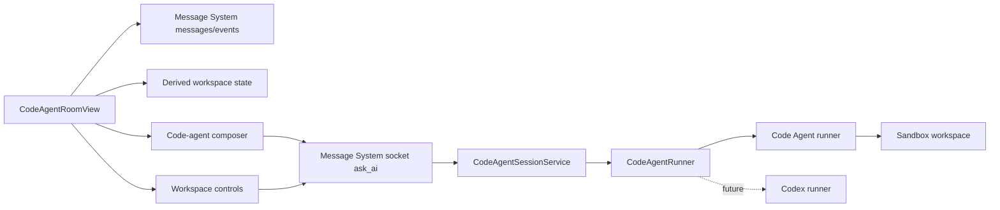

# Code Agent Workspace UI Plan

> Status: Phase 6 accepted; current plan complete
> Date: 2026-05-26
> Scope: turn Message System Code Agent rooms into a code-agent workspace UI, while preparing a future `codeAgentBackend = code-agent | codex | codex-app-server` abstraction.

## Goal

Message System already has ordinary chat rooms and Code Agent rooms. Code Agent rooms currently reuse the chat UI too heavily, so code-agent work appears as a regular message stream instead of a developer workspace.

The goal is to make Code Agent rooms feel like a focused coding-agent GUI:

- prompt composer optimized for coding tasks
- tool timeline and run state
- workspace/file/diff placeholders that can later be backed by real sandbox APIs
- clear plan/read-only vs edit-capable mode
- future backend switch point for Code Agent and Codex

Message System must keep ownership of rooms, users, permissions, persistence, costs, model selection, E2B sandbox lifecycle, and mobile/desktop shell. Code Agent or future Codex backends own the agent loop and tool semantics.

## Code Agent Change Policy

Code Agent can be changed when the GUI needs a capability that belongs inside the agent runtime, but the browser must never control Code Agent directly.

Allowed control path:

```text
Browser UI -> Message System API/Socket -> permission and audit checks -> sandbox runner protocol -> Code Agent engine
```

Do not expose E2B sandbox credentials, provider keys, raw workspace paths, or a Code Agent network port to the browser.

Good Code Agent-side changes:

- real-time `on_tool_result` events
- structured file-tree and diff snapshots
- explicit run cancellation/abort support
- mode-aware system prompts so `plan` mode does not attempt `Write/Edit/Shell`
- structured permission prompts if a future web-safe approval mode is added
- stable session metadata for resume/replay

Bad Code Agent-side changes:

- browser-to-Code Agent direct WebSocket/HTTP control
- letting the frontend send arbitrary shell commands around Message System policy
- forwarding long-lived provider keys into a write/Shell-capable sandbox
- making Message System depend on Code Agent terminal/TUI behavior

## Design Decision

Use T3 Code and Codex as references, not as a directly embedded sub-application.

### Why not embed T3 Code wholesale

- T3 Code is a complete app with its own project, thread, WebSocket, runtime, Git, and terminal assumptions.
- Message System already has room identity, Redis/PostgreSQL persistence, Socket.IO events, E2B sandbox lifecycle, feature flags, model pricing, and mobile navigation.
- Directly embedding T3 Code would create two competing product models inside one UI.

### What to absorb from T3 Code / Codex

- coding-session layout patterns
- tool timeline density
- workspace/status panels
- terminal/output panel structure
- diff/change-list presentation
- permission-mode language
- code-agent backend boundary ideas

### Copy policy

If any source code is copied or closely adapted from T3 Code, the exact files and upstream commit must be recorded in a follow-up attribution section. Until that audit is complete, implementation should use original Message System components inspired by the same product patterns.

## Target Architecture



### Workspace Revision Boundary

The workspace UI must not treat the current sandbox filesystem as durable history.
The file manager, diff viewer, review annotations, browser preview, and changed-files
surface may read the live sandbox through Message System-controlled socket/API handlers,
but durable product semantics belong to Message System:

- The sandbox filesystem is mutable runtime state.
- Message System needs immutable workspace revisions for turn-final snapshots, publish
  inputs, review comments, diff sections, explicit checkpoints, and rollback.
- A stable diff/review section should be addressed by a revision pair, not only by
  the current file path and line numbers.
- Review annotations must bind to a revision pair or equivalent section id plus
  file path and hunk context, otherwise later sandbox changes can move the comment.
- Browser preview tabs may show live workspace files, but the tab identity
  `workspace-file:<path>` is owned by client/server Message System state. Preview session
  reconcile must not replace that identity with an idle Browser page or a generic
  asset URL.
- Provider volumes, E2B filesystem state, or a runner's internal session can be
  implementation details, but they are not a substitute for Message System-owned
  revision metadata and content storage.

Conversation rollback and workspace rollback are separate. A backend may support
trimming conversation turns, but Message System rollback must restore a workspace
revision and record any non-reversible external side effects separately.

## Proposed Types

Longer term, Code Agent-specific naming should be hidden behind code-agent abstractions:

```ts
export type CodeAgentBackend = 'code-agent' | 'codex' | 'codex-app-server';
export type CodeAgentMode = 'plan' | 'acceptEdits';

export interface CodeAgentRoomState {
  backend: CodeAgentBackend;
  sandboxStatus: RoomSandboxStatus;
  agentStatus: RoomCode AgentStatus;
  sessionId?: string;
}

export interface CodeAgentFeatureFlags {
  backend: CodeAgentBackend;
  mode: CodeAgentMode;
}

export interface CodeAgentRunner {
  run(input: CodeAgentRunInput, handlers: CodeAgentEventHandlers): Promise<CodeAgentRunResult>;
}
```

For the first UI phase, persisted room fields may remain `type: 'codeAgent'`, `codeAgentStatus`, and `codeAgentSessionId`. The UI can adapt them through a small frontend utility instead of migrating database fields immediately.

The code-agent mode is process-level configuration for now, not room-level data. Phase 1 must expose it through `/api/features` as `codeAgent.mode` and the frontend must read it from feature flags. Do not hard-code plan/read-only text in the UI.

`CodeAgentRunner` intentionally omits `cancel()` for Phase 3. Cancellation remains handled by run-lock rejection, runner process stop, and sandbox destroy. Phase 6 must add an explicit cancel/abort contract before a Codex runner can be implemented.

## Phases

### Phase Status Notes

Phase 1 intentionally derives file/activity summaries from persisted Code Agent messages. File paths displayed in the workspace panel are normalized for browser display, but deeper workspace API path policy remains a Phase 4 gate because real file-tree and diff APIs do not exist yet.

Phase 1 completion record (2026-05-26):

- Implemented a dedicated `CodeAgentRoomView` and workspace activity summary for Code Agent rooms.
- Propagated configured Code Agent mode through `/api/features`, with `plan` as the fail-closed default.
- Added desktop/mobile Code Agent E2E coverage plus component and feature-flag tests.
- Closed Claude review findings by scoping Code Agent's working directory per turn, validating `CODE_AGENT_WORKSPACE_ROOT`, exercising real local Code Agent file-tool cwd behavior, sanitizing displayed file references, and exposing file-list truncation.
- Verified client unit tests (`73/73`), server unit tests (`197/197`), Python runner tests (`16/16`), frontend/backend builds, Code Agent desktop E2E (`2/2`), and Code Agent mobile E2E (`1/1`).
- Claude Code follow-up review: no blockers; Phase 1 may proceed.

Phase 2 completion record (2026-05-26):

- Added generic frontend helpers for code-agent backend, mode, support, and status while preserving persisted `type: 'codeAgent'` fields.
- Renamed the neutral workspace display component to `CodeAgentWorkspacePanel` and moved view/card/header/sidebar routing behind the new adapters.
- Added a controlled unavailable state for a future `codex` room so partial rollout data cannot crash render or expose runnable controls before backend support exists.
- Verified client unit tests (`78/78`), i18n coverage, production build, and Code Agent desktop/mobile E2E (`3/3`).
- Claude Code follow-up review: no blockers; Phase 2 is ready to commit.

Phase 3 completion record (2026-05-29):

- Added a server-side `CodeAgentRunner` boundary and a `Code AgentCodeAgentRunner` adapter above the existing Code Agent runner clients.
- Added `CODE_AGENT_BACKEND`, defaulting to `code-agent`; unsupported values fail at config resolution and `codex` is explicitly rejected until a runner exists.
- Moved `CodeAgentSessionService` onto the generic runner boundary while keeping the existing Code Agent request/event protocol unchanged for compatibility.
- Changed the direct-construction fallback mode from `acceptEdits` to fail-closed `plan`, with test coverage.
- Added delegation, context-forwarding, backend factory, and config rejection tests.
- Verified server unit tests (`201/201`), server build, Python runner tests (`16/16`), and Code Agent desktop/mobile E2E (`3/3`).
- Claude Code review found no blockers; follow-up fixes added an exhaustive backend guard and explicit runner context-forwarding coverage.

Phase 4 completion record (2026-05-29):

- Added a Message System-mediated read-only workspace snapshot flow. It now uses the registered socket session via `get_code_workspace_snapshot`; the earlier REST snapshot endpoint was removed to avoid split auth paths.
- Derived snapshot state from persisted Code Agent messages only; no direct browser access to Code Agent, E2B, sandbox files, or provider keys.
- Added owner, rollout, and room-type checks plus error-path coverage for workspace snapshot failures.
- Removed internal session identifiers from responses; snapshots expose only `hasSession`.
- Added path sanitization/length caps, command history previews, request abort handling for refresh races, and basic secret-shaped preview redaction.
- Added a workspace refresh control in the code-agent panel; API errors stay non-blocking and do not break message history rendering.
- Verified server unit tests (`208/208`), frontend unit tests (`84/84`), server/client builds, Python runner tests (`16/16`), i18n coverage, and Code Agent desktop/mobile E2E (`3/3`).
- Claude Code review blockers were resolved; final follow-up review reported no remaining Phase 4 blockers.

Phase 5 source audit record (2026-05-30):

- Reviewed T3 Code repository `https://github.com/pingdotgg/t3code` at commit `b3e8c0334b25238e2b55868a87bd6270e234b7de`.
- Upstream license is MIT (`Copyright (c) 2026 T3 Tools Inc.`), which allows reuse with the required copyright and license notice.
- Audited the Web UI shape around `apps/web/src/components/chat/ChatComposer.tsx`, `CompactComposerControlsMenu.tsx`, `ChangedFilesTree.tsx`, and related status/timeline components.
- Decision: Phase 5 will not copy source code or import T3 packages. It will implement original Message System components inspired by T3 Code's compact coding-session patterns: dense status strips, tabbed workspace details, command history rows, and file list rows.
- Because no T3 Code source is copied or closely adapted in this phase, no local MIT attribution file is required for the Phase 5 implementation. If later phases copy upstream code, update the Attribution section before committing that change.

Phase 5 completion record (2026-05-30):

- Reworked the code-agent workspace panel into a compact tabbed surface with Overview, Agent activity, and Files views.
- Replaced large summary cards with dense status rows, expanded command history to the five most recent commands, and rendered touched files as filename/directory rows.
- Kept the UI display-only: command/file rows are not clickable and no browser-to-Code Agent or browser-to-E2B controls were added.
- Added command status labels for running/done/failed states, animated running command icons, and kept all new strings covered across supported locales.
- Tightened workspace refresh lifecycle guards so manual refresh cannot update loading/error state after unmount.
- Added component coverage for default Overview rendering, all command statuses, root-level file paths, file truncation, and tabbed activity/files behavior.
- Verified frontend lint, frontend unit tests (`85/85`), client build, i18n coverage, and Code Agent desktop/mobile E2E (`3/3`).
- Claude Code review findings were resolved; final follow-up review reported Phase 5 is safe to commit.

Phase 6 completion record (2026-05-30):

- Audited local `codex-cli 0.125.0` and its experimental `codex app-server` command.
- Audited T3 Code's Codex integration layers at `https://github.com/pingdotgg/t3code` commit `b3e8c0334b25238e2b55868a87bd6270e234b7de`, including driver, adapter, provider, session runtime, and developer-instruction layers.
- Recorded the spike decision in `docs/code-agent-codex-backend-spike.md`.
- Decision: Codex is feasible as a future second backend, but it remains disabled until Message System has a protocol-neutral runner contract, sandboxed app-server lifecycle, approval/cancel/rollback contracts, and production credential boundaries.
- Confirmed that no T3 Code source was copied into Message System for this spike.
- Verified server unit tests and server build.
- Claude Code review completed with no required code changes for this docs-only phase.

Current master compatibility record (2026-06-26):

- Confirmed `codex/code-agent-legacy` is already an ancestor of `origin/master`; there are no remaining legacy Code Agent commits to merge.
- Rechecked Code Agent against the newer master architecture after the AI outbox, A2UI, media storage, room reliability, authentication, and mobile composer changes.
- Verified server tests (`392/392`) including Code Agent access control, session lifecycle, runner protocol, workspace snapshot, room creation/join guards, and AI routing into Code Agent rooms.
- Verified frontend Code Agent component tests (`8/8`) for `CodeAgentRoomView`, `CodeAgentToolMessage`, and code-agent helpers.
- Verified Python JSONL runner tests (`16/16`) in an isolated temporary pytest environment.
- Verified Playwright Code Agent E2E (`3/3`) covering fake Code Agent turns, refresh restore of tool history, running-turn input locks, and mobile workspace/composer layout.
- Verified `npm run smoke:code-agent:e2b` skips safely without `RUN_CODE_AGENT_E2B_SMOKE=true`.
- Verified `RUN_CODE_AGENT_E2B_SMOKE=true npm run smoke:code-agent:e2b` creates a real E2B sandbox, streams JSONL runner events, completes with a `final` event using `deepseek-v4-pro`, and destroys the sandbox.
- No implementation changes were required by this compatibility pass.

### Phase 0: Source Audit And Plan Review

Scope:

- Document this plan.
- Review T3 Code/Codex integration approach with Claude Code.
- Decide what may be copied, adapted, or only referenced.
- Confirm the current UI phase does not require new backend APIs.

Acceptance:

- Plan exists in `docs/code-agent-workspace-ui-plan.md`.
- Claude Code review has no blocking findings, or the plan is updated to address them.
- Any copied third-party code is explicitly deferred until license/attribution audit is done.

Verification:

```bash
claude -p "<plan review prompt>" --permission-mode dontAsk --tools Read,Grep,Glob,Bash --disallowedTools Edit,Write,MultiEdit
```

### Phase 1: Code Agent Room Workspace Shell

Scope:

- Add `CodeAgentRoomView` for `room.type === 'codeAgent'`.
- Keep `ChatRoomView` unchanged for ordinary rooms.
- Reuse `ChatHeader` and `MessageInput` where practical, but present the center area as a code-agent workspace.
- Add a derived activity summary from existing messages:
  - tool calls
  - tool results
  - failed tools
  - touched file paths from tool args
  - latest tool
- Make plan/read-only mode visible so users understand why `Write` is unavailable.
- Surface plan/read-only mode from `/api/features.codeAgent.mode`; no room field or database migration is allowed in this phase.
- Keep mobile layout single-column and avoid large side panels that overflow the viewport.

Acceptance:

- Chat rooms render exactly through the existing chat path.
- Code Agent rooms render through `CodeAgentRoomView`.
- Empty Code Agent rooms show a code-task oriented workspace, not a generic chat empty state.
- Tool calls/results are summarized without requiring new backend APIs.
- The displayed mode matches the server feature flag response (`plan` shows read-only, `acceptEdits` shows edit-capable).
- The user can still send a prompt and ask the agent from Code Agent rooms.
- Mobile viewport has no horizontal overflow and composer stays reachable.

Verification:

```bash
cd client-heroui && npm test -- --run
cd client-heroui && npm run check:i18n
cd client-heroui && npm run build
cd client-heroui && npm run test:e2e -- e2e/code-agent-flows.spec.ts
```

Claude gate:

- Review the Phase 1 diff with focus on UI regressions, ordinary chat isolation, mobile overflow, and stale/incorrect Code Agent status.

### Phase 2: Generic Code-Agent Frontend Model

Scope:

- Add frontend utilities that map a Message System room to a generic code-agent model:
  - `isCodeAgentRoom(room)`
  - `getCodeAgentBackend(room)`
  - `getCodeAgentMode(featureFlags)`
  - `getCodeAgentStatus(room)`
- Keep persisted values unchanged in this phase.
- Rename only UI-level component concepts from Code Agent-specific to CodeAgent-specific where it reduces future churn.
- Avoid mass renames in server code.

Acceptance:

- UI components that are not Code Agent-runner specific consume generic code-agent helpers.
- Existing Code Agent tests still pass.
- No persistence migration is needed; mode remains feature/config data unless a later phase explicitly adds per-room mode.
- Frontend utilities treat `codex` as unreachable until Phase 6 and warn or assert if it appears before backend support exists.

Verification:

```bash
cd client-heroui && npm test -- --run
cd client-heroui && npm run build
```

Claude gate:

- Review whether the abstraction is real and useful, or premature/noisy.

### Phase 3: Backend Runner Abstraction

Scope:

- Introduce a server-side `CodeAgentRunner` boundary above the existing Code Agent runner.
- Implement `Code AgentCodeAgentRunner` as the only concrete backend.
- Keep config default to Code Agent.
- Add `CODE_AGENT_BACKEND=code-agent` or equivalent alias while preserving existing `CODE_AGENT_*` config.
- Explicitly reject `codex` until a Codex runner is implemented.

Acceptance:

- No behavior change for current Code Agent rooms.
- Existing `CodeAgentSessionService` tests either remain valid or are moved behind the new wrapper with equivalent coverage.
- Unsupported backend config fails fast at startup with a clear error.
- Direct model-key safety rules from `docs/code-agent-model-access.md` remain enforced.

Verification:

```bash
cd server && npm test
cd server && npm run build
python3 -m pytest server/message-system_code_agent_runner/tests
```

Claude gate:

- Review abstraction boundaries, config compatibility, and security regressions.

### Phase 4: Workspace APIs

Scope:

- Add explicit APIs/events for workspace state when the runner can provide them:
  - file tree
  - changed files
  - diff summary
  - command/output history
- Add Message System-mediated controls only when each action has a clear backend policy:
  - refresh workspace snapshot
  - cancel current turn
  - reset sandbox/session
  - request diff
- Until backend support exists, continue deriving UI summaries from messages.
- Do not let Message System implement the agent's file operations itself.
- If Code Agent needs new hooks, implement them in Code Agent first and expose them through the JSONL runner protocol.

Acceptance:

- APIs are read-only unless the code-agent mode and model-access contract allow writes.
- Frontend controls call Message System endpoints/events, never Code Agent or E2B directly.
- Workspace API errors do not break message history rendering.
- Fake runner/E2E can simulate workspace snapshots.
- File path display is sanitized/truncated and tested so sandbox output cannot break layout or leak unintended path details.

Verification:

```bash
cd server && npm test
cd client-heroui && npm test -- --run
cd client-heroui && npm run test:e2e -- e2e/code-agent-flows.spec.ts
```

Claude gate:

- Review sandbox boundaries and data leakage risks.

### Phase 5: T3 Code UI Absorption

Scope:

- Audit selected T3 Code UI modules and styles.
- Copy/adapt only small, separable UI ideas that match Message System's data model.
- Add attribution if code is copied or closely adapted.
- Keep Message System's app shell and Socket.IO session model.

Acceptance:

- No iframe/sub-app embedding.
- No second WebSocket runtime competing with Message System.
- Imported/adapted code has clear license attribution.
- Any copied or closely adapted T3 Code component must have its upstream file path and commit hash recorded in the attribution section before the Phase 5 commit is merged.
- Bundle impact is measured and acceptable.

Verification:

```bash
cd client-heroui && npm run lint
cd client-heroui && npm run build
cd client-heroui && npm run test:e2e -- e2e/code-agent-flows.spec.ts
```

Claude gate:

- Review license attribution, dependency creep, and UI maintainability.

### Phase 6: Codex Backend Spike

Scope:

- Investigate Codex app-server/CLI integration as a second backend.
- Do not replace Code Agent.
- Add a disabled `codex` backend path only if its sandbox/model/key boundaries are clear.

Acceptance:

- `codeAgentBackend = code-agent | codex | codex-app-server` is technically feasible without changing Message System rooms again.
- Codex backend remains disabled unless all security and deployment prerequisites are explicit.

Verification:

```bash
cd server && npm test
cd server && npm run build
```

Claude gate:

- Review whether the Codex integration should proceed, stay as docs, or be dropped.

## UX Requirements

Desktop:

- Preserve the existing Message System sidebar and top room shell.
- Use the main area as a code-agent workspace, not a marketing page.
- Show tool/activity status without card nesting.
- Keep message content readable and code/tool output scannable.

Mobile:

- Single-column layout.
- Bottom composer must remain reachable.
- Tool/workspace panels should collapse into tabs or summary strips.
- No horizontal overflow from tool args, model menus, or file paths.

Accessibility:

- Interactive controls must have labels.
- Keyboard focus must remain visible.
- Tool/error status must not rely on color only.

## Testing Strategy

Unit/component tests:

- Code Agent room selects workspace view.
- Activity summary derives tools/files/errors correctly.
- `summarizeCode AgentMessages` covers empty messages, missing tool args, duplicate file refs, result errors, and non-file tool calls.
- Chat room path does not render code-agent workspace.
- Read-only/plan mode copy is visible.

## Attribution

No T3 Code source has been copied into this repository as of this plan. If Phase 5 copies or closely adapts upstream code, record:

- upstream repository URL
- upstream commit hash
- source file path
- local target file path
- license notice required by the upstream license

E2E:

- Create Code Agent room.
- Send a code task.
- See sandbox/tool/activity status.
- Refresh and verify workspace view restores.
- Mobile viewport: composer visible, no horizontal overflow, tool summaries usable.

Regression:

- Existing room flows and message flows still pass.
- Ordinary chat AI controls are unchanged.

## Review Rule

After every implementation phase:

1. Run the phase verification commands.
2. Call Claude Code in read-only mode.
3. Fix blocking/high/medium findings before continuing.
4. Record deferrable findings in the final status for that phase.
5. Commit only when the phase is green.
