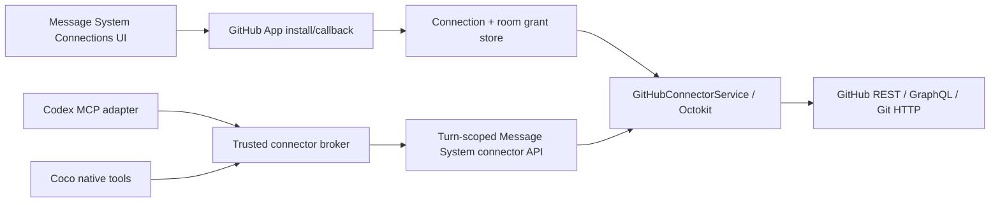

# GitHub Connector 调研与实现建议

> 日期：2026-07-11
> 状态：调研完成，待拆分实现任务
> 范围：让 Message System 的 sandbox-based cloud code agent 安全地读取 GitHub，并在明确授权后创建分支、提交和 PR。

## 结论

第一版应注册 Message System 自己的 **GitHub App**，而不是要求用户粘贴 PAT，也不应把 GitHub token 直接交给 sandbox。

建议组合：

- 授权、安装、webhook、installation token：`@octokit/app`
- agent 工具语义：优先复用 GitHub 官方 `github-mcp-server` 的命名和输入输出设计
- Message System 运行边界：沿用现有 turn-scoped token + trusted Unix socket broker
- 产品授权边界：用户级 connection 与 room/repository grant 分开存储
- 第一版只开放 allowlist 工具；默认只读，写操作限于 branch/commit/PR

GitHub 官方 Remote MCP 不能替 Message System 完成授权。其 host integration 文档明确说明 MCP server 只消费 access token，host application 仍需自己实现 GitHub App 或 OAuth App 授权。因此它是工具协议/实现参考，不是完整 connector backend。

## 为什么选 GitHub App

GitHub App 同时提供：

- 安装到个人账号或组织
- 安装时选择 `All repositories` 或 `Only select repositories`
- 细粒度 repository permissions
- installation webhook 与资源 webhook
- 短期 installation access token
- App 身份或用户身份两种归属方式

installation token 默认一小时过期，还可以在生成时进一步缩小 repositories 和 permissions。Message System 应只长期保存 `installationId`、GitHub account/repository 元数据和授权策略，不保存 installation token。

两种身份用途不要混用：

- App installation token：agent 自动化操作，GitHub 中显示为 Message System App
- GitHub App user access token：必须以具体用户身份归属的操作

第一版建议统一用 App installation identity，审计最清楚，也不需要为每个用户长期保存 user token。

## 推荐授权体验

Codex 官方连接提醒展示了值得复用的双层结构：产品先解释风险和权限，随后跳到 GitHub 完成 provider 授权。Message System 建议采用同样的边界，但增加 room 级授权：

1. 用户在 Message System 打开 `Connections -> GitHub`。
2. Message System 显示将开放的能力、数据使用边界和写操作风险。
3. 跳转到 GitHub App installation URL。
4. 用户选择个人/组织，并默认使用 `Only select repositories`。
5. GitHub 回调携带 `installation_id` 和 Message System 签名的单次 `state`。
6. Message System 读取 installation/repository 元数据，建立用户级 GitHub connection。
7. 用户把 connection 中的一个或多个 repository 显式授权给当前 room。
8. room 另行选择 `read` 或 `branch-and-pr` 能力档位。

`state` 必须签名、短期、单次使用，并绑定 `clientId + roomId + nonce`。不能相信浏览器回调里未经签名的 room/client 参数。

## 权限建议

GitHub App 注册权限是系统能申请的上限；installation token 和 Message System room grant 再做两次收窄。

第一版：

| GitHub permission | 建议 | 用途 |
| --- | --- | --- |
| Metadata | read | GitHub App 默认需要的仓库元数据 |
| Contents | read/write | 读取文件、创建分支和提交 |
| Pull requests | read/write | 读取、创建和评论 PR |
| Issues | read/write，可选 | issue 读取、创建、评论 |
| Actions | read，可选 | 查看 workflow run 和日志状态 |
| Checks | read，可选 | 查看 CI/check 状态 |
| Workflows | 不申请 | 第一版不允许修改 `.github/workflows` |
| Administration / Secrets | 不申请 | 不属于 coding-agent MVP |

高风险能力第一版不开放：merge PR、删除 branch/tag、修改 repository settings、管理 secrets、写 workflow、创建 release。

## Agent 工具面

不要把 GitHub 的全部 API 一次性暴露给模型。GitHub 官方 MCP server 已支持 toolset、单工具 allowlist、read-only 和 lockdown mode；Message System 应采用相同思路。

第一版只读工具：

- `github_list_repositories`
- `github_get_file_contents`
- `github_search_code`
- `github_list_commits`
- `github_issue_read`
- `github_pull_request_read`
- `github_actions_read`

第一版写工具：

- `github_create_branch`
- `github_push_files`
- `github_create_pull_request`
- `github_add_issue_comment`
- `github_add_pull_request_comment`

`plan` mode 只注册只读工具。`edit` mode 也只在 room grant 为 `branch-and-pr` 时注册写工具。工具是否出现应由 Message System 决定，不只依赖 system prompt 约束。

## Message System 内部架构



建议新增三个持久化概念：

```ts
type ExternalConnection = {
  id: string
  provider: 'github'
  ownerClientId: string
  installationId: number
  accountId: number
  accountLogin: string
  accountType: 'User' | 'Organization'
  status: 'connected' | 'suspended' | 'revoked'
  permissions: Record<string, 'read' | 'write'>
  createdAt: string
  updatedAt: string
}

type RoomConnectionGrant = {
  roomId: string
  connectionId: string
  repositoryIds: number[]
  capability: 'read' | 'branch-and-pr'
  grantedByClientId: string
  createdAt: string
  revokedAt?: string
}

type ConnectorAuditEvent = {
  roomId: string
  turnId: string
  clientId: string
  connectionId: string
  tool: string
  repositoryId?: number
  outcome: 'allowed' | 'denied' | 'succeeded' | 'failed'
  providerRequestId?: string
  createdAt: string
}
```

不要在这些表中保存 installation token。GitHub App private key 和 webhook secret 放在服务器 secret/KMS 中；每次调用前由服务器即时生成 installation token。

## Sandbox 与凭证边界

当前 Codex runner 会从 child environment 排除 `*_TOKEN`、`*_SECRET` 和 `*_KEY`，这个约束应该保留。不要新增 `GITHUB_TOKEN` 注入。

推荐路径：

```text
agent tool -> local Unix socket -> trusted runner broker
             -> turn-scoped Message System API -> GitHubConnectorService
             -> just-in-time installation token -> GitHub
```

普通 issue/PR/file 操作由 Message System server 通过 Octokit 执行。

真实 `git clone/fetch/push` 需要 workspace 文件系统时，由 trusted runner broker 执行 Git，并只在该受信进程内临时使用 installation token。禁止把 token 写进：

- shell environment
- `.git/config` remote URL
- Codex config
- prompt/tool result
- room message
- workspace 文件

更严格的后续版本可以让 backend 代理 Git smart HTTP；MVP 先用 broker 内存凭证 + 临时 `GIT_ASKPASS`，执行结束立即清理。

## 现成实现如何取舍

### 1. GitHub 官方 `github-mcp-server`

最值得复用。它是 MIT 开源的官方 MCP server，已经覆盖 repositories、issues、pull requests、actions、security 等 toolsets，并支持 read-only、tool allowlist 和 lockdown mode。

建议：

- 复用工具 schema、名称和错误语义
- 可在 trusted runner 区域评估 sidecar 运行
- 不要把带 token 的 local MCP process 放进 agent 可读环境
- 不依赖 GitHub Copilot 托管的 Remote MCP 作为 Message System 核心 backend

### 2. `@octokit/app`

最适合直接落进当前 Node/Express server。它原生覆盖 GitHub App auth、installation Octokit、OAuth callback 和 webhook middleware。第一版 connector backend 优先选它，而不是自己拼 JWT、token refresh 和 webhook 验签。

### 3. Probot

成熟的 GitHub App/webhook 框架，适合 webhook 驱动的 bot。Message System 已有 Express、日志、持久化和权限框架，直接引入 Probot 容易形成第二套应用骨架；可以参考事件处理方式，但 MVP 用 `@octokit/app` 更轻。

### 4. Nango

它解决多 provider OAuth、token storage/refresh、proxy、sync 和 webhook，适合未来一次接 GitHub、Slack、Google、Notion 等很多 provider。GitHub 第一版没有必要先引入这一层；等第二、第三个 connector 出现后，再评估自托管成本与 Elastic License 边界。

## 分阶段实施

### Phase 1：只读连接

- 注册 Message System GitHub App
- installation/callback/uninstall/suspend webhook
- connection 与 room repository grant
- repository/file/issue/PR/Actions 只读工具
- Settings 中的连接、断开、repository 选择
- 所有调用写入 audit event

### Phase 2：branch + PR

- create branch、push files、create PR、comment
- 首次写操作显示 room 内确认
- protected branch 和 fork 场景处理
- webhook 将 PR/CI 状态更新回 room

### Phase 3：受信 Git transport

- broker 执行 clone/fetch/push
- JIT installation token 与临时 credential helper
- 大仓库、LFS、submodule、GitHub Enterprise 支持

### Phase 4：通用 Connector 平台

- provider-neutral connection/grant/audit interfaces
- Slack、Google、Notion 等 provider adapters
- 可选引入 Nango 或独立 OAuth broker
- connector-triggered room automations

## 与当前仓库的落点

- `server/src/services/`：`githubConnectorService`、connection/grant store、turn token 验证
- `server/src/routes/`：install/callback/webhook/room connector API
- `server/src/services/codeAgentSessionService.ts`：只注入 connector broker 的 turn-scoped Message System token/URL
- `server/message-system_code_agent_runner/message-system_code_agent_runner/`：trusted connector broker、Message System GitHub CLI/MCP adapter
- `client-heroui/src/components/SettingsView.tsx`：用户级 GitHub connection
- code-agent room workspace：repository grant 与能力状态，不显示长期凭证

runner/broker、Codex MCP 配置或 sandbox Dockerfile 的改动属于 E2B artifact 变更，必须同步 artifact lock、Dockerfile、template 与 Fly secrets 后才算上线。

## 主要参考

- [GitHub App authentication modes](https://docs.github.com/en/apps/creating-github-apps/authenticating-with-a-github-app/about-authentication-with-a-github-app)
- [Generating an installation access token](https://docs.github.com/en/apps/creating-github-apps/authenticating-with-a-github-app/generating-an-installation-access-token-for-a-github-app)
- [Choosing permissions for a GitHub App](https://docs.github.com/en/apps/creating-github-apps/registering-a-github-app/choosing-permissions-for-a-github-app)
- [Installing a GitHub App and selecting repositories](https://docs.github.com/en/apps/using-github-apps/installing-a-github-app-from-a-third-party)
- [Validating webhook deliveries](https://docs.github.com/en/webhooks/using-webhooks/validating-webhook-deliveries)
- [GitHub official MCP server](https://github.com/github/github-mcp-server)
- [GitHub MCP host integration guide](https://github.com/github/github-mcp-server/blob/main/docs/host-integration.md)
- [`@octokit/app`](https://github.com/octokit/app.js)
- [Probot](https://github.com/probot/probot)
- [Nango](https://github.com/NangoHQ/nango)
